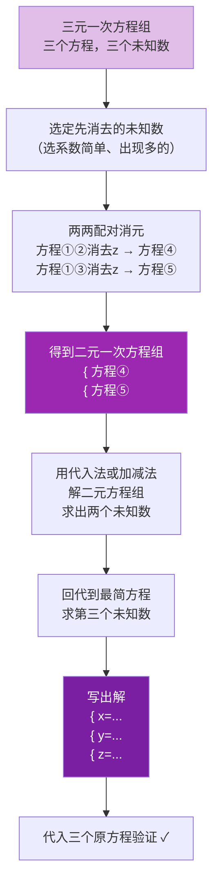

# 三元一次方程组的解法（选学）

标签：#选学 #拓展

## 一、三元一次方程组的概念

含有**三个未知数**，每个方程中含未知数的项的次数都是 **1**，并且一共有**三个方程**的方程组，叫做**三元一次方程组**。如

$$\begin{cases} x + y + z = 12 \\ x + 2y + 5z = 22 \\ x = 4y \end{cases}$$

## 二、解法思路：两次消元

核心仍是**消元**：

$$\text{三元} \xrightarrow{\text{消去一个未知数}} \text{二元} \xrightarrow{\text{再消元}} \text{一元}$$

一般步骤：

1. 选定要先消去的未知数（选系数简单、出现次数多的）；
2. 用代入或加减法，从三个方程中**两两配对**消去它，得到**二元一次方程组**；
3. 解二元一次方程组，求出两个未知数；
4. **回代**求第三个未知数，写出解 $\begin{cases} x = \cdots \\ y = \cdots \\ z = \cdots \end{cases}$。

## 三、例题解析

**例 1**：解方程组 $\begin{cases} x + y + z = 12 \ \ ① \\ x + 2y + 5z = 22 \ \ ② \\ x = 4y \ \ ③ \end{cases}$

**解**：③已表示出 $x$，用**代入法**消 $x$：
③代入①：$4y + y + z = 12$，即 $5y + z = 12$ ④；
③代入②：$4y + 2y + 5z = 22$，即 $6y + 5z = 22$ ⑤。
④$\times 5 -$ ⑤：$25y + 5z - 6y - 5z = 60 - 22$，$19y = 38$，$y = 2$；
代入④：$z = 2$；代入③：$x = 8$。

解为 $\begin{cases} x = 8 \\ y = 2 \\ z = 2 \end{cases}$。

**例 2**：解 $\begin{cases} 3x + 4z = 7 \ \ ① \\ 2x + 3y + z = 9 \ \ ② \\ 5x - 9y + 7z = 8 \ \ ③ \end{cases}$

**解**：①不含 $y$，故消 $y$：②$\times 3 +$ ③：$6x + 9y + 3z + 5x - 9y + 7z = 27 + 8$，
得 $11x + 10z = 35$ ④。
联立①④：①$\times 5$：$15x + 20z = 35$；④$\times 2$：$22x + 20z = 70$；相减得 $7x = 35$，$x = 5$；
代入①：$4z = -8$，$z = -2$；代入②：$10 + 3y - 2 = 9$，$y = \dfrac{1}{3}$。

## 四、易错点

1. 两次消元必须消**同一个**未知数，否则得到的仍是三元方程组。
2. 三个方程两两配对时，每个方程都应**至少被使用一次**。
3. 回代时选**最简单**的方程，减少计算量。
4. 解要写成三个未知数的一组值，缺一不可；最后代入三个原方程检验。

## 五、自测题

1. 解 $\begin{cases} x + y = 3 \\ y + z = 5 \\ x + z = 4 \end{cases}$（提示：三式相加）。
2. 解三元一次方程组的基本思想是什么？

参考答案

1. 三式相加：$2(x+y+z) = 12$，$x+y+z = 6$；分别减去各式得 $z = 3$，$x = 1$，$y = 2$。
2. 消元：三元 → 二元 → 一元，逐步化归。

## 六、知识联系

- 二元一次方程组的概念与解法见 [[概念]]、[[代入]]、[[加减]]；
- 化归得到的一元一次方程解法见 [[5.2 解一元一次方程]]；
- 实际问题中有三个未知量时可用本节方法，参见 [[10.3 实际问题]]。
