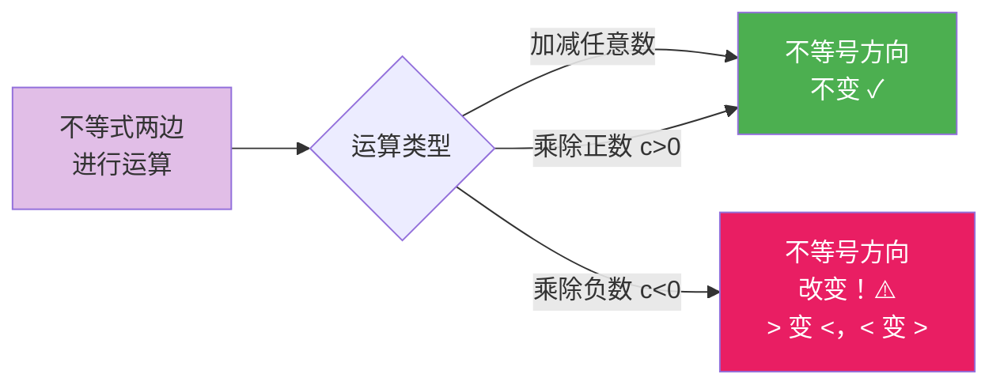

# 性质

标签：#中考必考 #重点

## 一、不等式的三条性质

**性质 1**：不等式两边**加（或减）同一个数（或式子）**，不等号方向**不变**。

$$a > b \Rightarrow a + c > b + c$$

**性质 2**：不等式两边**乘（或除以）同一个正数**，不等号方向**不变**。

$$a > b,\ c > 0 \Rightarrow ac > bc,\quad \frac{a}{c} > \frac{b}{c}$$

**性质 3**：不等式两边**乘（或除以）同一个负数**，不等号方向**改变**。

$$a > b,\ c < 0 \Rightarrow ac < bc,\quad \frac{a}{c} < \frac{b}{c}$$

> ⚠️ 与等式性质最大的区别：**乘除负数要变号**！这是全章的核心与高频考点。

## 二、利用性质解简单不等式

**例**：解不等式 $-2x > 6$。

两边同除以 $-2$（负数），不等号**变向**：

$$x < -3$$

## 三、例题解析

**例 1**：已知 $a > b$，判断下列各式方向：
(1) $a - 3$ 与 $b - 3$；(2) $-4a$ 与 $-4b$；(3) $\dfrac{a}{5}$ 与 $\dfrac{b}{5}$。

**解**：(1) $a - 3 > b - 3$（性质 1）；(2) $-4a < -4b$（性质 3，变向）；(3) $\dfrac{a}{5} > \dfrac{b}{5}$（性质 2）。

**例 2**：若 $(m-1)x < m-1$ 的两边同除以 $m-1$ 后得 $x > 1$，求 $m$ 的取值范围。

**解**：除以 $m-1$ 后不等号变向，说明 $m - 1 < 0$，即 $m < 1$。

**例 3**：利用性质把 $3x - 2 < 7$ 变形为 $x < a$ 的形式。

**解**：两边加 2：$3x < 9$（性质 1）；两边除以 3：$x < 3$（性质 2，正数不变向）。

## 四、易错点

1. 两边**乘除负数忘记变号**是最常见错误：$-x > 2$ 应得 $x < -2$。
2. 两边乘除**含字母的式子**时，必须先讨论其正负、是否为 0，不能直接约去。
3. 不等式两边乘 0：$a > b$ 不能推出 $0 \cdot a > 0 \cdot b$（会变成 $0 = 0$）。
4. 性质 1 中加减的可以是数也可以是**整式**，移项的依据正是性质 1。

## 五、自测题

1. 已知 $x < y$，用不等号连接：$x + 7$ ___ $y + 7$；$-\dfrac{x}{3}$ ___ $-\dfrac{y}{3}$。
2. 解不等式：$-\dfrac{1}{2}x \leq 4$。
3. 判断：若 $a > b$，则 $ac^2 > bc^2$。（对/错）

参考答案

1. $x + 7 < y + 7$；$-\dfrac{x}{3} > -\dfrac{y}{3}$（除以负数变向）。
2. 两边乘 $-2$，变向：$x \geq -8$。
3. 错。当 $c = 0$ 时 $ac^2 = bc^2$。（$c \neq 0$ 时才成立）

## 六、知识联系

- 对比 [[等式的性质]]：等式两边乘除负数不变号，不等式要变号；
- 不等式的解与解集概念见 [[解集]]；
- 三条性质是解 [[11.2 一元一次不等式]] 与 [[11.3 一元一次不等式组]] 的依据。
