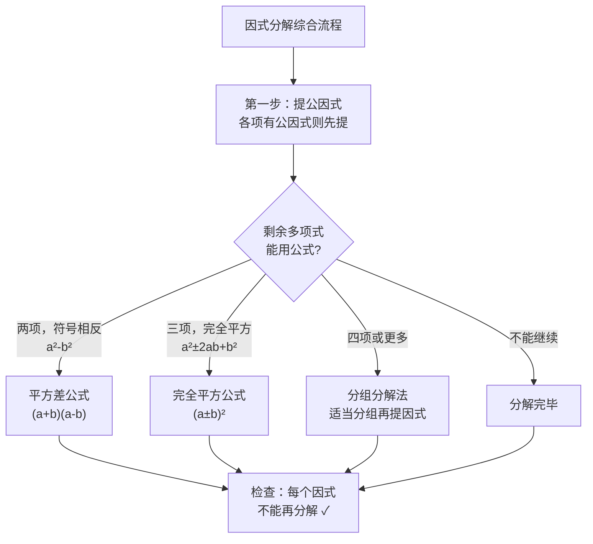

# 因式分解综合应用

## 综合方法

因式分解的基本思路是"一提二套三查"：
1. **一提**：先提取公因式。
2. **二套**：再用平方差公式或完全平方公式。
3. **三查**：检查是否分解彻底。

## 常见题型

**分组分解法**：把多项式适当分组，再分别提取公因式或运用公式。

例如：
$$ax+ay+bx+by=a(x+y)+b(x+y)=(a+b)(x+y)$$

**整体思想**：把某个多项式看作一个整体进行分解。

## 因式分解的应用

1. **简化计算**：利用因式分解简化代数式的求值。
2. **解方程**：如因式分解法解一元二次方程（后续学习）。
3. **证明恒等式**：通过因式分解证明等式成立。

## 例题解析

**例**：分解因式 $x^3-x$。

$$x^3-x=x(x^2-1)=x(x+1)(x-1)$$

**例**：已知 $a+b=3$，$ab=2$，求 $a^2b+ab^2$ 的值。

$$a^2b+ab^2=ab(a+b)=2\times3=6$$

## 易错点

- 分解不彻底是最常见的错误，要检查到每一个因式都不能再分解。
- 注意符号问题，特别是首项为负时。
- 不要混淆整式乘法与因式分解，两者是互逆过程。
- 因式分解的结果必须是几个整式乘积的形式。
- 遇到二项式优先考虑提公因式或平方差公式。

## 自测题

1. 分解因式：$x^3-4x=$____。
2. 分解因式：$a^2-b^2+a-b=$____。
3. 已知 $x+y=4$，$xy=3$，则 $x^2y+xy^2=$____。
4. 分解因式：$(x+1)^2-4=$____。

相关知识点：[[17.1 用提公因式法分解因式]]、[[17.2 用公式法分解因式]]、[[16.3 乘法公式]]
