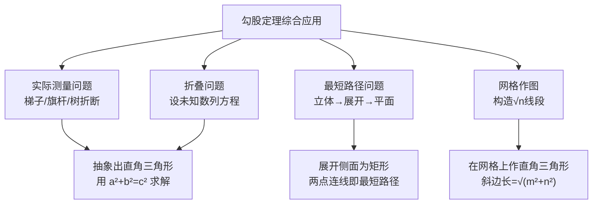

# 勾股定理综合应用

标签：#中考高频 #综合

## 一、应用类型总览

| 类型 | 关键动作 |
|---|---|
| 实际测量（梯子、旗杆、树折断） | 抽象出直角三角形 |
| 立体图形表面最短路径 | 展开成平面，两点连线段 |
| 折叠问题 | 设未知数，用 $a^2+b^2=c^2$ 列方程 |
| 网格与数轴作图 | 用勾股定理构造 $\sqrt{n}$ 长的线段 |

## 二、最短路径问题（展开思想）

**立体图形表面上的最短路径 = 展开图上两点间的线段长。**

**例1** 圆柱底面周长为 $12$，高为 $8$，一只蚂蚁从下底面 $A$ 点沿侧面爬到正上方对侧的 $B$ 点，求最短路程。

解：侧面展开后，水平距离为半周长 $6$，竖直距离为 $8$，
最短路程 $= \sqrt{6^2 + 8^2} = 10$。

> 💡 **技巧**：长方体表面爬行要按不同展开方式分别计算，取最小值。

## 三、折叠问题（方程思想）

折叠的本质是**轴对称**，对应线段相等。设未知数后用勾股定理列方程。

**例2** 矩形 $ABCD$ 中，$AB = 8$，$BC = 10$，将 $\triangle ADE$ 沿 $AE$ 折叠使 $D$ 落在 $BC$ 上的点 $F$ 处，求 $DE$ 的长（$E$ 在 $CD$ 上）。

解：由折叠 $AF = AD = 10$，在 $\text{Rt}\triangle ABF$ 中 $BF = \sqrt{10^2 - 8^2} = 6$，故 $FC = 4$。
设 $DE = EF = x$，则 $EC = 8 - x$。在 $\text{Rt}\triangle EFC$ 中：
$$x^2 = 4^2 + (8-x)^2 \Rightarrow x^2 = 16 + 64 - 16x + x^2 \Rightarrow x = 5$$
所以 $DE = 5$。

## 四、在数轴上表示无理数

利用勾股定理可以画出长为 $\sqrt{n}$ 的线段：如以 $2$、$1$ 为直角边的直角三角形斜边为 $\sqrt{5}$。以原点为圆心、该斜边长为半径画弧交数轴，即得表示 $\sqrt{5}$ 的点。

## 五、双直角三角形（公共高）模型

**例3** $\triangle ABC$ 中，$AB = 13$，$AC = 15$，BC 边上的高 $AD = 12$，求 $BC$。

解：$BD = \sqrt{13^2 - 12^2} = 5$，$CD = \sqrt{15^2 - 12^2} = 9$。
高在形内时 $BC = 5 + 9 = 14$；高在形外时 $BC = 9 - 5 = 4$。

> ⚠️ **易错点**：三角形形状不确定（锐角/钝角）时，高可能在形内或形外，务必**分类讨论**，只答一种会丢一半分。

## 六、要点小结

1. 最短路径：立体 → 展开 → 连线段 → 勾股定理；
2. 折叠：找相等线段 → 设 $x$ → 勾股定理列方程；
3. 数轴作图：构造直角边为整数的直角三角形；
4. 高的位置、斜边归属不明时分类讨论。

## 七、自测题

1. 长方体长宽高分别为 $3$、$2$、$1$，蚂蚁沿表面从一个顶点爬到对角顶点，最短路程是多少？
2. 矩形纸片 $ABCD$ 中 $AB=6$，$AD=8$，沿对角线 $BD$ 折叠后 $C$ 落到 $C'$，$BC'$ 交 $AD$ 于 $E$，求 $AE$。
3. 在数轴上作出表示 $\sqrt{13}$ 的点（写出构造方法）。

参考答案

1. 三种展开：$\sqrt{(3+2)^2+1^2}=\sqrt{26}$，$\sqrt{(3+1)^2+2^2}=\sqrt{20}$，$\sqrt{(2+1)^2+3^2}=\sqrt{18}=3\sqrt{2}$，最短 $3\sqrt{2}$；
2. 设 $AE=x$，由 $EB=ED=8-x$，在 $\text{Rt}\triangle ABE$ 中 $6^2+x^2=(8-x)^2$，解得 $x=\dfrac{7}{4}$；
3. 以 $2$、$3$ 为直角边作直角三角形，斜边 $=\sqrt{13}$，再用圆规转到数轴上。

## 八、知识联系

- 计算基础见 [[17.1 勾股定理]]，判定直角见 [[17.2 勾股定理的逆定理]]；
- 根式结果的化简依赖 [[16.2 二次根式的乘除]]；
- 折叠与对角线计算在 [[18.2 特殊的平行四边形]] 中还会反复出现。
