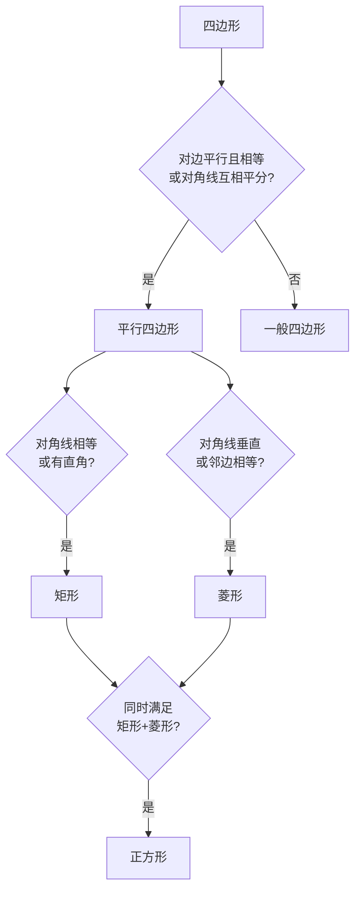

# 平行四边形综合应用

标签：#中考高频 #综合

## 一、常考题型总览

| 题型 | 核心方法 |
|---|---|
| 证明四边形形状 | 按"平行四边形 → 矩形/菱形 → 正方形"逐级加条件 |
| 求线段长、面积 | 性质 + 勾股定理 |
| 中点四边形 | 中位线定理 |
| 折叠与动点 | 轴对称性质 + 方程思想 |

## 二、逐级判定的思维链

判断特殊四边形，先问三个问题：

1. 是平行四边形吗？（对边关系 / 对角线互相平分）
2. 有直角或对角线相等吗？→ 矩形方向；
3. 有邻边相等或对角线垂直吗？→ 菱形方向。

**例1** 四边形 $ABCD$ 的对角线交于 $O$，且 $OA=OC$，$OB=OD$，$AC \perp BD$，判断形状。

解：对角线互相平分 → 平行四边形；又互相垂直 → **菱形**。

## 三、中点四边形

顺次连接四边形各边中点得到**中点四边形**，其形状由**原四边形对角线**决定：

| 原四边形对角线 | 中点四边形 |
|---|---|
| 一般 | 平行四边形 |
| 相等 | 菱形 |
| 垂直 | 矩形 |
| 相等且垂直 | 正方形 |

> ⚠️ **易错点**：对角线**相等** → 中点四边形是**菱形**（不是矩形），因为中位线长都等于对角线的一半；对角线垂直才得矩形。方向别记反。

## 四、典型例题

**例2** 菱形 $ABCD$ 中，$\angle B = 60^\circ$，边长为 $4$，求对角线 $AC$、$BD$ 与面积。

解：$\angle B = 60^\circ$，$\triangle ABC$ 为等边三角形，$AC = 4$。
半对角线 $AO = 2$，$BO = \sqrt{4^2 - 2^2} = 2\sqrt{3}$，$BD = 4\sqrt{3}$。
面积 $= \dfrac{1}{2} \times 4 \times 4\sqrt{3} = 8\sqrt{3}$。

**例3**（折叠）矩形 $ABCD$ 中 $AB=3$，$BC=5$，把 $\triangle BCD$ 沿 $BD$ 折叠，$C$ 落在 $C'$，$BC'$ 交 $AD$ 于 $E$，求 $DE$。

解：由折叠 $\angle EBD = \angle DBC = \angle EDB$（内错角），故 $EB = ED$。
设 $DE = x$，则 $AE = 5 - x$，在 $\text{Rt}\triangle ABE$ 中：
$$3^2 + (5-x)^2 = x^2 \Rightarrow 9 + 25 - 10x = 0 \Rightarrow x = \frac{17}{5}$$

**例4**（动点）$\square ABCD$ 中 $AD = 12$，点 $P$ 从 $A$ 沿 $AD$ 以 $1$ 单位/秒运动，点 $Q$ 从 $C$ 沿 $CB$ 以 $2$ 单位/秒同时出发，何时四边形 $PDCQ$（$Q$ 未到 $B$）是平行四边形？

解：$PD \parallel QC$，只需 $PD = QC$：$12 - t = 2t$，得 $t = 4$ 秒。

## 五、要点小结

1. 判定按"先平四、再特殊"的顺序，条件逐级加码；
2. 中点四边形看原对角线：等→菱、垂→矩、等垂→正；
3. 折叠题＝相等线段＋勾股方程；动点题＝用时间 $t$ 表示线段再列等量；
4. 面积工具箱：底×高、对角线积一半（菱形）、分割拼补。

## 六、自测题

1. 顺次连接矩形四边中点得到什么图形？连接菱形四边中点呢？
2. 菱形对角线为 $10$ 与 $24$，求周长。
3. 例4 中若改问四边形 $ABQP$ 何时为平行四边形，$t$ 为多少？

参考答案

1. 矩形（对角线相等）→ 菱形；菱形（对角线垂直）→ 矩形；
2. 边长 $=\sqrt{5^2+12^2}=13$，周长 $52$；
3. 需 $AP = BQ$：$t = 12 - 2t$，$t = 4$ 秒。

## 七、知识联系

- 基础性质与判定见 [[18.1 平行四边形]] 与 [[18.2 特殊的平行四边形]]；
- 折叠与线段计算的方程思想同 [[勾股定理综合应用]]；
- 动点问题中"路程随时间变化"的关系可用 [[19.1 函数]] 的观点理解。
