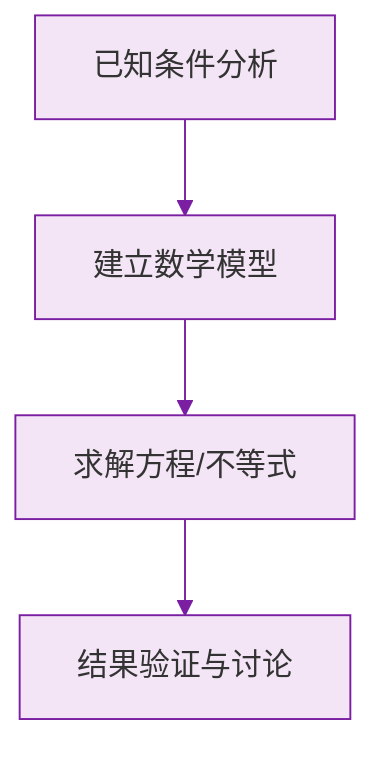

# 21.3 实际问题与一元二次方程

## 解题基本步骤

用一元二次方程解决实际问题的一般步骤（"审、设、列、解、验、答"）：

1. **审**：审清题意，找出已知量、未知量及等量关系；
2. **设**：设未知数（直接设或间接设）；
3. **列**：根据等量关系列出方程；
4. **解**：解方程；
5. **验**：检验根是否符合实际意义（舍去不合题意的根）；
6. **答**：写出答案。

## 常见题型与模型

### 1. 传播问题

设每轮传播中一人传染 $x$ 人，经过两轮传播后共有：
$$(1+x)^2 \text{ 人患病}$$

### 2. 增长率（下降率）问题

设平均增长率为 $x$，基数为 $a$，经过两次增长后为 $b$：
$$a(1+x)^2=b$$
平均下降率则为 $a(1-x)^2=b$。

### 3. 面积问题

常见"边框、甬道"模型：矩形场地长 $a$、宽 $b$，修建宽为 $x$ 的道路，常用**平移法**将道路移到边缘，剩余面积为：
$$(a-x)(b-x)$$

### 4. 利润问题

$$\text{总利润}=\text{单件利润}\times\text{销售量}$$
涨价 $x$ 元时销量减少，降价 $x$ 元时销量增加，需根据题意建立关系式。

### 5. 握手 / 比赛 / 送礼问题

- 单循环（握手）：$\dfrac{n(n-1)}{2}=m$；
- 双循环（互送礼物）：$n(n-1)=m$。

## 例题解析

**例 1**（传播）：有一人患了流感，经过两轮传染后共有 $121$ 人患流感，求每轮传染中平均一人传染几人。

设每轮传染 $x$ 人，则 $(1+x)^2=121$，解得 $x=10$ 或 $x=-12$（舍去）。
**答**：每轮平均一人传染 $10$ 人。

**例 2**（增长率）：某厂一月份产量 $500$ 台，三月份产量 $720$ 台，求月平均增长率。

设增长率为 $x$，则 $500(1+x)^2=720$，即 $(1+x)^2=1.44$，$1+x=\pm 1.2$，
解得 $x=0.2$ 或 $x=-2.2$（舍去）。**答**：月平均增长率为 $20\%$。

**例 3**（面积）：矩形空地长 $32$ m、宽 $20$ m，要在其中修同样宽的两条互相垂直的道路，使剩余面积为 $540\ \text{m}^2$，求路宽。

设路宽为 $x$ m，平移得 $(32-x)(20-x)=540$，整理得 $x^2-52x+100=0$，
解得 $x=2$ 或 $x=50$（舍去，超过宽度）。**答**：路宽为 $2$ m。

**例 4**（利润）：某商品进价 $40$ 元，售价 $60$ 元时每天可售 $300$ 件；售价每涨 $1$ 元，销量减少 $10$ 件。要使每天利润为 $6080$ 元，售价应定为多少？

设涨价 $x$ 元，则 $(20+x)(300-10x)=6080$，整理得 $x^2-10x+8=0$……结合"薄利多销"等条件取舍根。

## 易错点

- 解出的根必须**检验实际意义**：负数、超出范围的根要舍去。
- 传播问题中，第二轮传染的基数是 $(1+x)$ 人，不是 $1$ 人。
- 增长率问题中"增长到"与"增长了"含义不同。
- 道路面积问题中两条路的**重叠部分**易被重复计算，平移法可避免。

## 自测题

1. 某种细菌一个可分裂为 $x$ 个，两轮分裂后共 $64$ 个，则 $x=$____。
2. 某商品原价 $100$ 元，连续两次降价后为 $81$ 元，平均降价率为____。
3. 参加一次聚会的每两人都握手一次，共握手 $28$ 次，则参会人数为____。
4. 长 $10$ m、宽 $8$ m 的矩形花圃四周镶宽度相同的边框，边框面积为 $40\ \text{m}^2$，设边框宽 $x$ m，可列方程____。

本节的方程工具来自 [[21.1 一元二次方程]] 与 [[21.2 解一元二次方程]]，最值类应用问题将在 [[22.3 实际问题与二次函数]] 中进一步学习。

### 数学几何与函数分析

<svg xmlns="http://www.w3.org/2000/svg" viewBox="0 0 300 200" style="background-color: #f3e5f5; border: 1px solid #7b1fa2; border-radius: 8px;">
  <line x1="20" y1="180" x2="280" y2="180" stroke="#7b1fa2" stroke-width="2" />
  <line x1="50" y1="20" x2="50" y2="180" stroke="#7b1fa2" stroke-width="2" />
  <path d="M50,180 Q150,20 280,180" fill="none" stroke="#9c27b0" stroke-width="3" />
  <text x="260" y="195" fill="#7b1fa2" font-size="12">X轴</text>
  <text x="10" y="30" fill="#7b1fa2" font-size="12">Y轴</text>
  <text x="140" y="100" fill="#7b1fa2" font-size="14">抛物线图示</text>
</svg>

