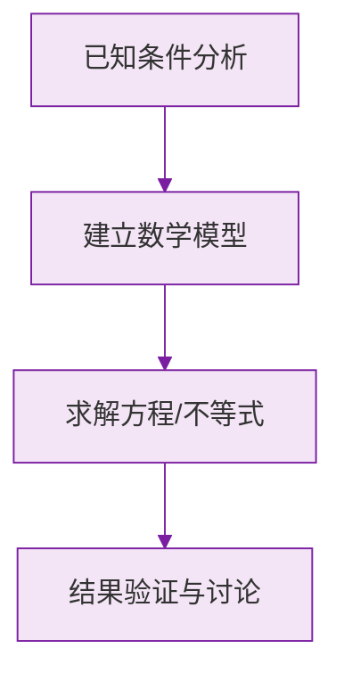

# 22.2 二次函数与一元二次方程

## 核心联系

二次函数 $y=ax^2+bx+c$ 的图象与 $x$ 轴交点的**横坐标**，就是一元二次方程
$$ax^2+bx+c=0$$
的实数根。令 $y=0$ 即得该方程。

## 交点个数与判别式

设 $\Delta=b^2-4ac$：

| 判别式 | 与 $x$ 轴交点 | 方程的根 |
| --- | --- | --- |
| $\Delta>0$ | 两个交点 | 两个不相等的实数根 |
| $\Delta=0$ | 一个交点（顶点在 $x$ 轴上） | 两个相等的实数根 |
| $\Delta<0$ | 没有交点 | 无实数根 |

## 利用图象解不等式

以 $a>0$、$\Delta>0$、两根 $x_1<x_2$ 为例：
- $ax^2+bx+c>0$ 的解集：$x<x_1$ 或 $x>x_2$（图象在 $x$ 轴上方的部分）；
- $ax^2+bx+c<0$ 的解集：$x_1<x<x_2$（图象在 $x$ 轴下方的部分）。

## 图象法求方程的近似解

画出抛物线，观察其与 $x$ 轴交点的横坐标，通过取值逐步逼近，可求方程的近似解。也可以将方程 $ax^2+bx+c=k$ 的解看作抛物线 $y=ax^2+bx+c$ 与直线 $y=k$ 交点的横坐标。

## 例题解析

**例 1**：求抛物线 $y=x^2-2x-3$ 与 $x$ 轴的交点坐标。

令 $y=0$：$x^2-2x-3=0$，因式分解 $(x-3)(x+1)=0$，得 $x_1=3$，$x_2=-1$。
交点为 $(3,0)$ 和 $(-1,0)$。

**例 2**：已知抛物线 $y=x^2-4x+m$ 与 $x$ 轴只有一个交点，求 $m$。

由 $\Delta=16-4m=0$，得 $m=4$。

**例 3**：抛物线 $y=x^2-2x-3$ 的图象上，当 $y<0$ 时 $x$ 的取值范围是？

由例 1 知与 $x$ 轴交于 $x=-1$ 和 $x=3$，开口向上，图象在 $x$ 轴下方的部分对应
$$-1<x<3$$

**例 4**：若抛物线 $y=ax^2+bx+c\ (a\neq 0)$ 经过 $(-2,0)$ 和 $(4,0)$，求方程 $ax^2+bx+c=0$ 的解及对称轴。

方程的解即交点横坐标：$x_1=-2$，$x_2=4$；对称轴为两交点的中点：$x=\dfrac{-2+4}{2}=1$。

## 易错点

- "与 $x$ 轴只有一个公共点"对二次函数意味着 $\Delta=0$；但若题目说"函数 $y=ax^2+bx+c$ 与 $x$ 轴只有一个交点"且未限定是二次函数，需讨论 $a=0$（一次函数）的情形。
- 交点的横坐标才是方程的根，写坐标时不要漏掉纵坐标 $0$。
- 利用图象解不等式时，务必先确认开口方向。
- 对称轴公式 $x=\dfrac{x_1+x_2}{2}$ 只在两交点存在时使用。

## 自测题

1. 抛物线 $y=x^2-5x+6$ 与 $x$ 轴的交点坐标为____。
2. 若抛物线 $y=x^2+2x+k$ 与 $x$ 轴没有交点，则 $k$ 的取值范围是____。
3. 已知抛物线与 $x$ 轴交于 $(1,0)$、$(5,0)$，则其对称轴为____。
4. 利用图象可知，不等式 $x^2-4<0$ 的解集为____。
5. 方程 $x^2-2x-1=0$ 的根可以看作抛物线 $y=x^2-2x$ 与直线____的交点横坐标。

方程解法详见 [[21.2 解一元二次方程]]，函数图象性质见 [[22.1 二次函数的图象和性质]]，综合应用见 [[22.3 实际问题与二次函数]]。

### 数学几何与函数分析

<svg xmlns="http://www.w3.org/2000/svg" viewBox="0 0 300 200" style="background-color: #f3e5f5; border: 1px solid #7b1fa2; border-radius: 8px;">
  <line x1="20" y1="180" x2="280" y2="180" stroke="#7b1fa2" stroke-width="2" />
  <line x1="50" y1="20" x2="50" y2="180" stroke="#7b1fa2" stroke-width="2" />
  <path d="M50,180 Q150,20 280,180" fill="none" stroke="#9c27b0" stroke-width="3" />
  <text x="260" y="195" fill="#7b1fa2" font-size="12">X轴</text>
  <text x="10" y="30" fill="#7b1fa2" font-size="12">Y轴</text>
  <text x="140" y="100" fill="#7b1fa2" font-size="14">抛物线图示</text>
</svg>

