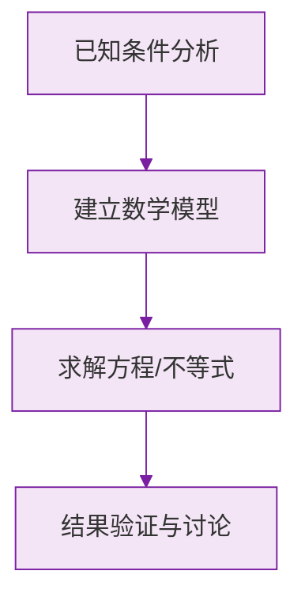

# 23.2 中心对称

## 概念定义

### 中心对称

把一个图形绕着某一点旋转 $180^\circ$，如果它能够与另一个图形重合，那么就说这两个图形关于这个点**对称**或**中心对称**，这个点叫做**对称中心**，旋转后重合的点是对应点（对称点）。

### 中心对称图形

把一个图形绕某一点旋转 $180^\circ$，如果旋转后的图形能与**原图形自身**重合，那么这个图形叫做**中心对称图形**，这个点是它的对称中心。

**区别**：中心对称是**两个图形**之间的关系；中心对称图形是**一个图形**自身的性质。

## 中心对称的性质

1. 对称中心是任意一对对应点连线的**中点**（对应点连线都经过对称中心，且被对称中心平分）；
2. 关于中心对称的两个图形是全等图形。

## 关于原点对称的点的坐标

点 $P(x,y)$ 关于**原点**对称的点为：
$$P'(-x,\ -y)$$

对比记忆：
- 关于 $x$ 轴对称：$(x,-y)$；
- 关于 $y$ 轴对称：$(-x,y)$；
- 关于原点对称：$(-x,-y)$。

## 常见的中心对称图形

平行四边形、矩形、菱形、正方形、圆、线段、正六边形等。

**注意**：等边三角形、等腰三角形、正五边形是轴对称图形但**不是**中心对称图形。

## 例题解析

**例 1**：点 $A(3,-5)$ 关于原点对称的点的坐标是？

由公式 $(x,y)\to(-x,-y)$，得 $A'(-3,5)$。

**例 2**：下列图形中既是轴对称图形又是中心对称图形的是（ ）
A. 等边三角形　B. 平行四边形　C. 矩形　D. 正五边形

**解析**：等边三角形、正五边形只是轴对称图形；一般平行四边形只是中心对称图形；矩形两者都是。选 **C**。

**例 3**：已知 $\triangle ABC$ 与 $\triangle A'B'C'$ 关于点 $O$ 中心对称，$AA'=8$，求 $OA$。

对称中心平分对应点连线，$OA=\dfrac{1}{2}AA'=4$。

**例 4**：直线 $y=2x+1$ 关于原点对称的直线的解析式是？

设对称直线上任一点 $(x,y)$，其关于原点的对称点 $(-x,-y)$ 在原直线上：
$-y=2(-x)+1$，即 $y=2x-1$。

## 易错点

- 混淆"中心对称"（两个图形的关系）与"中心对称图形"（一个图形的性质）。
- 误认为平行四边形是轴对称图形（一般平行四边形不是）。
- 关于原点对称时，横、纵坐标**都**要变号，易只变一个。
- 正偶数边形（正方形、正六边形）是中心对称图形，正奇数边形（正三角形、正五边形）不是。

## 自测题

1. 点 $(-2,7)$ 关于原点对称的点的坐标是____。
2. 在"线段、角、等边三角形、菱形、圆"中，是中心对称图形的有____。
3. 两个图形关于点 $O$ 中心对称，则对应点连线都经过____，且被其____。
4. 点 $P(a,3)$ 与点 $Q(2,b)$ 关于原点对称，则 $a=$____，$b=$____。
5. 中心对称图形绕对称中心旋转____度后能与自身重合。

中心对称是旋转角为 $180^\circ$ 的特殊旋转，基础见 [[23.1 图形的旋转]]；利用对称设计图案见 [[23.3 课题学习：图案设计]]；圆是典型的中心对称图形，详见 [[24.1 圆的有关性质]]。

### 数学几何与函数分析

<svg xmlns="http://www.w3.org/2000/svg" viewBox="0 0 300 200" style="background-color: #f3e5f5; border: 1px solid #7b1fa2; border-radius: 8px;">
  <line x1="20" y1="180" x2="280" y2="180" stroke="#7b1fa2" stroke-width="2" />
  <line x1="50" y1="20" x2="50" y2="180" stroke="#7b1fa2" stroke-width="2" />
  <path d="M50,180 Q150,20 280,180" fill="none" stroke="#9c27b0" stroke-width="3" />
  <text x="260" y="195" fill="#7b1fa2" font-size="12">X轴</text>
  <text x="10" y="30" fill="#7b1fa2" font-size="12">Y轴</text>
  <text x="140" y="100" fill="#7b1fa2" font-size="14">抛物线图示</text>
</svg>

