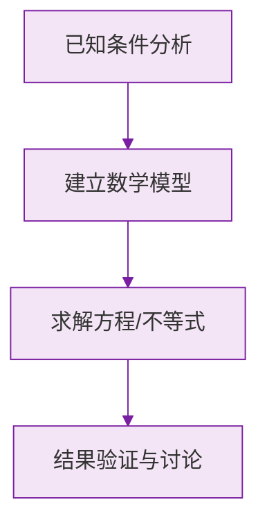

# 23.3 课题学习：图案设计

## 三种基本图形变换

图案设计的基础是三种全等变换，它们都**不改变图形的形状和大小**：

| 变换 | 要素 | 性质 |
| --- | --- | --- |
| 平移 | 方向、距离 | 对应点连线平行（或共线）且相等 |
| 轴对称（翻折） | 对称轴 | 对应点连线被对称轴垂直平分 |
| 旋转 | 旋转中心、方向、角度 | 对应点到旋转中心距离相等 |

三种变换可以**单独使用**，也可以**组合使用**，从一个基本图案出发生成丰富的图案。

## 图案设计的一般步骤

1. **确定基本图案**（基本单元）：选取一个简单图形，如三角形、花瓣、字母等；
2. **选择变换方式**：确定用平移、旋转、轴对称中的一种或几种；
3. **实施变换**：按一定规律重复变换，形成图案；
4. **修饰完善**：着色、加边框等。

## 分析图案的方法

拿到一个图案，思考：
- 基本图案是什么？
- 由基本图案经过怎样的变换（平移的方向与距离、旋转的中心与角度、对称轴的位置）得到整个图案？

同一个图案往往可以用**多种**变换方式解释。例如风车图案既可看作基本叶片绕中心依次旋转 $90^\circ$ 得到，也可以看作两次旋转 $180^\circ$ 的组合。

## 例题解析

**例 1**：一个图案由一个基本花瓣绕中心点依次旋转 $60^\circ$ 得到，共需旋转几次？整个图案有几个花瓣？

$360^\circ\div 60^\circ=6$，即图案由 $6$ 个花瓣组成，需将基本花瓣旋转 $5$ 次（加上原图共 $6$ 个）。

**例 2**：在方格纸中，将图形 $A$ 先向右平移 $4$ 格，再绕某点旋转 $180^\circ$ 得到图形 $B$。这一过程用到了哪些变换？

用到了**平移**和**旋转**（旋转 $180^\circ$ 也可视为中心对称）。

**例 3**：设计一个既是轴对称图形又是中心对称图形的图案，并说明设计方法。

例如：以正方形为基本框架，在四个角放置相同的花纹，使图案关于两条对角线（及两条中线）成轴对称，同时绕中心旋转 $180^\circ$ 能与自身重合。

**例 4**：判断：某图案沿一条直线折叠后两部分完全重合，该图案一定是中心对称图形吗？

不一定。折叠重合说明是**轴对称图形**，与中心对称图形是两个不同概念，如等边三角形是轴对称图形但不是中心对称图形。

## 易错点

- 描述旋转变换时漏掉旋转中心或旋转角度，描述平移时漏掉方向或距离。
- 误认为图案设计只能用一种变换，实际常常是多种变换的组合。
- 旋转 $n$ 次每次 $\alpha$ 度形成完整图案时，应满足 $n\alpha=360^\circ$。
- 混淆轴对称图形与中心对称图形的判定。

## 自测题

1. 三种基本的全等变换是________、________、________。
2. 一个图案由基本图形绕中心旋转 $45^\circ$ 依次得到，则整个图案由____个基本图形组成。
3. 平移变换的两个要素是____和____。
4. 请说出一个既是轴对称图形又是中心对称图形的常见图形：____。
5. 将一个三角形绕它的一个顶点旋转三次，每次 $90^\circ$，连同原图形共得到____个三角形。

旋转变换的性质见 [[23.1 图形的旋转]]，中心对称与对称图形见 [[23.2 中心对称]]，正多边形的旋转对称性见 [[24.3 正多边形和圆]]。

### 数学几何与函数分析

<svg xmlns="http://www.w3.org/2000/svg" viewBox="0 0 300 200" style="background-color: #f3e5f5; border: 1px solid #7b1fa2; border-radius: 8px;">
  <line x1="20" y1="180" x2="280" y2="180" stroke="#7b1fa2" stroke-width="2" />
  <line x1="50" y1="20" x2="50" y2="180" stroke="#7b1fa2" stroke-width="2" />
  <path d="M50,180 Q150,20 280,180" fill="none" stroke="#9c27b0" stroke-width="3" />
  <text x="260" y="195" fill="#7b1fa2" font-size="12">X轴</text>
  <text x="10" y="30" fill="#7b1fa2" font-size="12">Y轴</text>
  <text x="140" y="100" fill="#7b1fa2" font-size="14">抛物线图示</text>
</svg>

