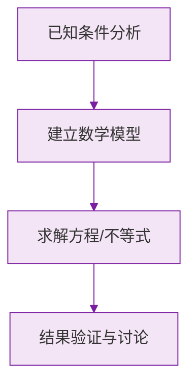

# 24.4 弧长和扇形面积

## 弧长公式

半径为 $R$ 的圆中，$n^\circ$ 的圆心角所对的弧长：
$$l=\frac{n\pi R}{180}$$

推导：圆周长为 $2\pi R$，$n^\circ$ 圆心角所对弧长占整个圆周的 $\dfrac{n}{360}$，即 $l=\dfrac{n}{360}\times 2\pi R=\dfrac{n\pi R}{180}$。

## 扇形面积公式

半径为 $R$、圆心角为 $n^\circ$ 的扇形面积：
$$S=\frac{n\pi R^2}{360}$$

用弧长表示（类比三角形面积公式）：
$$S=\frac{1}{2}lR$$

## 圆锥的侧面积与全面积

圆锥的侧面展开图是一个**扇形**：
- 扇形的半径 = 圆锥的**母线长** $l$；
- 扇形的弧长 = 圆锥**底面圆的周长** $2\pi r$。

由此得：
$$S_{\text{侧}}=\frac{1}{2}\times 2\pi r\times l=\pi rl$$
$$S_{\text{全}}=\pi rl+\pi r^2$$

母线、底面半径、高满足勾股定理：$l^2=r^2+h^2$。

侧面展开扇形的圆心角 $n$ 满足：$\dfrac{n\pi l}{180}=2\pi r$，即 $n=\dfrac{360r}{l}$。

## 例题解析

**例 1**：半径为 $6$、圆心角为 $60^\circ$ 的弧长和扇形面积。

$$l=\frac{60\pi\times 6}{180}=2\pi,\qquad S=\frac{60\pi\times 36}{360}=6\pi$$

**例 2**：一个扇形弧长为 $4\pi$，半径为 $6$，求扇形面积。

$$S=\frac{1}{2}lR=\frac{1}{2}\times 4\pi\times 6=12\pi$$

**例 3**：圆锥底面半径为 $3$，母线长为 $5$，求侧面积、全面积及侧面展开图的圆心角。

$S_{\text{侧}}=\pi\times 3\times 5=15\pi$；$S_{\text{全}}=15\pi+9\pi=24\pi$；
圆心角 $n=\dfrac{360\times 3}{5}=216^\circ$。

**例 4**（阴影面积）：正方形边长为 $2$，以一个顶点为圆心、边长为半径在正方形内作弧，求正方形内弧外的面积。

阴影面积 = 正方形面积 - 四分之一圆面积 $=4-\dfrac{90\pi\times 4}{360}=4-\pi$。

## 常用方法：不规则图形面积

- **和差法**：整体减部分；
- **割补法**：分割后重新拼接；
- **等积变形**：平移、旋转、对称转化为规则图形。

## 易错点

- 公式中的 $n$ 表示角的**度数**（不带单位参与计算），如 $60^\circ$ 时代入 $n=60$。
- 混淆弧长公式（分母 $180$）与扇形面积公式（分母 $360$）。
- 圆锥问题中区分**底面半径 $r$** 与**母线 $l$**：展开扇形的半径是母线，不是底面半径。
- 求"全面积"时漏加底面圆面积。

## 自测题

1. 半径为 $9$、圆心角为 $120^\circ$ 的弧长为____。
2. 弧长为 $3\pi$、半径为 $9$ 的扇形面积为____。
3. 圆锥底面半径为 $4$，高为 $3$，则母线长为____，侧面积为____。
4. 扇形面积为 $12\pi$，半径为 $6$，则圆心角为____度。
5. 圆锥侧面展开图是半圆，则母线长与底面半径的比为____。

圆的基本概念见 [[24.1 圆的有关性质]]，切线相关知识见 [[24.2 点和圆、直线和圆的位置关系]]，正多边形与圆的计算见 [[24.3 正多边形和圆]]。

### 数学几何与函数分析

<svg xmlns="http://www.w3.org/2000/svg" viewBox="0 0 300 200" style="background-color: #f3e5f5; border: 1px solid #7b1fa2; border-radius: 8px;">
  <line x1="20" y1="180" x2="280" y2="180" stroke="#7b1fa2" stroke-width="2" />
  <line x1="50" y1="20" x2="50" y2="180" stroke="#7b1fa2" stroke-width="2" />
  <path d="M50,180 Q150,20 280,180" fill="none" stroke="#9c27b0" stroke-width="3" />
  <text x="260" y="195" fill="#7b1fa2" font-size="12">X轴</text>
  <text x="10" y="30" fill="#7b1fa2" font-size="12">Y轴</text>
  <text x="140" y="100" fill="#7b1fa2" font-size="14">抛物线图示</text>
</svg>

