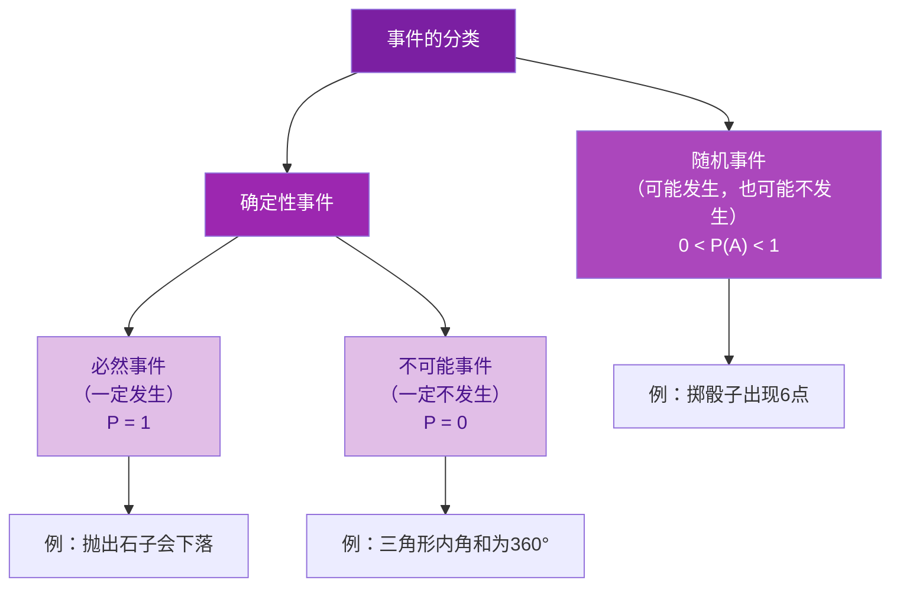

# 25.1 随机事件与概率

## 事件的分类

在一定条件下：

- **必然事件**：一定会发生的事件。如"抛出的石子会下落"。
- **不可能事件**：一定不会发生的事件。如"标准大气压下水加热到 $50^\circ\text{C}$ 沸腾"。
- **随机事件**：可能发生也可能不发生的事件。如"掷一枚骰子，向上一面是 $6$"。

必然事件和不可能事件统称为**确定性事件**。

## 概率的定义

一般地，对于一个随机事件 $A$，我们把刻画其发生可能性大小的数值，称为随机事件 $A$ 发生的**概率**，记为 $P(A)$。

## 古典概型（等可能事件）的概率

当一次试验满足：
1. 可能出现的结果只有**有限个**；
2. 各种结果出现的可能性**相等**；

事件 $A$ 的概率为：
$$P(A)=\frac{m}{n}$$
其中 $n$ 是所有等可能结果的总数，$m$ 是事件 $A$ 包含的结果数。

## 概率的取值范围

$$0\leq P(A)\leq 1$$

- 必然事件：$P=1$；
- 不可能事件：$P=0$；
- 随机事件：$0<P(A)<1$。

概率越接近 $1$，事件发生的可能性越大；越接近 $0$，可能性越小。

## 例题解析

**例 1**：判断下列事件的类型：
(1) 掷一枚硬币，正面朝上；(2) $367$ 人中至少有两人生日相同；(3) 任意画一个三角形，其内角和为 $360^\circ$。

**解析**：(1) 随机事件；(2) 必然事件（一年最多 $366$ 天，由抽屉原理必有重复）；(3) 不可能事件（三角形内角和恒为 $180^\circ$）。

**例 2**：掷一枚质地均匀的骰子，求：(1) 向上一面点数为 $3$ 的概率；(2) 点数为偶数的概率；(3) 点数小于 $7$ 的概率。

共 $6$ 种等可能结果。
(1) $P=\dfrac{1}{6}$；(2) 偶数有 $2,4,6$ 共 $3$ 种，$P=\dfrac{3}{6}=\dfrac{1}{2}$；(3) 必然事件，$P=1$。

**例 3**：袋中有 $3$ 个红球、$5$ 个白球，除颜色外完全相同。随机摸出一球，求摸到红球的概率。

$$P(\text{红球})=\frac{3}{3+5}=\frac{3}{8}$$

**例 4**：一个转盘被均分为 $8$ 个扇形，其中 $3$ 个涂红色，指针指向红色区域的概率是？

$$P=\frac{3}{8}$$

## 易错点

- "可能性大"不等于"一定发生"：概率为 $0.99$ 的事件也可能不发生。
- 使用公式 $P=\dfrac{m}{n}$ 的前提是**各结果等可能**，如"明天下雨与不下雨"不能直接说概率各为 $\dfrac{1}{2}$。
- 概率是理论值，与一次试验的实际结果无关：掷硬币前 $5$ 次都正面，第 $6$ 次正面的概率仍是 $\dfrac{1}{2}$。
- 区分"必然事件"与"概率很大的随机事件"。

## 自测题

1. 概率为 $1$ 的事件是____事件，概率为 $0$ 的事件是____事件。
2. 掷一枚均匀骰子，点数为 $5$ 的概率是____。
3. 袋中有 $4$ 个黄球、$6$ 个蓝球（仅颜色不同），摸到蓝球的概率是____。
4. 随机事件 $A$ 的概率 $P(A)$ 的取值范围是____。
5. "打开电视机，正在播放广告"属于____事件。

具体求概率的方法见 [[25.2 用列举法求概率]]，当结果不等可能或无法列举时的处理方法见 [[25.3 用频率估计概率]]。
