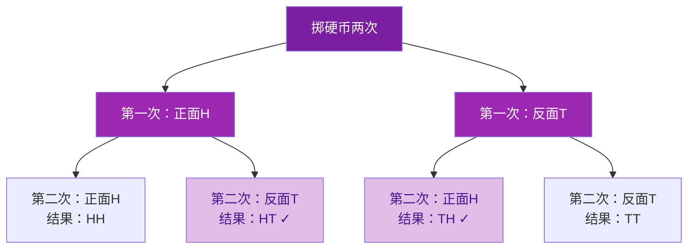

# 25.2 用列举法求概率

## 适用条件

当一次试验中：
1. 可能出现的结果为**有限个**；
2. 各种结果发生的可能性**相等**；

可以用列举法求概率：
$$P(A)=\frac{m}{n}$$
其中 $n$ 为所有等可能结果总数，$m$ 为事件 $A$ 包含的结果数。

## 三种列举方法

### 1. 直接列举法

试验只有**一步**且结果较少时，直接把所有结果一一列出。

### 2. 列表法

试验包含**两步**（或涉及两个因素）时，用表格列出所有可能结果，行、列分别表示两步的结果。

### 3. 画树状图法

试验包含**两步或更多步**时，用树状图逐层列出所有可能结果，条理清晰、不重不漏。

**选择建议**：一步→直接列举；两步→列表法或树状图；三步及以上→树状图。

> 树状图共4个等可能结果，恰好一次正面（✓）有2个，P = 2/4 = 1/2

## "放回"与"不放回"

- **放回**：第二次抽取时所有对象都还在，两次抽取相互独立；
- **不放回**：第二次抽取时少了第一次抽走的对象，结果总数减少。

列表或画树状图时务必先分清是否放回。

## 例题解析

**例 1**（列表法）：同时掷两枚质地均匀的骰子，求点数之和为 $7$ 的概率。

列 $6\times 6$ 表格，共 $36$ 种等可能结果，其中和为 $7$ 的有 $(1,6),(2,5),(3,4),(4,3),(5,2),(6,1)$ 共 $6$ 种：
$$P=\frac{6}{36}=\frac{1}{6}$$

**例 2**（树状图）：掷一枚均匀硬币两次，求"恰好一次正面朝上"的概率。

树状图列出：正正、正反、反正、反反，共 $4$ 种结果，恰好一次正面的有正反、反正 $2$ 种：
$$P=\frac{2}{4}=\frac{1}{2}$$

**例 3**（不放回）：袋中有 $2$ 个红球、$1$ 个白球，不放回地摸两次，求两次都摸到红球的概率。

记红球为 $R_1$、$R_2$，白球为 $W$。树状图共 $3\times 2=6$ 种结果，两次都是红球的有 $(R_1,R_2)$、$(R_2,R_1)$ 共 $2$ 种：
$$P=\frac{2}{6}=\frac{1}{3}$$

**例 4**：从 $1$、$2$、$3$ 三个数字中随机抽取两个（不放回）组成两位数，求这个两位数是偶数的概率。

所有两位数：$12,13,21,23,31,32$ 共 $6$ 个，偶数有 $12,32$ 共 $2$ 个，$P=\dfrac{2}{6}=\dfrac{1}{3}$。

## 易错点

- 相同物品要**编号区分**：$2$ 个红球应记为 $R_1$、$R_2$，否则结果总数会数错。
- "同时掷两枚骰子"中 $(1,2)$ 与 $(2,1)$ 是**不同**结果，不能合并。
- 混淆"放回"与"不放回"，导致结果总数出错。
- 树状图漏画分支或列表漏格，导致 $n$ 统计不全。

## 自测题

1. 掷两枚均匀硬币，两枚都是正面的概率是____。
2. 同时掷两枚骰子，点数之和为 $12$ 的概率是____。
3. 袋中有 $1$ 红 $1$ 白 $1$ 黄三个球，先摸一个记下颜色后**放回**，再摸一个，两次颜色相同的概率是____。
4. 三步试验适合用____法列举所有结果。
5. 从 $2$、$3$、$4$ 中不放回取两数，和为奇数的概率是____。

概率的基本概念见 [[25.1 随机事件与概率]]，当结果不等可能或难以列举时用 [[25.3 用频率估计概率]]。
