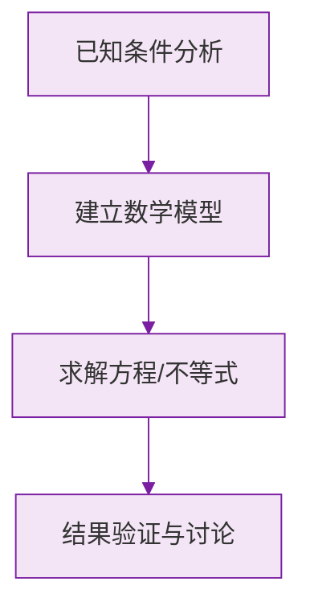

# 25.3 用频率估计概率

## 频率与概率

### 频率

在 $n$ 次重复试验中，事件 $A$ 发生了 $m$ 次，则比值
$$\frac{m}{n}$$
叫做事件 $A$ 发生的**频率**。

### 频率稳定性（大数法则思想）

在大量重复试验中，随机事件发生的频率会**稳定**在某个常数附近。这个常数就可以作为该事件概率的估计值：
$$P(A)\approx \frac{m}{n} \quad (n\text{ 很大时})$$

## 频率与概率的区别和联系

| | 频率 | 概率 |
| --- | --- | --- |
| 性质 | 试验值，随试验变化 | 理论值，客观确定的常数 |
| 获得方式 | 通过试验统计 | 理论计算或频率估计 |
| 联系 | 试验次数很大时，频率稳定于概率 | 概率是频率的稳定值 |

## 适用情形

当试验结果**不是有限个**，或各种结果**不等可能**（无法用列举法）时，用频率估计概率。例如：
- 抛图钉，钉尖朝上的概率；
- 种子的发芽率；
- 某射击运动员命中靶心的概率；
- 产品的合格率。

## 典型应用：估计数量

**捕捞—标记—再捕捞**模型：池塘中先捞出 $a$ 条鱼做标记后放回，再捞出 $b$ 条鱼，其中有标记的有 $c$ 条，则估计池塘中鱼的总数 $N$ 满足：
$$\frac{a}{N}=\frac{c}{b} \implies N=\frac{ab}{c}$$

## 例题解析

**例 1**：某种子在相同条件下发芽试验结果如下：

| 试验粒数 | 100 | 500 | 1000 | 5000 |
| --- | --- | --- | --- | --- |
| 发芽频率 | 0.94 | 0.952 | 0.948 | 0.950 |

估计该种子的发芽概率。

频率稳定在 $0.95$ 附近，估计发芽概率约为 $0.95$。

**例 2**：抛一枚图钉 $1000$ 次，钉尖朝上 $620$ 次，估计钉尖朝上的概率。

$$P\approx\frac{620}{1000}=0.62$$
（注意：图钉两种结果不等可能，不能用列举法算出 $\dfrac{1}{2}$。）

**例 3**：为估计湖中鱼的数量，先捕捞 $200$ 条做标记后放回，一段时间后再捕捞 $100$ 条，发现有标记的鱼 $4$ 条。估计湖中鱼的总数。

设总数为 $N$：$\dfrac{200}{N}=\dfrac{4}{100}$，解得 $N=5000$ 条。

**例 4**：某工厂抽检产品 $500$ 件，合格 $485$ 件。从该厂产品中任取一件，是合格品的概率约为？

$$P\approx\frac{485}{500}=0.97$$

## 易错点

- 频率不等于概率：频率是试验结果，会随试验变化；只有**大量**试验的频率才能作为概率的估计值。
- 试验次数太少时，频率波动大，不能用来估计概率。
- "概率为 $0.95$"不代表 $100$ 粒种子中一定恰好发芽 $95$ 粒。
- 能用列举法（等可能、有限结果）时优先用列举法求精确概率，不必做试验估计。

## 自测题

1. 在 $n$ 次试验中事件 $A$ 发生 $m$ 次，则 $A$ 发生的频率为____。
2. 大量重复试验中，频率会稳定在____附近，可用它估计概率。
3. 掷一枚均匀硬币 $10$ 次，出现 $7$ 次正面，能否说正面朝上的概率是 $0.7$？____（能/不能）。
4. 某批灯泡抽检 $1000$ 只，次品 $20$ 只，从中任取一只是次品的概率约为____。
5. 先捕 $100$ 条鱼标记放回，再捕 $50$ 条中有标记 $5$ 条，估计鱼总数为____条。

概率的基本概念见 [[25.1 随机事件与概率]]，等可能条件下求精确概率的方法见 [[25.2 用列举法求概率]]。

### 数学几何与函数分析

<svg xmlns="http://www.w3.org/2000/svg" viewBox="0 0 300 200" style="background-color: #f3e5f5; border: 1px solid #7b1fa2; border-radius: 8px;">
  <line x1="20" y1="180" x2="280" y2="180" stroke="#7b1fa2" stroke-width="2" />
  <line x1="50" y1="20" x2="50" y2="180" stroke="#7b1fa2" stroke-width="2" />
  <path d="M50,180 Q150,20 280,180" fill="none" stroke="#9c27b0" stroke-width="3" />
  <text x="260" y="195" fill="#7b1fa2" font-size="12">X轴</text>
  <text x="10" y="30" fill="#7b1fa2" font-size="12">Y轴</text>
  <text x="140" y="100" fill="#7b1fa2" font-size="14">抛物线图示</text>
</svg>

