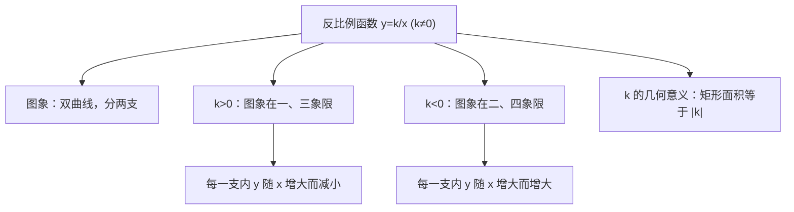

# 26.1 反比例函数

## 概念定义

一般地，形如 $y=\dfrac{k}{x}$（$k$ 为常数，$k\neq 0$）的函数，叫做**反比例函数**，其中 $x$ 是自变量，取值范围是 $x\neq 0$。

反比例函数的三种等价形式：
$$y=\dfrac{k}{x} \quad\Longleftrightarrow\quad xy=k \quad\Longleftrightarrow\quad y=kx^{-1} \quad (k\neq 0)$$

## 知识梳理

## 图象与性质表

| 项目 | $k>0$ | $k<0$ |
| --- | --- | --- |
| 图象位置 | 第一、三象限 | 第二、四象限 |
| 增减性 | 每一支内 $y$ 随 $x$ 增大而减小 | 每一支内 $y$ 随 $x$ 增大而增大 |
| 对称性 | 关于原点中心对称 | 关于原点中心对称 |

**$k$ 的几何意义**：双曲线上任一点 $P(x,y)$ 向两坐标轴作垂线，所围矩形面积为 $|xy|=|k|$；$P$、原点与一个垂足围成的三角形面积为 $\dfrac{|k|}{2}$。

## 典型例题

**例 1**：已知反比例函数图象经过点 $(2,-3)$，求解析式，并判断点 $(-1,6)$ 是否在图象上。

**解**：设 $y=\dfrac{k}{x}$，代入得 $k=2\times(-3)=-6$，所以 $y=-\dfrac{6}{x}$。
当 $x=-1$ 时 $y=6$，故点 $(-1,6)$ 在图象上。

**例 2**：点 $A(x_1,y_1)$、$B(x_2,y_2)$ 在 $y=\dfrac{4}{x}$ 图象上，且 $x_1<0<x_2$，比较 $y_1$ 与 $y_2$。

**解**：$k=4>0$，图象在一、三象限。$x_1<0$ 时 $A$ 在第三象限，$y_1<0$；$x_2>0$ 时 $B$ 在第一象限，$y_2>0$。所以 $y_1<y_2$。

## 易错点

- 叙述增减性必须加"**在每一支内**"，两点不在同一支时不能直接用增减性比较大小。
- $k\neq 0$、$x\neq 0$，图象与坐标轴**永不相交**，只能无限接近。
- 待定系数法中 $k=xy$，注意符号，别丢负号。
- 形如 $y=x^{m}$ 判断反比例函数时，指数必须为 $-1$ 且系数不为 $0$。

## 背记要点

1. 定义式 $y=\dfrac{k}{x}$（$k\neq 0$），等价于 $xy=k$。
2. 口诀："$k$ 正一三减，$k$ 负二四增"（每支内）。
3. 几何意义：矩形面积 $=|k|$，直角三角形面积 $=\dfrac{|k|}{2}$。

## 自测题

1. 若 $y=(m-2)x^{m^2-5}$ 是反比例函数，则 $m=$____。
2. 反比例函数 $y=-\dfrac{3}{x}$ 的图象位于第____象限。
3. 双曲线上一点向两轴作垂线所围矩形面积为 $5$，图象在二、四象限，则 $k=$____。
4. 已知 $y=\dfrac{6}{x}$，当 $2\le x\le 3$ 时，$y$ 的取值范围是____。

## 相关知识点

本节的实际应用见 [[26.2 实际问题与反比例函数]]；与抛物线图象性质对比可参考 [[22.1 二次函数的图象和性质]]。
