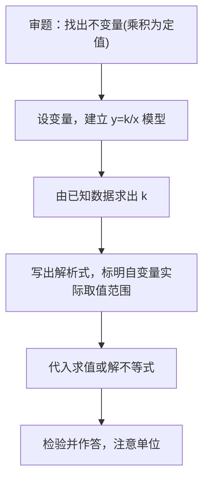

# 26.2 实际问题与反比例函数

## 核心概念

当两个变量的**乘积为定值**时，这两个变量成反比例关系，可用反比例函数 $y=\dfrac{k}{x}$（$k\neq 0$）建模。

常见模型：

| 模型 | 关系式 | 反比例形式 |
| --- | --- | --- |
| 面积一定 | $S=xy$ | $y=\dfrac{S}{x}$ |
| 路程一定 | $s=vt$ | $v=\dfrac{s}{t}$ |
| 工作总量一定 | $W=pt$ | $t=\dfrac{W}{p}$ |
| 压力一定 | $F=pS$ | $p=\dfrac{F}{S}$ |
| 电压一定 | $U=IR$ | $I=\dfrac{U}{R}$ |
| 杠杆平衡 | $Fl=F_0l_0$ | $F=\dfrac{F_0 l_0}{l}$ |

## 解题流程

## 知识梳理

1. **建模关键**：确定"哪个量不变"，不变量就是 $k$。
2. **自变量范围**：实际问题中自变量一般取正值，有时还有上、下限。
3. **与不等式结合**：如"至少""不超过"类问题，利用反比例函数的增减性把等式结论过渡到不等式结论。

## 典型例题

**例 1**：码头有货物 $1200$ 吨，设平均每天卸货 $x$ 吨，卸完需 $y$ 天。
(1) 写出 $y$ 与 $x$ 的函数关系式；(2) 若要求不超过 $5$ 天卸完，每天至少卸货多少吨？

**解**：(1) 由 $xy=1200$，得 $y=\dfrac{1200}{x}$（$x>0$）。
(2) 令 $y\le 5$，即 $\dfrac{1200}{x}\le 5$。因 $x>0$，得 $x\ge 240$。故每天至少卸货 $240$ 吨。

**例 2**：在温度不变时，气体压强 $p$（kPa）与体积 $V$（mL）成反比例。当 $V=100$ 时，$p=60$。求 $p$ 关于 $V$ 的解析式；当 $V=50$ 时，压强是多少？

**解**：设 $p=\dfrac{k}{V}$，代入得 $k=100\times 60=6000$，所以 $p=\dfrac{6000}{V}$（$V>0$）。
当 $V=50$ 时，$p=\dfrac{6000}{50}=120$（kPa）。

## 易错点

- 忘记标注**自变量的实际取值范围**（如 $x>0$）。
- 由 $\dfrac{k}{x}\le a$ 解不等式时，要利用 $x>0$ 才能直接乘 $x$，避免不等号方向出错。
- "至少、至多"方向搞反：天数减少意味着每天卸货量**增大**。
- 单位不统一（如 kPa 与 Pa、小时与分钟）导致 $k$ 求错。

## 背记要点

1. 乘积一定 $\Rightarrow$ 反比例：$xy=k$。
2. 实际问题三步走：**建模—求 $k$—应用**。
3. 结论必须带单位、符合实际意义。

## 自测题

1. 某村耕地 $10^6\ \text{m}^2$，人均耕地面积 $y$ 与人口数 $x$ 的关系式为____。
2. 一定电压下 $I=\dfrac{U}{R}$，若 $U=220$ V，$R=44\ \Omega$ 时电流为____ A。
3. 运输 $240$ 吨货物，若每天运 $x$ 吨，需 $y$ 天，则 $y=$____；要求 $4$ 天内运完，每天至少运____吨。
4. 杠杆平衡中阻力与阻力臂乘积为 $600$，动力臂为 $l$，则动力 $F=$____。

## 相关知识点

函数基础见 [[26.1 反比例函数]]；类似的函数建模思想可参考 [[22.1 二次函数的图象和性质]]。
