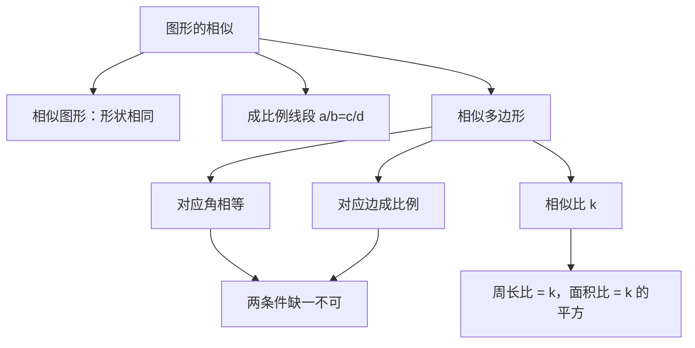

# 27.1 图形的相似

## 概念定义

**相似图形**：形状相同的图形叫做相似图形。相似图形的大小可以相同，也可以不同；全等是相似的特殊情况（相似比为 $1$）。

**相似多边形**：两个边数相同的多边形，如果对应角相等、对应边成比例，那么这两个多边形叫做**相似多边形**。相似多边形对应边的比叫做**相似比**。

**成比例线段**：四条线段 $a,b,c,d$ 中，如果 $\dfrac{a}{b}=\dfrac{c}{d}$，那么这四条线段叫做成比例线段。

## 知识梳理

## 重要性质与公式

1. 比例的基本性质：若 $\dfrac{a}{b}=\dfrac{c}{d}$，则 $ad=bc$（$b,d\neq 0$）。
2. 相似多边形的性质：对应角相等，对应边成比例。
3. 相似多边形**周长比等于相似比**，**面积比等于相似比的平方**：
$$\dfrac{C_1}{C_2}=k, \qquad \dfrac{S_1}{S_2}=k^2$$
4. 判定相似多边形必须**同时满足**"对应角相等"与"对应边成比例"。

## 典型例题

**例 1**：判断：(1) 所有正方形都相似；(2) 所有矩形都相似；(3) 所有菱形都相似。

**解**：(1) 正确。正方形四角都是 $90^\circ$，四边相等，对应边必成比例。
(2) 错误。矩形四角都相等，但长宽之比不一定相同，对应边不一定成比例。
(3) 错误。菱形四边成比例，但各角不一定对应相等。

**例 2**：两个相似多边形的相似比为 $2:3$，小多边形的周长为 $12$，面积为 $8$，求大多边形的周长和面积。

**解**：周长比等于相似比，故大多边形周长 $=12\times\dfrac{3}{2}=18$。
面积比等于相似比的平方 $\left(\dfrac{2}{3}\right)^2=\dfrac{4}{9}$，故大多边形面积 $=8\times\dfrac{9}{4}=18$。

## 易错点

- 只满足"对应角相等"或只满足"对应边成比例"**不能**判定多边形相似（矩形、菱形是典型反例）。
- 面积比是相似比的**平方**，不要和周长比混淆。
- 相似比有顺序：甲比乙为 $k$，则乙比甲为 $\dfrac{1}{k}$。
- 成比例线段有单位时需统一单位再算比值。

## 背记要点

1. 相似多边形定义两条件：角相等 + 边成比例。
2. 周长比 $=k$，面积比 $=k^2$。
3. 全等 $\Leftrightarrow$ 相似比为 $1$ 的相似。

## 自测题

1. 若线段 $a=2$，$b=3$，$c=4$，且 $a,b,c,d$ 成比例，则 $d=$____。
2. 两个相似五边形的相似比为 $1:4$，面积比为____。
3. "所有等边三角形都相似"这一说法是否正确？____。
4. 相似多边形对应边之比为 $3:5$，若大多边形周长为 $40$，则小多边形周长为____。

## 相关知识点

相似三角形的判定与性质见 [[27.2 相似三角形]]；相似的特殊变换见 [[27.3 位似]]。
