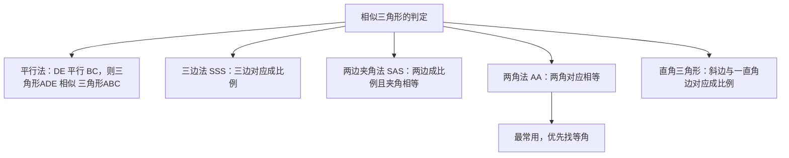

# 27.2 相似三角形

## 概念定义

对应角相等、对应边成比例的两个三角形叫做**相似三角形**，记作 $\triangle ABC \sim \triangle A'B'C'$，对应边的比叫**相似比**。

**平行线分线段成比例**：两条直线被一组平行线所截，所得的对应线段成比例。推论：平行于三角形一边的直线截其他两边（或延长线），所得对应线段成比例。

## 判定方法

## 性质汇总

设相似比为 $k$，则：

| 项目 | 结论 |
| --- | --- |
| 对应角 | 相等 |
| 对应边 | 成比例，比值为 $k$ |
| 对应高、中线、角平分线之比 | 均为 $k$ |
| 周长比 | $k$ |
| 面积比 | $k^2$ |

$$\dfrac{S_{\triangle ABC}}{S_{\triangle A'B'C'}}=k^2$$

## 常见基本图形

- **A 字型**：$DE\parallel BC$ 截 $\triangle ABC$。
- **8 字型（X 型）**：对顶角 + 一组平行线。
- **母子型（射影型）**：直角三角形斜边上的高分出的两个小三角形与原三角形两两相似。
- **一线三等角型**：同一直线上三个相等的角产生相似。

## 典型例题

**例 1**：如图，$DE\parallel BC$，$AD=4$，$DB=2$，$DE=6$，求 $BC$。

**解**：由 $DE\parallel BC$ 得 $\triangle ADE\sim\triangle ABC$，$\dfrac{DE}{BC}=\dfrac{AD}{AB}=\dfrac{4}{6}=\dfrac{2}{3}$，所以 $BC=6\times\dfrac{3}{2}=9$。

**例 2**：$\triangle ABC\sim\triangle DEF$，相似比为 $2:3$，$\triangle ABC$ 的面积为 $8$，求 $\triangle DEF$ 的面积。

**解**：面积比 $=\left(\dfrac{2}{3}\right)^2=\dfrac{4}{9}$，故 $S_{\triangle DEF}=8\times\dfrac{9}{4}=18$。

## 易错点

- 相似的**对应关系**要看字母顺序，$\triangle ABC\sim\triangle DEF$ 中 $AB$ 对应 $DE$。
- "两边成比例且**夹角**相等"才能判定相似，非夹角不行。
- 面积比是相似比的平方，反过来由面积比求相似比要**开方**。
- 图形中一个三角形可能与多个三角形相似，注意分类讨论（如动点问题）。

## 背记要点

1. 判定四法：平行、AA、SAS、SSS，首选 **AA**。
2. 性质：角等、边比 $k$、周长比 $k$、面积比 $k^2$。
3. 四大基本图形：A 字、8 字、母子、一线三等角。

## 自测题

1. $\triangle ABC\sim\triangle A'B'C'$，$AB=6$，$A'B'=9$，则相似比为____，面积比为____。
2. 判定两个三角形相似最常用的方法是____（写名称）。
3. $DE\parallel BC$，$\dfrac{AD}{AB}=\dfrac{2}{5}$，$BC=10$，则 $DE=$____。
4. 两个相似三角形面积比为 $9:16$，则对应中线之比为____。

## 相关知识点

相似的基础概念见 [[27.1 图形的相似]]；特殊的相似变换见 [[27.3 位似]]；相似与三角函数结合的计算见 [[28.1 锐角三角函数]]。
