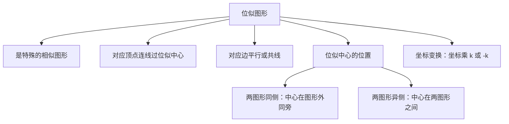

# 27.3 位似

## 概念定义

两个多边形不仅**相似**，而且**对应顶点的连线相交于一点**，对应边互相平行（或在同一直线上），这样的两个图形叫做**位似图形**，这个点叫做**位似中心**，相似比又称**位似比**。

位似是一种特殊的相似：位似 $\Rightarrow$ 相似，但相似不一定位似。

## 知识梳理

## 性质与坐标规律

1. 位似图形上任意一对对应点到**位似中心的距离之比等于位似比** $|k|$。
2. 对应线段平行（或共线），对应线段之比等于位似比。
3. **坐标规律**：以原点 $O$ 为位似中心，位似比为 $k$，若原图形上点为 $(x,y)$，则位似图形对应点为
$$(kx,\,ky) \quad \text{或} \quad (-kx,\,-ky)$$
（后者表示位似图形在原点另一侧）。
4. 利用位似可以将图形**放大或缩小**：$|k|>1$ 放大，$0<|k|<1$ 缩小。

## 位似作图步骤

1. 确定位似中心 $O$；
2. 连接 $O$ 与各顶点（或延长）；
3. 按位似比在连线（或延长线、反向延长线）上截取对应点；
4. 顺次连接各对应点。

## 典型例题

**例 1**：以原点为位似中心，把 $\triangle ABC$ 放大为原来的 $2$ 倍，若 $A(2,3)$，写出对应点 $A'$ 的坐标。

**解**：位似比 $k=2$，对应点为 $(2\times 2, 2\times 3)=(4,6)$，或在原点另一侧为 $(-4,-6)$。

**例 2**：两个位似图形的位似比为 $1:3$，位似中心到小图形上一点 $P$ 的距离为 $4$，求中心到对应点 $P'$ 的距离。

**解**：对应点到位似中心的距离之比等于位似比，故 $OP'=4\times 3=12$。

## 易错点

- 以原点为位似中心作图时，答案往往有**两个**（同侧与异侧），坐标 $(kx,ky)$ 与 $(-kx,-ky)$ 容易漏掉一个。
- 位似必须满足"对应顶点连线共点 + 对应边平行"，两个相似图形随意摆放**不是**位似。
- 位似比与面积比混淆：面积比仍是位似比的平方。
- 位似中心可以在图形外部、内部或边上，不要默认在外部。

## 背记要点

1. 位似 $=$ 相似 $+$ 对应点连线共点。
2. 原点位似坐标口诀：**横纵坐标同乘 $k$（或同乘 $-k$）**。
3. 距离比 $=$ 位似比，面积比 $=$ 位似比的平方。

## 自测题

1. 位似图形一定是相似图形吗？相似图形一定是位似图形吗？____。
2. 以原点为位似中心、位似比为 $\dfrac{1}{2}$，点 $(6,-4)$ 的对应点坐标为____或____。
3. 两位似图形位似比为 $2:5$，则面积比为____。
4. 位似中心到点 $A$ 的距离为 $3$，位似比为 $1:2$（$A$ 在原图上），则中心到对应点 $A'$ 的距离为____。

## 相关知识点

相似的一般概念见 [[27.1 图形的相似]]；相似三角形的判定与性质见 [[27.2 相似三角形]]。
