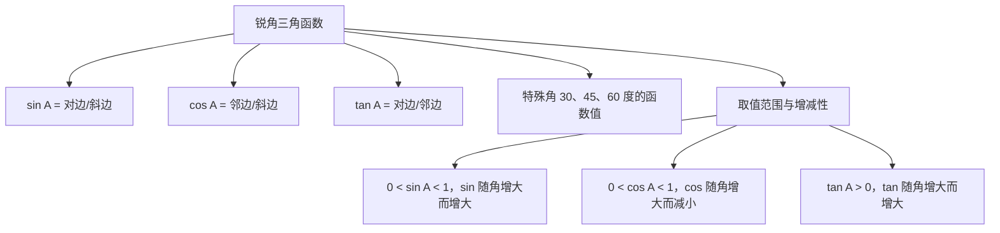

# 28.1 锐角三角函数

## 概念定义

在 $\text{Rt}\triangle ABC$ 中，$\angle C=90^\circ$，$\angle A$ 的对边为 $a$，$\angle B$ 的对边为 $b$，斜边为 $c$，则：

$$\sin A=\dfrac{a}{c} \quad (\text{对边比斜边}), \qquad \cos A=\dfrac{b}{c} \quad (\text{邻边比斜边}), \qquad \tan A=\dfrac{a}{b} \quad (\text{对边比邻边})$$

锐角 $A$ 的正弦、余弦、正切统称为 $\angle A$ 的**锐角三角函数**。锐角一旦确定，比值随之唯一确定，与三角形大小无关（相似原理）。

## 知识结构

## 特殊角三角函数值表（必背）

| 角 $\alpha$ | $30^\circ$ | $45^\circ$ | $60^\circ$ |
| --- | --- | --- | --- |
| $\sin\alpha$ | $\dfrac{1}{2}$ | $\dfrac{\sqrt{2}}{2}$ | $\dfrac{\sqrt{3}}{2}$ |
| $\cos\alpha$ | $\dfrac{\sqrt{3}}{2}$ | $\dfrac{\sqrt{2}}{2}$ | $\dfrac{1}{2}$ |
| $\tan\alpha$ | $\dfrac{\sqrt{3}}{3}$ | $1$ | $\sqrt{3}$ |

记忆技巧：$\sin$ 值为 $\dfrac{\sqrt{1}}{2},\dfrac{\sqrt{2}}{2},\dfrac{\sqrt{3}}{2}$ 递增；$\cos$ 恰好倒序。

## 常用关系式

$$\sin^2 A+\cos^2 A=1, \qquad \tan A=\dfrac{\sin A}{\cos A}, \qquad \sin A=\cos(90^\circ-A)$$

## 典型例题

**例 1**：在 $\text{Rt}\triangle ABC$ 中，$\angle C=90^\circ$，$a=3$，$c=5$，求 $\angle A$ 的三个三角函数值。

**解**：由勾股定理 $b=\sqrt{5^2-3^2}=4$。
所以 $\sin A=\dfrac{3}{5}$，$\cos A=\dfrac{4}{5}$，$\tan A=\dfrac{3}{4}$。

**例 2**：计算 $2\sin 30^\circ+\sqrt{3}\tan 60^\circ-\cos 45^\circ\cdot\sqrt{2}$。

**解**：原式 $=2\times\dfrac{1}{2}+\sqrt{3}\times\sqrt{3}-\dfrac{\sqrt{2}}{2}\times\sqrt{2}=1+3-1=3$。

## 易错点

- 三角函数是**比值**，没有单位；必须在**直角三角形**中定义，先确认直角。
- "对边、邻边"是相对于所求角而言的，换角要换边，$\sin A$ 与 $\sin B$ 的对边不同。
- $\sin 30^\circ=\dfrac{1}{2}$ 与 $\cos 30^\circ=\dfrac{\sqrt{3}}{2}$ 易互相记混，用"正弦递增"检验。
- 已知一个函数值求另两个时，可设参数（如 $\sin A=\dfrac{3}{5}$ 设 $a=3k$，$c=5k$），别忘了勾股定理。

## 背记要点

1. 定义口诀：**正弦对比斜，余弦邻比斜，正切对比邻**。
2. 特殊角函数值表（上表）必须秒答。
3. 平方关系 $\sin^2A+\cos^2A=1$，商数关系 $\tan A=\dfrac{\sin A}{\cos A}$。

## 自测题

1. $\sin 60^\circ=$____，$\tan 45^\circ=$____，$\cos 30^\circ=$____。
2. 在 $\text{Rt}\triangle ABC$ 中，$\angle C=90^\circ$，$\tan A=\dfrac{1}{2}$，则 $\sin A=$____。
3. 若 $\alpha$ 为锐角且 $\cos\alpha=\dfrac{\sqrt{2}}{2}$，则 $\alpha=$____。
4. 计算：$\sin^2 45^\circ+\cos^2 45^\circ=$____。

## 相关知识点

三角函数的应用见 [[28.2 解直角三角形及其应用]]；其定义的理论依据是 [[27.2 相似三角形]]。
