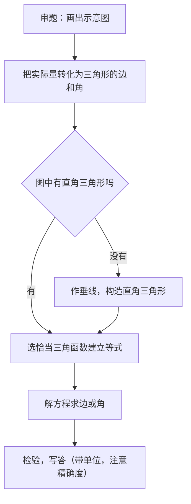

# 28.2 解直角三角形及其应用

## 概念定义

在直角三角形中，由**已知元素求出其余未知元素**的过程，叫做**解直角三角形**。$\text{Rt}\triangle ABC$（$\angle C=90^\circ$）共有五个元素：两锐角 $\angle A,\angle B$，三条边 $a,b,c$。

**可解条件**：除直角外，已知两个元素（其中**至少有一条边**）即可解直角三角形。

## 关系式汇总

1. 角的关系：$\angle A+\angle B=90^\circ$；
2. 边的关系（勾股定理）：$a^2+b^2=c^2$；
3. 边角关系：$\sin A=\dfrac{a}{c}$，$\cos A=\dfrac{b}{c}$，$\tan A=\dfrac{a}{b}$。

## 应用中的三个重要概念

| 概念 | 含义 |
| --- | --- |
| 仰角、俯角 | 视线与**水平线**的夹角，向上为仰角，向下为俯角 |
| 坡度（坡比）$i$ | 坡面的铅直高度 $h$ 与水平宽度 $l$ 之比，$i=\dfrac{h}{l}=\tan\alpha$（$\alpha$ 为坡角） |
| 方向角 | 从正北或正南方向起算的水平角，如"北偏东 $30^\circ$" |

## 解题流程

## 典型例题

**例 1**：在 $\text{Rt}\triangle ABC$ 中，$\angle C=90^\circ$，$\angle A=30^\circ$，$c=8$，解这个直角三角形。

**解**：$\angle B=90^\circ-30^\circ=60^\circ$；$a=c\sin A=8\times\dfrac{1}{2}=4$；$b=c\cos A=8\times\dfrac{\sqrt{3}}{2}=4\sqrt{3}$。

**例 2**：在地面 $C$ 处测得塔顶 $A$ 的仰角为 $60^\circ$，向后退 $20$ m 到 $D$ 处，测得仰角为 $30^\circ$，求塔高 $AB$（塔底为 $B$，$B,C,D$ 共线）。

**解**：设 $AB=h$。在 $\text{Rt}\triangle ABC$ 中 $BC=\dfrac{h}{\tan 60^\circ}=\dfrac{h}{\sqrt{3}}$；在 $\text{Rt}\triangle ABD$ 中 $BD=\dfrac{h}{\tan 30^\circ}=\sqrt{3}h$。
由 $BD-BC=20$ 得 $\sqrt{3}h-\dfrac{h}{\sqrt{3}}=20$，即 $\dfrac{2\sqrt{3}}{3}h=20$，解得 $h=10\sqrt{3}$（m）。

## 易错点

- 仰角、俯角都是与**水平线**的夹角，不是与铅垂线的夹角。
- 坡度 $i=\tan\alpha$ 是**比值**（常写成 $1:\sqrt{3}$ 形式），不是角度。
- 图中没有现成直角三角形时，务必**作高**构造，别硬套公式。
- 结果按题目要求取近似值（如精确到 $0.1$ m），中间过程尽量保留根号。

## 背记要点

1. 解直角三角形口诀：**有斜用弦（sin、cos），无斜用切（tan）**。
2. 双直角三角形"退测仰角"模型：公共直角边设为 $h$，用两段水平距离之差列方程。
3. 三概念：仰俯角看水平线，坡度是正切，方向角从南北起算。

## 自测题

1. $\text{Rt}\triangle ABC$ 中 $\angle C=90^\circ$，$a=5$，$b=5$，则 $\angle A=$____，$c=$____。
2. 某坡面坡度 $i=1:\sqrt{3}$，则坡角为____。
3. 在 $A$ 处测得树顶仰角为 $45^\circ$，$A$ 距树底 $10$ m（同一水平面），则树高____ m。
4. "南偏西 $40^\circ$"方向与正南方向的夹角是____度。

## 相关知识点

三角函数定义与特殊角函数值见 [[28.1 锐角三角函数]]；构造相似求边长的方法见 [[27.2 相似三角形]]。
