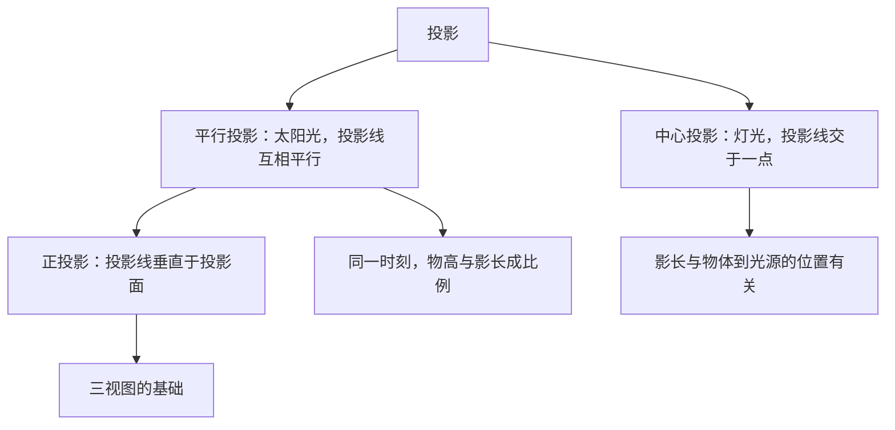

# 29.1 投影

## 概念定义

用光线照射物体，在某个平面（地面、墙壁等）上得到的影子叫做物体的**投影**，照射光线叫做**投影线**，投影所在的平面叫做**投影面**。

**平行投影**：由平行光线（如太阳光）形成的投影。
**中心投影**：由同一点（如灯泡）发出的光线形成的投影。
**正投影**：投影线**垂直于**投影面产生的投影（平行投影的特例）。

## 知识梳理

## 平行投影与中心投影的比较

| 项目 | 平行投影 | 中心投影 |
| --- | --- | --- |
| 光源 | 太阳光等平行光线 | 灯泡、路灯等点光源 |
| 投影线 | 互相平行 | 交于光源一点 |
| 影子规律 | 同一时刻物高与影长**成比例** | 距光源越近，影子相对越短小（同高物体） |
| 典型应用 | 测旗杆高、日晷 | 皮影戏、路灯下的影子 |

## 正投影的规律

一条线段（或平面图形）相对投影面的位置不同，正投影不同：

1. 线段**平行**于投影面：正投影是与它**等长**的线段；
2. 线段**倾斜**于投影面：正投影是比它**短**的线段；
3. 线段**垂直**于投影面：正投影是一个**点**。

平面图形平行于投影面时，正投影与原图形**全等**；垂直时正投影为一条线段。

## 典型例题

**例 1**：同一时刻，身高 $1.6$ m 的小明影长 $2$ m，旗杆影长 $15$ m，求旗杆高度。

**解**：太阳光是平行投影，物高与影长成比例：$\dfrac{h}{15}=\dfrac{1.6}{2}$，解得 $h=12$（m）。

**例 2**：一个正方形硬纸片与投影面平行，其正投影是什么图形？若逐渐倾斜（不垂直），正投影如何变化？

**解**：平行时正投影是与原正方形**全等**的正方形；倾斜后正投影变为**矩形（面积变小）**；垂直于投影面时退化为一条线段。

## 易错点

- 判断平行投影还是中心投影：看影子方向——平行投影中各影子**互相平行**，中心投影中影子（反向）延长线**交于一点**（光源）。
- "物高与影长成比例"**仅适用于同一时刻的平行投影**，路灯下不成立。
- 正投影要求投影线垂直于投影面，不要与一般平行投影混为一谈。
- 物体的正投影大小与它到投影面的距离**无关**（平行光），与摆放角度有关。

## 背记要点

1. 三种投影：平行（太阳）、中心（灯光）、正投影（垂直照射）。
2. 平行投影口诀：**同一时刻，高影成比**。
3. 线段正投影三情形：平行等长、倾斜变短、垂直成点。

## 自测题

1. 皮影戏中的影子属于____投影；用太阳光测楼高属于____投影。
2. 同一时刻，$1.5$ m 的标杆影长 $1$ m，某树影长 $6$ m，树高____ m。
3. 一条线段的正投影是一个点，则该线段与投影面的位置关系是____。
4. 路灯下两人身高相同，离灯近的人影子较____（长/短）。

## 相关知识点

正投影是学习 [[29.2 三视图]] 的基础；由视图还原实物的实践见 [[29.3 课题学习：制作立体模型]]。
