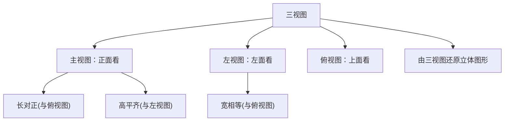

# 29.2 三视图

## 概念定义

把物体分别向三个互相垂直的投影面作**正投影**，所得的三个图形合称**三视图**：

- **主视图**：从**正面**看得到的视图（正投影到正立投影面）；
- **左视图**：从**左面**看得到的视图（侧立投影面）；
- **俯视图**：从**上面**看得到的视图（水平投影面）。

## 三视图的位置与规律

主视图在左上，左视图在主视图**右边**，俯视图在主视图**下边**。三条对应规律：

$$\text{主、俯视图——长对正；主、左视图——高平齐；左、俯视图——宽相等}$$

画图时：看得见的轮廓线画**实线**，看不见的轮廓线画**虚线**。

## 常见几何体的三视图

| 几何体 | 主视图 | 左视图 | 俯视图 |
| --- | --- | --- | --- |
| 正方体 | 正方形 | 正方形 | 正方形 |
| 圆柱（直立） | 矩形 | 矩形 | 圆 |
| 圆锥（直立） | 等腰三角形 | 等腰三角形 | 圆（带圆心点） |
| 球 | 圆 | 圆 | 圆 |

## 典型例题

**例 1**：由若干个相同小正方体搭成的几何体，俯视图中各位置数字表示该处小正方体的个数：第一行 $2,1$，第二行 $1,1$。画出主视图需要判断每一**列**的最大层数。

**解**：主视图看列方向的最高层数：第一列 $\max(2,1)=2$，第二列 $\max(1,1)=1$，故主视图为左列 $2$ 层、右列 $1$ 层的图形。

**例 2**：一个几何体的主视图和左视图都是矩形，俯视图是圆，这个几何体是什么？若俯视图是三角形呢？

**解**：主、左视图为矩形，说明是柱体；俯视图是圆，故为**圆柱**。若俯视图是三角形，则为**三棱柱**（水平放置底面朝上下）。

## 易错点

- 左视图是**从左往右看**，其"宽"对应物体的前后方向，与俯视图的宽相等，方向易画反。
- 看不见的棱要画**虚线**，漏画虚线是常见失分点。
- 由三视图确定小正方体个数时，答案可能**不唯一**，注意求最多、最少个数：俯视图定位置，主、左视图定层数。
- 圆锥俯视图是"圆 + 中心一个点"（顶点的投影），不要漏点。

## 背记要点

1. 口诀：**长对正、高平齐、宽相等**。
2. 位置：主视图左上、左视图在右、俯视图在下。
3. 实虚线规则：可见实线、不可见虚线。
4. 还原技巧：俯视图给"底盘"，主视图给列高，左视图给行高。

## 自测题

1. 从上面看物体得到的视图叫____视图。
2. 圆锥的主视图是____，俯视图是____。
3. 主视图与俯视图满足的关系是____（口诀）。
4. 某几何体三视图都是圆，则它是____。
5. 由 $5$ 个小正方体搭成的几何体，俯视图有 $4$ 个方格，则一定有一格上摞了____个正方体。

## 相关知识点

三视图基于正投影原理，见 [[29.1 投影]]；由三视图动手还原立体图形见 [[29.3 课题学习：制作立体模型]]。
