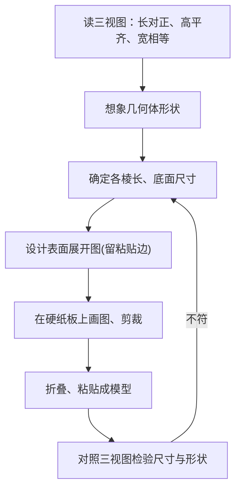

# 29.3 课题学习：制作立体模型

## 核心概念

本课题综合运用**三视图**与**展开图**知识，经历"由视图想象实物—设计展开图—动手制作模型—对照检验"的完整过程，体会平面图形与立体图形的相互转化。

两条主线：

1. **视图 → 实物**：由三视图想象并确定几何体的形状与尺寸；
2. **展开图 → 实物**：画出几何体的表面展开图，剪裁折叠成立体模型。

## 制作流程

## 知识梳理

1. **由视图定形体**：主视图、左视图定高度与前后宽度，俯视图定底面形状。
2. **常见展开图**：
   - 正方体有 $11$ 种展开图（"一四一""二三一""二二二""三三"型）；
   - 圆柱侧面展开为矩形，宽为高 $h$，长为底面周长 $2\pi r$；
   - 圆锥侧面展开为扇形，半径为母线 $l$，弧长为 $2\pi r$。
3. **尺寸计算公式**：
$$\text{圆柱侧面积}=2\pi rh, \qquad \text{圆锥侧面积}=\pi r l, \qquad \text{圆锥展开扇形圆心角 } \theta=\dfrac{r}{l}\times 360^\circ$$

## 典型例题

**例 1**：某几何体三视图：主视图与左视图均为边长 $4$ 的正方形，俯视图为边长 $4$ 的正方形。判断几何体并画展开图要点。

**解**：三视图均为全等正方形，该几何体是**棱长为 $4$ 的正方体**。展开图可选"一四一"型：中间一行 $4$ 个正方形，上、下各接 $1$ 个，共 $6$ 个边长为 $4$ 的正方形。

**例 2**：制作一个底面半径 $r=3$ cm、母线 $l=9$ cm 的圆锥模型，求侧面展开扇形的圆心角和所需纸片侧面积。

**解**：圆心角 $\theta=\dfrac{r}{l}\times 360^\circ=\dfrac{3}{9}\times 360^\circ=120^\circ$。
侧面积 $S=\pi rl=\pi\times 3\times 9=27\pi\ (\text{cm}^2)$，再加底面圆 $\pi r^2=9\pi\ (\text{cm}^2)$。

## 易错点

- 只看一个视图就下结论：**同一个视图可对应多种几何体**，必须三个视图综合判断。
- 圆锥展开扇形的半径是**母线长** $l$，不是底面半径 $r$。
- 展开图折叠时忘记留粘贴边，或相邻面尺寸不吻合。
- 由视图还原组合体时漏掉凹进去的部分（注意视图中的虚线）。

## 背记要点

1. 制作四步：**想形体—算尺寸—画展开—折检验**。
2. 圆锥三公式：$S_{侧}=\pi rl$，弧长 $=2\pi r$，圆心角 $\theta=\dfrac{r}{l}\times 360^\circ$。
3. 正方体展开图共 $11$ 种，"田"字形与"凹"字形**不能**折成正方体。

## 自测题

1. 正方体的表面展开图共有____种。
2. 圆柱底面半径 $2$，高 $5$，其侧面展开矩形的长为____，宽为____。
3. 圆锥母线长 $6$，侧面展开扇形圆心角为 $180^\circ$，则底面半径为____。
4. 由三视图还原几何体时，俯视图主要确定几何体的____。

## 相关知识点

投影原理见 [[29.1 投影]]；视图知识见 [[29.2 三视图]]；圆锥侧面展开涉及的弧长与扇形知识可回顾 [[24.1 圆的有关性质]]。
