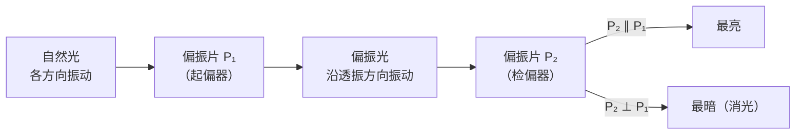

# 6 光的偏振 激光

## 概念定义

**自然光**：包含**各个方向**振动（垂直于传播方向、且各方向振幅相同）的光，普通光源直接发出的光都是自然光。

**偏振光**：只沿某个**特定方向**振动的光。自然光通过**偏振片**（起偏器）后成为偏振光。

**偏振现象证明光是横波**：只有横波才有偏振；纵波各方向"表现相同"，无偏振。

**激光**：受激辐射产生的**相干光**，特点：① 相干性好（频率、相位一致）；② 平行度好（方向性强）；③ 亮度高（能量集中）。

## 知识梳理

| 项目 | 内容 |
| --- | --- |
| 起偏与检偏 | 第一块偏振片起偏；第二块（检偏器）旋转时透射光强变化 |
| 两偏振片关系 | 透振方向平行→最亮；垂直→最暗（消光） |
| 自然偏振光来源 | 反射光、散射光都是（部分）偏振光 |
| 偏振应用 | 偏振太阳镜/摄影镜（滤反射眩光）、液晶显示、立体电影 |
| 激光应用 | 光纤通信、激光测距（雷达）、激光切割/焊接、医疗手术、全息照相、读取光盘 |

**偏振片旋转实验**：自然光照射单块偏振片，旋转它透射强度**不变**；两块偏振片时，旋转检偏器光强在最亮与最暗间**周期变化**——说明透过起偏器的光已是偏振光。

## 偏振示意（mermaid）

## 典型例题

**例 1**：让自然光依次通过两块偏振片，缓慢转动第二块一周，观察到什么？说明了什么？

**解**：透射光强经历"亮→暗→亮→暗→亮"两个循环：两透振方向平行时最亮，垂直时最暗。这说明通过第一块偏振片后的光只沿一个方向振动（偏振光），进而证明**光是横波**。

**例 2**：钓鱼者戴偏振太阳镜能减弱水面反光。解释原因。

**解**：水面**反射光是（部分）偏振光**，其振动方向以水平方向为主；偏振镜片的透振方向做成**竖直**方向，可大幅滤除水平振动的反射眩光，而来自水下景物的透射光受影响较小，故能看清水中情况。

## 易错点

- 偏振证明光是**横波**，干涉和衍射只证明光是波（不区分横纵）。
- 单块偏振片旋转时透射自然光强度不变（恒为约一半），只有加检偏器才能看到强度变化。
- 反射光、散射光是偏振（部分偏振）光，蓝天光即散射偏振光。
- 激光的本领源于**相干性好、平行度高、亮度大**三特性，答题需对应场景选特性（测距→平行度；通信→相干性；切割→亮度）。

## 背记要点

1. 自然光各向振动；偏振光单向振动；偏振片起偏、检偏。
2. 两偏振片透振方向平行最亮、垂直消光；偏振证明光是横波。
3. 激光三特性：相干性好、平行度好、亮度高。
4. 高考视角：偏振应用（太阳镜、液晶屏）与激光应用的特性对应是情境题采分点。

## 自测题

1. 偏振现象说明光是____波。
2. 两偏振片透振方向互相垂直时，透射光强____。
3. 激光的三个特点：____、____、____。
4. 判断：自然光通过一块偏振片后仍是自然光。（　）

## 相关知识点

光的波动性证据链见 [[3 光的干涉]] 与 [[5 光的衍射]]；激光在光纤中的传输原理见 [[2 全反射]]；折射率基础见 [[1 光的折射]]。
