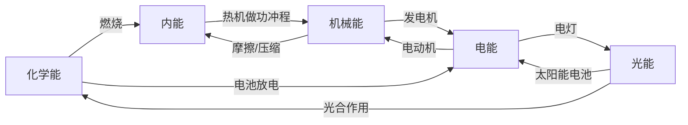

# 第3节 能量的转化和守恒

## 核心概念表

| 概念 | 含义 | 说明 |
|---|---|---|
| 能量转化 | 能量由一种形式变为另一种形式 | 如电能→光能 |
| 能量转移 | 能量从一个物体传到另一个物体 | 形式不变 |
| 能量守恒定律 | 能量既不会凭空消灭，也不会凭空产生 | 自然界最普遍的定律之一 |

## 知识梳理

自然界存在多种形式的能量：机械能（动能、势能）、内能、电能、光能、化学能、核能等。各种形式的能量在一定条件下可以相互转化。

**能量守恒定律**：能量既不会凭空消灭，也不会凭空产生，它只会从一种形式转化为其他形式，或者从一个物体转移到另一个物体，而在转化和转移的过程中，能量的总量保持不变。

能量守恒定律是自然界最普遍、最重要的基本定律之一，一切涉及能量的过程都遵守它。**永动机不可能制成**，因为它违背能量守恒定律。

能量的转化和转移具有**方向性**：热量自发地从高温物体传向低温物体，而不能自发地反向进行；机械能可以全部转化为内能，但内能不能全部转化为机械能而不引起其他变化。因此虽然能量守恒，仍需节约能源。

## 常见能量转化实例

| 现象/装置 | 能量转化 |
|---|---|
| 摩擦生热 | 机械能→内能 |
| 内燃机做功冲程 | 内能→机械能 |
| 电动机 | 电能→机械能 |
| 发电机 | 机械能→电能 |
| 电灯发光 | 电能→光能（和内能） |
| 燃料燃烧 | 化学能→内能 |
| 光合作用 | 光能→化学能 |
| 电池放电 | 化学能→电能 |
| 太阳能电池 | 光能→电能 |

## 能量转化关系图

**乒乓球反弹变低——机械能转化为内能**：

<svg viewBox="0 0 420 160" width="420" xmlns="http://www.w3.org/2000/svg" style="max-width:100%">
  <line x1="20" y1="140" x2="400" y2="140" stroke="#334155" stroke-width="3"/>
  <circle cx="60" cy="35" r="9" fill="#f97316" stroke="#334155"/>
  <path d="M60 48 Q95 140 130 140" stroke="#94a3b8" stroke-width="1.5" fill="none" stroke-dasharray="4 3"/>
  <circle cx="165" cy="70" r="9" fill="#f97316" stroke="#334155"/>
  <path d="M130 140 Q165 60 200 140" stroke="#94a3b8" stroke-width="1.5" fill="none" stroke-dasharray="4 3"/>
  <circle cx="255" cy="100" r="9" fill="#f97316" stroke="#334155"/>
  <path d="M200 140 Q255 92 310 140" stroke="#94a3b8" stroke-width="1.5" fill="none" stroke-dasharray="4 3"/>
  <circle cx="340" cy="122" r="9" fill="#f97316" stroke="#334155"/>
  <path d="M310 140 Q340 115 370 140" stroke="#94a3b8" stroke-width="1.5" fill="none" stroke-dasharray="4 3"/>
  <text x="210" y="25" text-anchor="middle" font-size="12" fill="#334155">反弹高度逐次降低：机械能↓ 内能↑ 总能量守恒</text>
</svg>

## 实验要点

- 来回迅速摩擦双手：机械能转化为内能，手变热。
- 黑色塑料袋装水放阳光下：光能转化为内能，水温升高。
- 乒乓球从高处落下反弹高度逐渐降低：部分机械能转化为内能，机械能不守恒但总能量守恒。

## 背记要点

1. 能量守恒定律内容：不会凭空消灭、不会凭空产生，只能转化或转移，总量不变。
2. 判断能量转化的方法：先找"消耗"的能，再找"得到"的能。
3. 永动机违背能量守恒定律，不可能制成。
4. 能量的转化和转移有方向性，所以要节约能源。
5. 机械能减少≠能量消失，通常转化为内能。

## 自测题

1. 从斜面滚下的小球速度越来越快，同时表面略微变热，发生了哪些能量转化？
2. "既然能量守恒，为什么还要节约能源？"请用能量转化的方向性回答。
3. 指出手机充电和使用时各发生什么能量转化。

## 相关知识点

[[第1节 热机]] [[第2节 热机的效率]] [[第2节 内能]]
