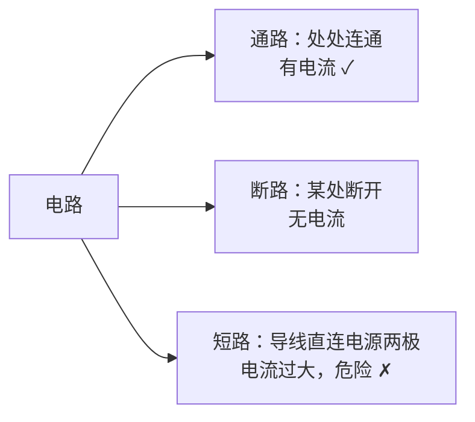

# 第2节 电流和电路

## 核心概念表

| 概念 | 含义 | 说明 |
|---|---|---|
| 电流 | 电荷的定向移动形成电流 | 符号 I |
| 电流方向 | 规定正电荷定向移动的方向为电流方向 | 与电子移动方向相反 |
| 电路 | 由电源、用电器、开关、导线组成的电流路径 | 四要素 |
| 电路图 | 用规定符号表示电路连接的图 | 要求规范 |

## 知识梳理

**电流的形成**：电荷的定向移动形成电流。金属导体中定向移动的是自由电子（负电荷），电流方向与电子定向移动方向**相反**。在电源外部，电流方向从电源正极经用电器流向负极。

**电路的组成**：
- 电源：提供电能的装置（干电池、蓄电池、发电机），把其他形式的能转化为电能；
- 用电器：消耗电能的装置，把电能转化为其他形式的能；
- 开关：控制电路的通断；
- 导线：连接电路，输送电能。

**电路的三种状态**：
- **通路**：处处连通的电路，电路中有电流；
- **断路（开路）**：某处断开的电路，电路中无电流；
- **短路**：不经过用电器，导线直接把电源两极连接起来（电源短路），电流过大会烧坏电源甚至引起火灾，**绝对不允许**。

**常见电路元件符号**：电池（长线为正极）、开关、灯泡、电动机、电流表、电压表、电阻等，画电路图时要用统一规定的符号，导线要横平竖直，元件不要画在拐角处。

## 电路图

**最简单的电路**（电源+开关+灯泡，标出电流方向）：

<svg viewBox="0 0 440 210" width="440" xmlns="http://www.w3.org/2000/svg" style="max-width:100%">
  <defs><marker id="ari" markerWidth="8" markerHeight="8" refX="6" refY="3" orient="auto"><path d="M0,0 L6,3 L0,6 z" fill="#dc2626"/></marker></defs>
  <path d="M100 40 h240 v130 h-240 z" fill="none" stroke="#334155" stroke-width="2"/>
  <line x1="188" y1="26" x2="188" y2="54" stroke="#334155" stroke-width="3"/>
  <line x1="212" y1="33" x2="212" y2="47" stroke="#334155" stroke-width="5"/>
  <rect x="185" y="30" width="30" height="20" fill="#fff" stroke="none"/>
  <line x1="185" y1="25" x2="185" y2="55" stroke="#334155" stroke-width="2.5"/>
  <line x1="200" y1="33" x2="200" y2="47" stroke="#334155" stroke-width="4.5"/>
  <text x="178" y="18" font-size="12" fill="#334155">+</text>
  <text x="206" y="18" font-size="12" fill="#334155">−</text>
  <circle cx="220" cy="170" r="16" fill="#fff" stroke="#334155" stroke-width="2"/>
  <line x1="209" y1="159" x2="231" y2="181" stroke="#334155" stroke-width="2"/>
  <line x1="231" y1="159" x2="209" y2="181" stroke="#334155" stroke-width="2"/>
  <text x="220" y="200" text-anchor="middle" font-size="12" fill="#334155">灯泡 L</text>
  <circle cx="330" cy="105" r="3.5" fill="#334155"/>
  <circle cx="352" cy="105" r="3.5" fill="#334155"/>
  <line x1="330" y1="105" x2="352" y2="88" stroke="#334155" stroke-width="2.5"/>
  <rect x="322" y="82" width="40" height="30" fill="#fff" opacity="0"/>
  <text x="372" y="100" font-size="12" fill="#334155">开关 S</text>
  <path d="M130 40 h30" stroke="#dc2626" stroke-width="2.5" marker-end="url(#ari)"/>
  <text x="145" y="30" text-anchor="middle" font-size="12" fill="#dc2626">I</text>
  <text x="60" y="110" text-anchor="middle" font-size="11" fill="#64748b">电源外部：</text>
  <text x="60" y="126" text-anchor="middle" font-size="11" fill="#64748b">正极→负极</text>
</svg>

注：图中电流 $I$ 沿"电源正极→开关→灯泡→负极"方向流动（此图仅示意；实物连接顺序可任意，电流方向不变）。

**电路的三种状态**：

## 对比分析

| 电路状态 | 特征 | 有无电流 |
|---|---|---|
| 通路 | 处处连通 | 有 |
| 断路 | 某处断开 | 无 |
| 短路 | 导线直接接电源两极 | 电流过大（危险） |

## 实验要点

- 连接电路前开关必须**断开**；
- 任何情况下都不能把电池两极直接用导线连接；
- 检查电路无误后再闭合开关试触。

## 背记要点

1. 电流是电荷的定向移动形成的；正电荷移动方向为电流方向。
2. 金属中导电的是自由电子，电子移动方向与电流方向相反。
3. 电路四要素：电源、用电器、开关、导线。
4. 通路有电流，断路无电流，短路很危险。
5. 电源外部电流方向：正极→用电器→负极。
6. 电路图规范：符号统一、横平竖直、元件不画在拐角。

## 自测题

1. 金属导线中电流方向与自由电子定向移动方向有什么关系？
2. 手电筒电路由哪些部分组成？各起什么作用？
3. 什么是短路？为什么短路很危险？

## 相关知识点

[[第1节 两种电荷]] [[第3节 串联和并联]] [[第4节 电流的测量]]
