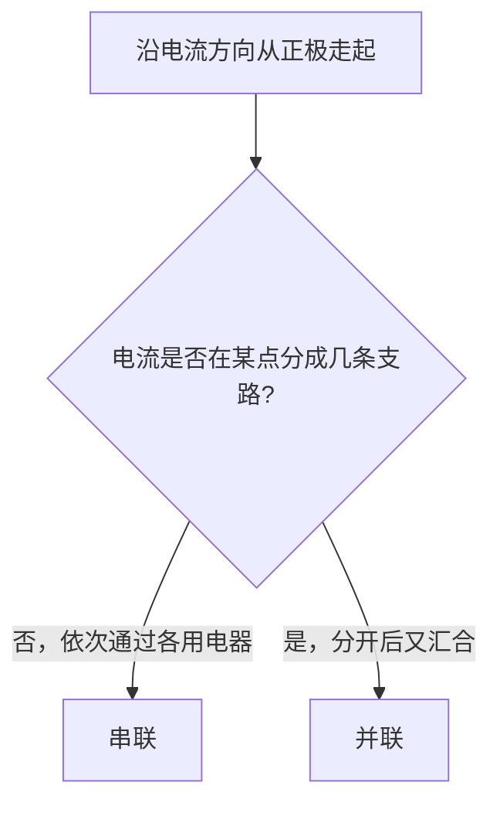

# 第3节 串联和并联

## 核心概念表

| 概念 | 含义 | 特点 |
|---|---|---|
| 串联 | 用电器逐个顺次连接 | 电流只有一条路径 |
| 并联 | 用电器并列连接在两点之间 | 电流有多条路径 |
| 干路 | 并联电路中电流汇合的公共部分 | 干路开关控制全部 |
| 支路 | 并联电路中分开的各条路径 | 支路开关控制本支路 |

## 知识梳理

**串联电路特点**：
- 电流路径只有**一条**；
- 各用电器**相互影响**，一个断开，其余都不工作；
- 开关位置任意，控制**整个电路**，作用与位置无关。

**并联电路特点**：
- 电流路径有**多条**；
- 各支路用电器**互不影响**，一条支路断开，其他支路仍工作；
- 干路开关控制整个电路，支路开关只控制所在支路。

**识别串并联的方法**：
1. **电流法**（最常用）：从电源正极出发沿电流方向走一圈，若电流不分流依次通过各用电器为串联；若在某点分成几条支路，各支路再汇合为并联；
2. **拆除法**：拆掉一个用电器，若其他用电器不工作为串联，仍工作为并联；
3. **节点法**：找出电路中的分支点（节点），两节点间并列的元件为并联。

生活实例：马路上的路灯、家庭中的各用电器都是**并联**；节日小彩灯（老式）、开关与它控制的用电器是**串联**。

## 电路图

**串联电路与并联电路对比**：

<svg viewBox="0 0 620 230" width="620" xmlns="http://www.w3.org/2000/svg" style="max-width:100%">
  <defs><marker id="arc3" markerWidth="8" markerHeight="8" refX="6" refY="3" orient="auto"><path d="M0,0 L6,3 L0,6 z" fill="#dc2626"/></marker></defs>
  <g>
    <path d="M40 40 h220 v140 h-220 z" fill="none" stroke="#334155" stroke-width="2"/>
    <line x1="135" y1="28" x2="135" y2="52" stroke="#334155" stroke-width="2.5"/>
    <line x1="150" y1="34" x2="150" y2="46" stroke="#334155" stroke-width="5"/>
    <text x="126" y="20" font-size="11">+</text><text x="152" y="20" font-size="11">−</text>
    <circle cx="100" cy="180" r="13" fill="#fff" stroke="#334155" stroke-width="2"/>
    <line x1="91" y1="171" x2="109" y2="189" stroke="#334155" stroke-width="1.8"/>
    <line x1="109" y1="171" x2="91" y2="189" stroke="#334155" stroke-width="1.8"/>
    <text x="100" y="212" text-anchor="middle" font-size="11">L₁</text>
    <circle cx="200" cy="180" r="13" fill="#fff" stroke="#334155" stroke-width="2"/>
    <line x1="191" y1="171" x2="209" y2="189" stroke="#334155" stroke-width="1.8"/>
    <line x1="209" y1="171" x2="191" y2="189" stroke="#334155" stroke-width="1.8"/>
    <text x="200" y="212" text-anchor="middle" font-size="11">L₂</text>
    <circle cx="260" cy="110" r="3" fill="#334155"/><line x1="260" y1="110" x2="278" y2="94" stroke="#334155" stroke-width="2.2"/>
    <path d="M60 40 h24" stroke="#dc2626" stroke-width="2.2" marker-end="url(#arc3)"/>
    <text x="150" y="230" text-anchor="middle" font-size="12" fill="#334155">串联：电流一条路径</text>
  </g>
  <g>
    <path d="M360 40 h220 v140 h-220 z" fill="none" stroke="#334155" stroke-width="2"/>
    <line x1="455" y1="28" x2="455" y2="52" stroke="#334155" stroke-width="2.5"/>
    <line x1="470" y1="34" x2="470" y2="46" stroke="#334155" stroke-width="5"/>
    <text x="446" y="20" font-size="11">+</text><text x="472" y="20" font-size="11">−</text>
    <line x1="420" y1="180" x2="420" y2="80" stroke="#334155" stroke-width="2"/>
    <line x1="530" y1="180" x2="530" y2="80" stroke="#334155" stroke-width="2"/>
    <line x1="420" y1="80" x2="530" y2="80" stroke="#334155" stroke-width="2"/>
    <line x1="420" y1="130" x2="530" y2="130" stroke="#334155" stroke-width="2"/>
    <circle cx="420" cy="180" r="3.5" fill="#334155"/><circle cx="530" cy="180" r="3.5" fill="#334155"/>
    <circle cx="475" cy="80" r="13" fill="#fff" stroke="#334155" stroke-width="2"/>
    <line x1="466" y1="71" x2="484" y2="89" stroke="#334155" stroke-width="1.8"/>
    <line x1="484" y1="71" x2="466" y2="89" stroke="#334155" stroke-width="1.8"/>
    <text x="500" y="70" font-size="11">L₁</text>
    <circle cx="475" cy="130" r="13" fill="#fff" stroke="#334155" stroke-width="2"/>
    <line x1="466" y1="121" x2="484" y2="139" stroke="#334155" stroke-width="1.8"/>
    <line x1="484" y1="121" x2="466" y2="139" stroke="#334155" stroke-width="1.8"/>
    <text x="500" y="120" font-size="11">L₂</text>
    <circle cx="380" cy="180" r="3" fill="#334155"/><line x1="380" y1="180" x2="398" y2="164" stroke="#334155" stroke-width="2.2"/>
    <path d="M380 40 h24" stroke="#dc2626" stroke-width="2.2" marker-end="url(#arc3)"/>
    <text x="470" y="230" text-anchor="middle" font-size="12" fill="#334155">并联：节点处分流，多条路径</text>
  </g>
</svg>

**识别方法流程**：

## 对比分析

| 比较项 | 串联电路 | 并联电路 |
|---|---|---|
| 电流路径 | 只有一条 | 两条或多条 |
| 用电器关系 | 相互影响 | 互不影响 |
| 开关作用 | 控制全部，与位置无关 | 干路控制全部，支路控制本支路 |
| 实例 | 开关与被控灯、老式彩灯 | 家庭电路、路灯 |

## 实验要点

- 连接电路时先串后并：先连好干路（主环路），再把支路"首首相连、尾尾相连"接入。
- 连接过程中开关保持断开。
- 判断连接方式时观察灯是否互相影响：取下一只灯泡，另一只仍亮则为并联。

## 背记要点

1. 串联一条路，并联多条路。
2. 串联互相影响，并联互不影响。
3. 串联开关位置任意、作用相同；并联干路开关管全部、支路开关管自己。
4. 识别电路首选"电流法"，看电流是否分流。
5. 家庭电路各用电器之间是并联。

## 自测题

1. 教室里的电灯是串联还是并联？如何判断？
2. 两个开关分别控制两盏灯互不影响，这两盏灯是如何连接的？
3. 一个开关同时控制两盏灯，两盏灯可能是什么连接方式？（两种情况）

## 相关知识点

[[第2节 电流和电路]] [[第5节 串、并联电路中电流的规律]] [[第2节 串、并联电路中电压的规律]]
