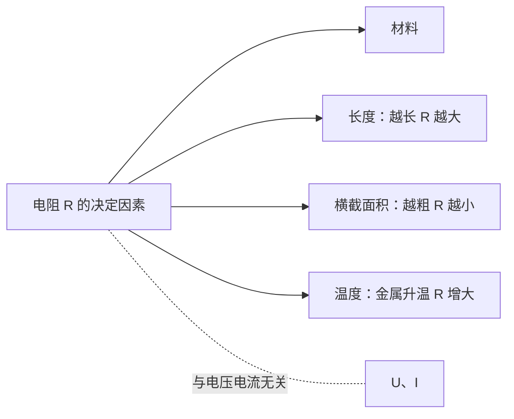

# 第3节 电阻

## 核心概念表

| 概念 | 含义 | 单位 |
|---|---|---|
| 电阻 | 导体对电流阻碍作用的大小 | 欧姆（Ω） |
| 千欧 | 常用单位 | $1\ \text{k}\Omega=10^{3}\ \Omega$ |
| 兆欧 | 常用单位 | $1\ \text{M}\Omega=10^{6}\ \Omega$ |
| 半导体 | 导电性能介于导体和绝缘体之间 | 如硅、锗 |
| 超导体 | 温度降到足够低时电阻变为零的现象 | 超导现象 |

## 知识梳理

电阻表示导体对电流**阻碍作用**的大小，用符号 $R$ 表示，单位欧姆（Ω）。**电阻是导体本身的一种性质**，与电压、电流无关。

电阻大小取决于：
- **材料**：不同材料导电性能不同（银、铜最好）；
- **长度**：材料、横截面积相同时，导体越长电阻越大；
- **横截面积**：材料、长度相同时，横截面积越大电阻越小；
- **温度**：一般金属导体温度越高，电阻越大。

**半导体**：导电性能介于导体与绝缘体之间，如硅、锗。其电阻受温度、光照、杂质影响显著，可制成热敏电阻、光敏电阻、二极管等。

**超导现象**：某些物质在温度降到足够低时电阻突然变为零。

## 示意图

**影响电阻大小的因素**（控制变量对比）：

<svg viewBox="0 0 520 210" width="520" xmlns="http://www.w3.org/2000/svg" style="max-width:100%">
  <g>
    <rect x="40" y="35" width="180" height="10" rx="5" fill="#f59e0b" stroke="#334155"/>
    <rect x="40" y="65" width="90" height="10" rx="5" fill="#f59e0b" stroke="#334155"/>
    <text x="240" y="45" font-size="12" fill="#334155">长 → R 大</text>
    <text x="240" y="75" font-size="12" fill="#334155">短 → R 小</text>
    <text x="130" y="100" text-anchor="middle" font-size="11" fill="#64748b">材料、粗细相同，比长度</text>
  </g>
  <g>
    <rect x="40" y="125" width="150" height="6" rx="3" fill="#0ea5e9" stroke="#334155"/>
    <rect x="40" y="150" width="150" height="16" rx="8" fill="#0ea5e9" stroke="#334155"/>
    <text x="240" y="133" font-size="12" fill="#334155">细 → R 大</text>
    <text x="240" y="162" font-size="12" fill="#334155">粗 → R 小</text>
    <text x="130" y="192" text-anchor="middle" font-size="11" fill="#64748b">材料、长度相同，比横截面积</text>
  </g>
  <g>
    <rect x="360" y="125" width="120" height="12" rx="6" fill="#f87171" stroke="#334155"/>
    <text x="420" y="118" text-anchor="middle" font-size="11" fill="#dc2626">镍铬合金（R 大）</text>
    <rect x="360" y="155" width="120" height="12" rx="6" fill="#fbbf24" stroke="#334155"/>
    <text x="420" y="185" text-anchor="middle" font-size="11" fill="#b45309">铜（R 小）——比材料</text>
  </g>
</svg>

## 实验要点

探究影响电阻大小的因素（**控制变量法**）：
- 分别控制材料、长度、横截面积相同，只改变一个因素进行对比；
- 用电流表示数（或灯泡亮度）反映电阻大小——**转换法**。

## 对比分析

| 影响因素 | 控制不变的量 | 结论 |
|---|---|---|
| 材料 | 长度、横截面积 | 不同材料电阻一般不同 |
| 长度 | 材料、横截面积 | 越长电阻越大 |
| 横截面积 | 材料、长度 | 越粗电阻越小 |
| 温度 | 材料、长度、横截面积 | 金属温度越高电阻越大 |

## 背记要点

1. 电阻表示导体对电流的阻碍作用，符号 $R$，单位 Ω。
2. 电阻大小由材料、长度、横截面积、温度决定，与 $U$、$I$ 无关。
3. 导体越长电阻越大，越粗电阻越小；半导体：硅、锗。
## 自测题

1. 一根导线均匀拉长后，电阻如何变化？为什么？
2. 灯泡刚接通瞬间容易烧断灯丝，与电阻随温度的变化有什么关系？

## 相关知识点

[[第1节 两种电荷]] [[第4节 变阻器]] [[第1节 电流与电压和电阻的关系]] [[第3节 电阻的测量]]
