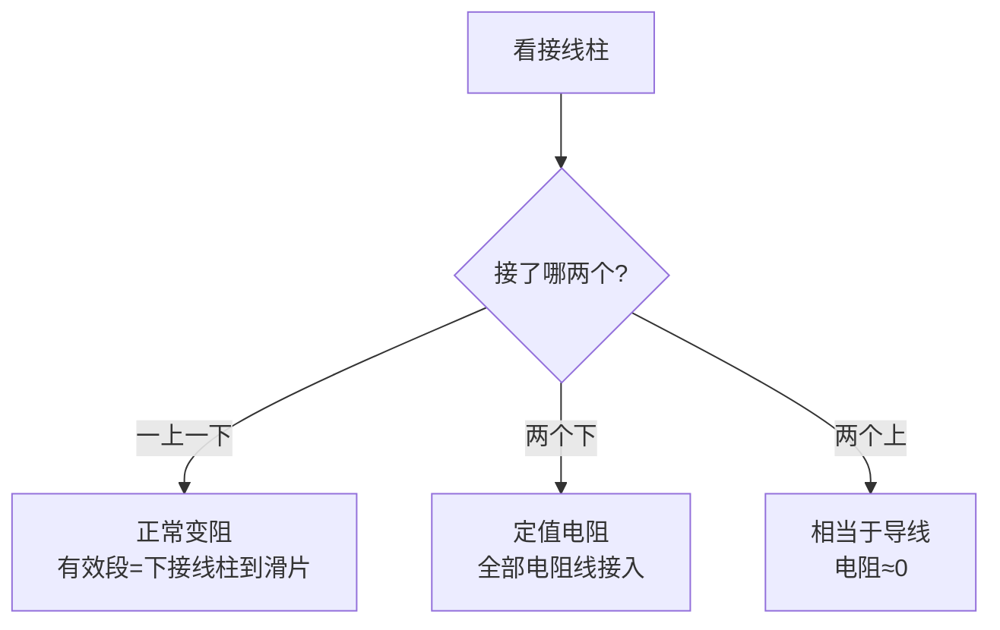

# 第4节 变阻器

## 核心概念表

| 概念 | 含义 |
|---|---|
| 滑动变阻器原理 | 改变接入电路中电阻线的长度来改变电阻 |
| 铭牌"50 Ω 2 A" | 最大阻值 50 Ω，允许最大电流 2 A |

## 知识梳理

**构造**：瓷筒绕电阻线，金属杆上有滑片，四个接线柱（上二下二）。**原理**：移动滑片改变接入电路电阻线的有效长度，从而改变电阻、电流和部分电压。

**正确接法**："**一上一下**"，有效部分是下接线柱到滑片之间的电阻线；两个下接线柱=定值电阻（最大阻值），两个上接线柱=导线。口诀：**"看下不看上"**。

**使用要求**：与用电器串联；闭合开关前滑片移到阻值最大处；不超过最大电流。应用：调节灯的亮度、音量等。**电阻箱**可读阻值，但不能连续改变电阻。

## 示意图

**滑动变阻器结构与"一上一下"接法**：

<svg viewBox="0 0 480 220" width="480" xmlns="http://www.w3.org/2000/svg" style="max-width:100%">
  <rect x="90" y="90" width="260" height="45" rx="22" fill="#e7e5e4" stroke="#334155" stroke-width="2"/>
  <g stroke="#a8a29e" stroke-width="1">
    <line x1="105" y1="92" x2="105" y2="133"/><line x1="120" y1="92" x2="120" y2="133"/>
    <line x1="135" y1="92" x2="135" y2="133"/><line x1="150" y1="92" x2="150" y2="133"/>
    <line x1="165" y1="92" x2="165" y2="133"/><line x1="180" y1="92" x2="180" y2="133"/>
    <line x1="195" y1="92" x2="195" y2="133"/><line x1="210" y1="92" x2="210" y2="133"/>
    <line x1="225" y1="92" x2="225" y2="133"/><line x1="240" y1="92" x2="240" y2="133"/>
    <line x1="255" y1="92" x2="255" y2="133"/><line x1="270" y1="92" x2="270" y2="133"/>
    <line x1="285" y1="92" x2="285" y2="133"/><line x1="300" y1="92" x2="300" y2="133"/>
    <line x1="315" y1="92" x2="315" y2="133"/><line x1="330" y1="92" x2="330" y2="133"/>
  </g>
  <line x1="110" y1="55" x2="330" y2="55" stroke="#334155" stroke-width="4"/>
  <rect x="200" y="45" width="18" height="50" fill="#78716c" stroke="#334155"/>
  <text x="209" y="36" text-anchor="middle" font-size="11" fill="#334155">滑片 P</text>
  <path d="M209 30 h-40" stroke="#16a34a" stroke-width="1.6" marker-end="url(#arp)"/>
  <defs><marker id="arp" markerWidth="8" markerHeight="8" refX="6" refY="3" orient="auto"><path d="M0,0 L6,3 L0,6 z" fill="#16a34a"/></marker></defs>
  <circle cx="110" cy="55" r="5" fill="#dc2626"/><text x="95" y="48" font-size="11" fill="#dc2626">A(上)</text>
  <circle cx="330" cy="55" r="5" fill="#94a3b8"/><text x="340" y="48" font-size="11" fill="#64748b">B(上)</text>
  <circle cx="100" cy="112" r="5" fill="#dc2626"/><text x="60" y="116" font-size="11" fill="#dc2626">C(下)</text>
  <circle cx="340" cy="112" r="5" fill="#94a3b8"/><text x="355" y="116" font-size="11" fill="#64748b">D(下)</text>
  <line x1="100" y1="135" x2="140" y2="112" stroke="#f97316" stroke-width="0"/>
  <path d="M100 128 H209" stroke="#f97316" stroke-width="4" fill="none" opacity="0.6"/>
  <text x="150" y="160" font-size="11" fill="#ea580c">接 A、C：有效电阻为 C→P 段</text>
  <text x="150" y="180" font-size="11" fill="#64748b">P 右移，有效电阻线变长，R 变大</text>
  <text x="150" y="205" font-size="12" fill="#334155">口诀：一上一下，看下不看上</text>
</svg>

**接法判断**：

## 对比分析

| 比较项 | 滑动变阻器 | 电阻箱 |
|---|---|---|
| 阻值变化 | 连续改变 | 不连续（跳跃式） |
| 能否读出阻值 | 不能 | 能 |

## 实验与背记要点

- 原理：改变接入电阻线的长度；接法"一上一下"，判断有效段"看下不看上"（看滑片与所接下接线柱之间的长度变化）。
- 使用前滑片调到最大阻值处，与用电器串联；铭牌"50 Ω 2 A"＝最大阻值 50 Ω、最大电流 2 A。
- 电阻箱可读数但不能连续变阻；滑动变阻器连续变阻但不能读数。

## 自测题

1. 滑动变阻器接"两上"或"两下"接线柱时各相当于什么？为什么闭合开关前要把滑片移到阻值最大处？

## 相关知识点

[[第3节 电阻]] [[第1节 电流与电压和电阻的关系]] [[第3节 电阻的测量]]
