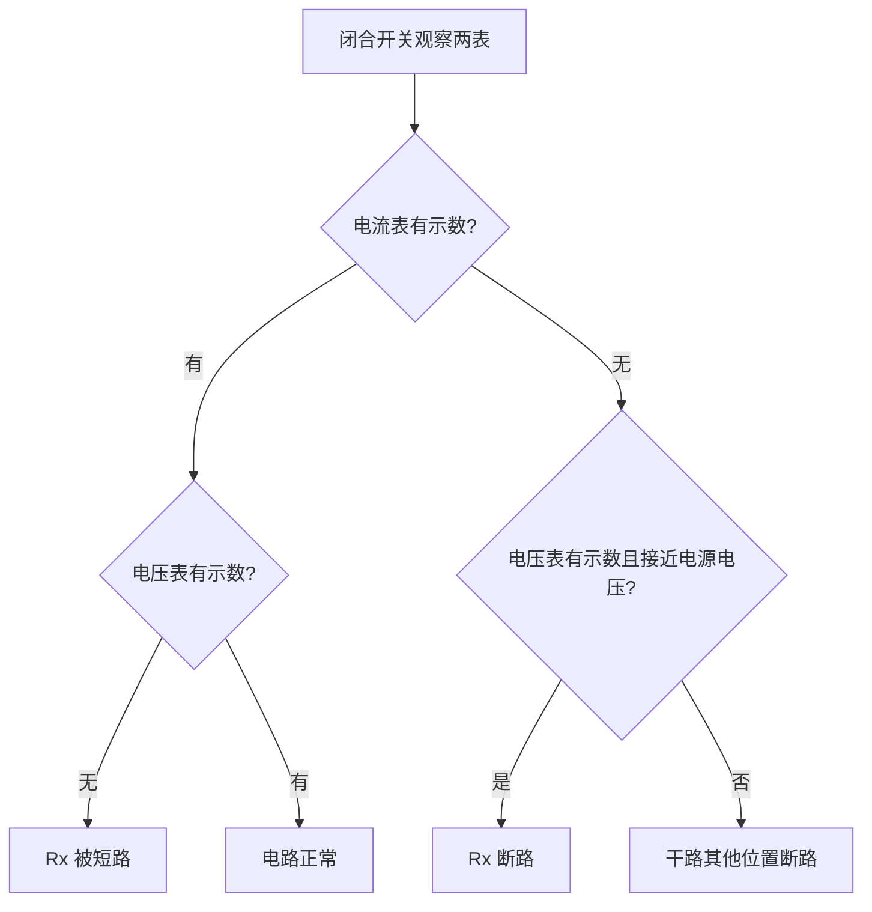

# 第3节 电阻的测量

## 核心概念表

| 项目 | 内容 |
|---|---|
| 实验名称 | 伏安法测电阻 |
| 实验原理 | $R=\dfrac{U}{I}$（欧姆定律变形式） |
| 主要器材 | 电源、电压表、电流表、滑动变阻器、待测电阻、开关、导线 |

## 知识梳理

**伏安法测电阻**：用电压表测出待测电阻两端的电压，用电流表测出通过它的电流，由 $R=\dfrac{U}{I}$ 算出电阻。

**电路连接**：电压表并联在待测电阻 $R_x$ 两端，电流表与 $R_x$ 串联，滑动变阻器串联接入电路。

**滑动变阻器的作用**：①保护电路；②**改变待测电阻两端的电压和通过的电流，进行多次测量**。

**测定值电阻**：多次测量取 $R$ 的**平均值**，目的是**减小误差**。

**测小灯泡电阻**：灯丝电阻随温度升高而**增大**，不同电压下测得的电阻不同，因此**不能取平均值**，多次测量的目的是研究灯丝电阻随温度的变化规律。

## 实验电路图

**伏安法测电阻电路**（电流表串联、电压表并联在 Rx 两端、变阻器串联）：

<svg viewBox="0 0 460 210" width="460" xmlns="http://www.w3.org/2000/svg" style="max-width:100%">
  <path d="M50 40 h360 v110 h-360 z" fill="none" stroke="#334155" stroke-width="2"/>
  <line x1="215" y1="28" x2="215" y2="52" stroke="#334155" stroke-width="2.5"/>
  <line x1="231" y1="34" x2="231" y2="46" stroke="#334155" stroke-width="5"/>
  <circle cx="90" cy="40" r="3.5" fill="#334155"/>
  <line x1="90" y1="40" x2="112" y2="24" stroke="#334155" stroke-width="2.2"/>
  <text x="100" y="14" font-size="11">S</text>
  <circle cx="120" cy="150" r="15" fill="#fff" stroke="#334155" stroke-width="2"/>
  <text x="120" y="155" text-anchor="middle" font-size="12">A</text>
  <rect x="200" y="140" width="55" height="20" fill="#fff" stroke="#334155" stroke-width="2"/>
  <text x="227" y="132" text-anchor="middle" font-size="11">Rx（待测）</text>
  <rect x="310" y="140" width="60" height="20" fill="#fff" stroke="#334155" stroke-width="2"/>
  <line x1="316" y1="132" x2="340" y2="132" stroke="#334155" stroke-width="2"/>
  <path d="M340 132 l-6 -4 m6 4 l-6 4" stroke="#334155" stroke-width="1.5" fill="none"/>
  <text x="342" y="122" text-anchor="middle" font-size="11">滑动变阻器 R'</text>
  <line x1="200" y1="160" x2="200" y2="188" stroke="#2563eb" stroke-width="1.6"/>
  <line x1="255" y1="160" x2="255" y2="188" stroke="#2563eb" stroke-width="1.6"/>
  <line x1="200" y1="188" x2="212" y2="188" stroke="#2563eb" stroke-width="1.6"/>
  <line x1="243" y1="188" x2="255" y2="188" stroke="#2563eb" stroke-width="1.6"/>
  <circle cx="227" cy="188" r="13" fill="#fff" stroke="#2563eb" stroke-width="2"/>
  <text x="227" y="193" text-anchor="middle" font-size="11" fill="#2563eb">V</text>
  <text x="335" y="200" font-size="11" fill="#64748b">R = U/I，多次测量</text>
</svg>

**故障判断流程**：

## 实验要点

- 连接电路时开关断开，滑片置于阻值最大处。
- 电压表、电流表量程选择合适，"+"进"−"出。
- 记录多组 $U$、$I$ 数据（一般3次以上）。
- 故障分析：
  - 电流表有示数、电压表无示数→电压表被短路（$R_x$ 短路）；
  - 电压表有示数（接近电源电压）、电流表无示数→$R_x$ 断路；
  - 两表均无示数→干路断路。

## 特殊方法测电阻（拓展）

| 方法 | 缺少的表 | 需要的辅助 | 核心思路 |
|---|---|---|---|
| 安阻法 | 缺电压表 | 已知定值电阻 $R_0$ | 用 $R_0$ 和电流求电压 |
| 伏阻法 | 缺电流表 | 已知定值电阻 $R_0$ | 用 $R_0$ 和电压求电流 |
| 等效替代法 | — | 电阻箱 | 电阻箱替代 $R_x$ 使电流相同 |

## 对比分析

| 比较项 | 测定值电阻 | 测小灯泡电阻 |
|---|---|---|
| 多次测量目的 | 取平均值减小误差 | 研究电阻随温度变化 |
| 电阻是否恒定 | 基本不变 | 随温度升高而增大 |
| 能否取平均值 | 能 | 不能 |

## 背记要点

1. 伏安法原理：$R=U/I$；电压表并联、电流表串联。
2. 变阻器作用：保护电路 + 改变电压电流实现多次测量。
3. 定值电阻多次测量取平均值减小误差。
4. 小灯泡电阻随温度变化，不能取平均值。
5. 闭合开关前：滑片在最大阻值处。

## 自测题

1. 伏安法测电阻的原理是什么？需要哪些测量仪表？
2. 测小灯泡电阻时，三次测得阻值分别为 8 Ω、9.5 Ω、11 Ω，为什么差别较大？能取平均值吗？
3. 实验中电压表示数接近电源电压、电流表示数为零，故障可能是什么？

## 相关知识点

[[第2节 欧姆定律]] [[第4节 变阻器]] [[第3节 电阻]] [[第1节 电流与电压和电阻的关系]]
