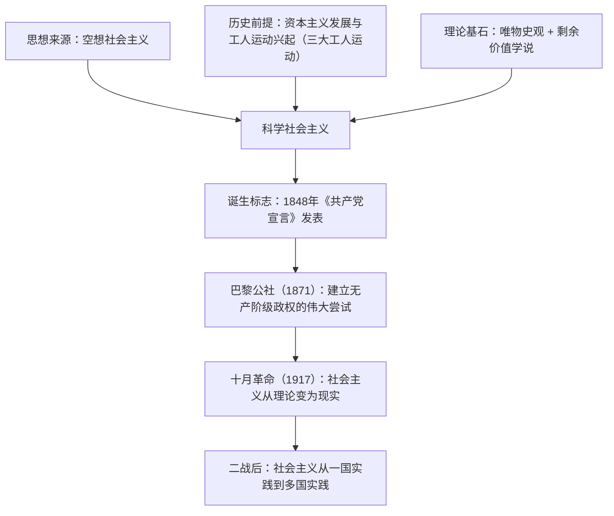

# 1.2 科学社会主义的理论与实践

## 核心概念

**空想社会主义**：科学社会主义的思想来源，代表人物有圣西门、傅立叶、欧文。其局限：仅从理性、正义等原则出发揭露资本主义弊端，主张阶级调和、反对阶级斗争，**没有找到消灭资本主义社会、建立新社会的强大力量，也没有找到正确的道路**。

**历史前提**：资本主义的发展和工人运动的兴起。三大工人运动标志着无产阶级作为独立的政治力量登上历史舞台。

**两大理论基石**：唯物史观和剩余价值学说。唯物史观揭示了人类社会发展的一般规律和阶级斗争在阶级社会发展中的巨大作用；剩余价值学说揭示了资本家剥削工人、占有工人剩余劳动的秘密。两者使社会主义**由空想变为科学**。

**诞生标志**：1848 年《共产党宣言》发表。

## 知识梳理

## 要点表格

| 环节 | 内容 | 地位/意义 |
| --- | --- | --- |
| 思想来源 | 空想社会主义 | 提供思想材料，但有根本局限 |
| 历史前提 | 资本主义发展、工人运动兴起 | 无产阶级登上历史舞台，需要科学理论指导 |
| 理论基石 | 唯物史观、剩余价值学说 | 实现社会主义从空想到科学的飞跃 |
| 诞生标志 | 《共产党宣言》（1848） | 阐明"两个必然"、政党学说、未来社会理想 |
| 伟大实践 | 十月革命（1917） | 建立第一个社会主义国家，理论变为现实 |

## 典型例题

**例 1（选择）**：空想社会主义之所以陷于"空想"，主要是因为其代表人物（　）
A. 没有揭露资本主义的弊端　B. 没有表达对未来理想社会的诉求　C. 主张阶级调和，没有找到变革社会的强大力量和正确道路　D. 反对消灭私有制

**解析**：选 **C**。空想社会主义者深刻揭露了资本主义弊端，并对未来社会作出美好设想（排除 A、B、D），但他们看不到广大人民群众特别是无产阶级的力量，反对阶级斗争，因而无法实现主张，只能是空想。

**例 2（简答）**：为什么说《共产党宣言》的发表标志着科学社会主义的诞生？

**解析**：①它分析了资本主义生产方式的内在矛盾和阶级斗争规律，科学论证了资本主义必然灭亡、社会主义必然胜利的历史必然性（"两个必然"）。②它总结工人运动的经验教训，第一次系统论述了无产阶级政党的性质、特点、任务和策略原则，阐明了建立无产阶级政党的必要性。③它描绘了未来共产主义社会的美好前景，指出代替资产阶级旧社会的将是每个人自由发展是一切人自由发展条件的"自由人联合体"。故其发表标志着科学社会主义的诞生。

## 易错点

- 空想社会主义是**思想来源**，不是理论基石；两大基石是唯物史观和剩余价值学说。
- 三大工人运动（法国里昂工人起义、英国宪章运动、德意志西里西亚纺织工人起义）说明工人阶级迫切需要**科学理论指导**。
- 十月革命实现的是"从理论到现实（实践/制度）"的飞跃，《共产党宣言》实现的是"从空想到科学"的飞跃，不能混淆。
- 苏联解体、东欧剧变只表明社会主义发展的**道路是曲折的**，不能否定社会主义代替资本主义的历史总趋势。

## 背记要点

1. 一个来源（空想社会主义）＋一个前提（资本主义发展与工人运动兴起）＋两大基石（唯物史观、剩余价值学说）＝科学社会主义。
2. 《共产党宣言》三大内容：两个必然、无产阶级政党学说、自由人联合体。
3. 发展脉络：1848 理论诞生 → 1871 巴黎公社尝试 → 1917 十月革命成为现实 → 二战后一国到多国。
4. 前途是光明的，道路是曲折的；社会主义终将代替资本主义是历史发展的必然趋势。

## 自测题

1. 科学社会主义的思想来源是____，代表人物有圣西门、傅立叶、____。
2. 使社会主义实现从空想到科学飞跃的两大理论基石是____和____。
3. 建立无产阶级政权的第一次伟大尝试是____。
4. 十月革命的胜利实现了社会主义从____到____的历史性飞跃。

## 相关知识点

阶级社会演进与资本主义基本矛盾见 [[1.1 原始社会的解体和阶级社会的演进]]；马克思列宁主义传入中国后引发的革命实践见 [[2.1 新民主主义革命的胜利]]；科学社会主义在 21 世纪中国焕发生机见 [[4.1 中国特色社会主义进入新时代]]。
