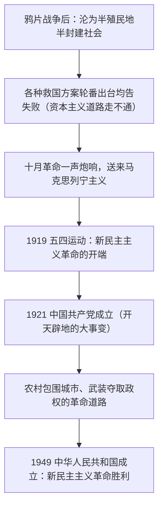

# 2.1 新民主主义革命的胜利

## 核心概念

**近代中国社会性质**：半殖民地半封建社会。主要矛盾是帝国主义和中华民族的矛盾、封建主义和人民大众的矛盾。

**近代中国的两大历史任务**：争取民族独立、人民解放；实现国家富强、人民幸福。

**新民主主义革命**：无产阶级领导的，工人阶级领导的、以工农联盟为基础的，人民大众的，反对帝国主义、封建主义和官僚资本主义的民主革命。"新"在领导权（无产阶级）、前途（社会主义）、指导思想（马克思列宁主义）。

**革命道路**：农村包围城市、武装夺取政权。**三大法宝**：统一战线、武装斗争、党的建设。

## 知识梳理

## 要点表格

| 项目 | 旧民主主义革命 | 新民主主义革命 |
| --- | --- | --- |
| 领导阶级 | 资产阶级 | 无产阶级（通过中国共产党） |
| 指导思想 | 资产阶级民主思想 | 马克思列宁主义 |
| 革命前途 | 资产阶级共和国 | 社会主义社会（经新民主主义过渡） |
| 革命性质 | 资产阶级民主革命 | 仍属资产阶级民主革命范畴，但是新式的、特殊的民主革命 |

## 典型例题

**例 1（选择）**：近代中国，无论是旧式农民起义、封建统治者的自救，还是资产阶级改良与革命，都不能改变中国的命运。这说明（　）
A. 近代中国人民缺乏斗争精神　B. 资本主义道路在中国走不通　C. 中国不需要民主革命　D. 半殖民地半封建的性质无法改变

**解析**：选 **B**。太平天国、洋务运动、戊戌变法、辛亥革命的相继失败证明：由于帝国主义不允许、封建势力阻挠和民族资产阶级的软弱性，资本主义道路在中国走不通，中国需要新的领导力量和新的道路。A、C、D 均不符合史实与教材观点。

**例 2（简答）**：简述中华人民共和国成立的历史意义。

**解析**：①实现了中国从几千年封建专制政治向人民民主的伟大飞跃，彻底结束了旧中国半殖民地半封建社会的历史和一盘散沙的局面，废除了列强强加的不平等条约和一切特权。②为实现由新民主主义向社会主义的过渡创造了前提条件，为国家富强、民族复兴扫清障碍、奠定基础。③冲破了帝国主义的东方战线，极大改变了世界政治力量对比，鼓舞了被压迫民族和人民争取解放的斗争。

## 易错点

- 新民主主义革命的性质仍是**资产阶级民主革命**（反帝反封建），不是社会主义革命；"新"在领导权、指导思想和前途。
- 五四运动是新民主主义革命的**开端**；新中国成立标志新民主主义革命**基本胜利**，但不标志社会主义制度确立（1956 年三大改造完成才确立）。
- 中国革命必须分"民主革命—社会主义革命"两步走，二者是**上篇与下篇**的关系，不能"毕其功于一役"。
- 毛泽东思想的活的灵魂是**实事求是、群众路线、独立自主**，其精髓是实事求是。

## 背记要点

1. 社会性质：半殖民地半封建；两大历史任务：民族独立人民解放、国家富强人民幸福。
2. "三个深刻改变"：中国共产党的诞生深刻改变了近代以后中华民族发展的方向和进程、中国人民和中华民族的前途和命运、世界发展的趋势和格局。
3. 三大法宝：统一战线、武装斗争、党的建设；革命道路：农村包围城市、武装夺取政权。
4. 中国革命两步走：新民主主义革命（上篇）→ 社会主义革命（下篇）。

## 自测题

1. 近代中国的社会性质是____，其主要矛盾是____和____。
2. 新民主主义革命的开端是____年的____运动。
3. 新民主主义革命"新"在哪三个方面？
4. 中国共产党在革命中战胜敌人的三大法宝是____、____、____。

## 相关知识点

科学社会主义理论来源见 [[科学社会主义的理论与实践]]；新中国成立后向社会主义过渡见 [[社会主义制度在中国的确立]]；道路选择的历史比较见 [[综合探究一 回看走过的路 比较别人的路 远眺前行的路]]。
