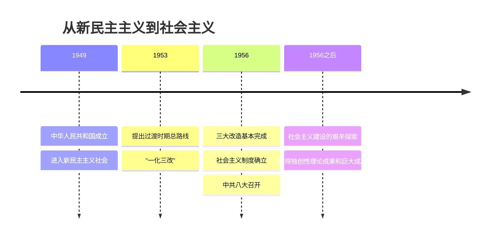

# 2.2 社会主义制度在中国的确立

## 核心概念

**过渡时期（1949—1956）**：从中华人民共和国成立到社会主义改造基本完成。总路线和总任务是"一化三改"：逐步实现国家的社会主义**工业化**，逐步实现国家对**农业、手工业、资本主义工商业**的社会主义改造。

**社会主义制度确立的标志**：1956 年生产资料私有制的社会主义改造基本完成，标志着我国实现了从新民主主义到社会主义的转变，进入社会主义社会。这是**中华民族有史以来最为广泛而深刻的社会变革**。

**中共八大（1956）**：最重要贡献是对社会主义改造基本完成后中国社会的**主要矛盾和根本任务**作出规定——主要矛盾是人民对于建立先进的工业国的要求同落后的农业国的现实之间的矛盾，人民对于经济文化迅速发展的需要同当前经济文化不能满足人民需要的状况之间的矛盾；根本任务是集中力量发展社会生产力。

## 知识梳理

## 要点表格

| 项目 | 内容 | 意义 |
| --- | --- | --- |
| 过渡的历史必然性 | 国营经济迅速发展成为主导；国家积累了管理和改造私营工商业的经验；个体农业需要合作化；国际形势有利于向社会主义阵营靠拢 | 社会主义改造顺应历史必然 |
| 一化三改 | 工业化＋改造农业、手工业、资本主义工商业 | 建立社会主义经济基础 |
| 制度确立 | 1956 年三大改造基本完成 | 最深刻最伟大的社会变革，中华民族站起来走向强起来的重要基石 |
| 艰辛探索 | 以苏为鉴、走自己的路，虽有曲折 | 为新时期开创中国特色社会主义提供宝贵经验、理论准备、物质基础 |

## 典型例题

**例 1（选择）**：1956 年底，我国基本完成对农业、手工业和资本主义工商业的社会主义改造。这一历史事件的重大意义在于（　）
A. 标志着中华人民共和国的成立　B. 标志着社会主义制度在我国确立　C. 标志着我国实现了社会主义现代化　D. 标志着新民主主义革命取得胜利

**解析**：选 **B**。三大改造基本完成，生产资料公有制成为社会经济制度的基础，标志着我国进入社会主义社会。A、D 对应 1949 年，C 至今仍是奋斗目标（2035 基本实现现代化）。

**例 2（简答）**：如何正确认识我国社会主义建设的艰辛探索时期？

**解析**：①社会主义制度确立后，以毛泽东同志为主要代表的中国共产党人提出把马克思列宁主义基本原理同中国具体实际进行"第二次结合"，走自己的路。②这一时期我国建立起独立的比较完整的工业体系和国民经济体系，取得"两弹一星"等重大成就，取得了独创性理论成果。③虽然经历了严重曲折，但党在社会主义革命和建设中取得的独创性理论成果和巨大成就，为新的历史时期开创中国特色社会主义提供了宝贵经验、理论准备、物质基础。评价应坚持全面、历史、辩证的观点。

## 易错点

- 1949 年新中国成立进入的是**新民主主义社会**（过渡时期），不是社会主义社会；1956 年才进入社会主义社会。
- "一化三改"中，工业化是**主体（发展生产力）**，三大改造是**两翼（变革生产关系）**，两者相互促进。
- 中共八大规定的主要矛盾不同于新时代主要矛盾（美好生活需要与不平衡不充分发展），注意时代表述差异。
- 对探索时期的失误不能全盘否定该时期成就；"宝贵经验、理论准备、物质基础"是高频考点表述。

## 背记要点

1. 过渡时期总路线："一化三改"；1956 年三大改造完成＝社会主义制度确立。
2. 只有社会主义才能救中国：社会主义制度确立后中国发生的翻天覆地变化雄辩地证明了这一结论。
3. 八大两大贡献：明确主要矛盾＋根本任务（集中力量发展社会生产力）。
4. 探索时期的定位：为开创中国特色社会主义提供宝贵经验、理论准备、物质基础。

## 自测题

1. 过渡时期总路线和总任务可概括为"____"。
2. 我国社会主义制度确立的标志是____年____基本完成。
3. 中共八大提出的党和人民的主要任务是____。
4. 社会主义革命和建设时期的成就为开创中国特色社会主义提供了____、____、____。

## 相关知识点

新民主主义革命为过渡创造前提见 [[2.1 新民主主义革命的胜利]]；三条道路的历史比较见 [[综合探究一 回看走过的路 比较别人的路 远眺前行的路]]；此后历史转折见 [[3.1 伟大的改革开放]]。
