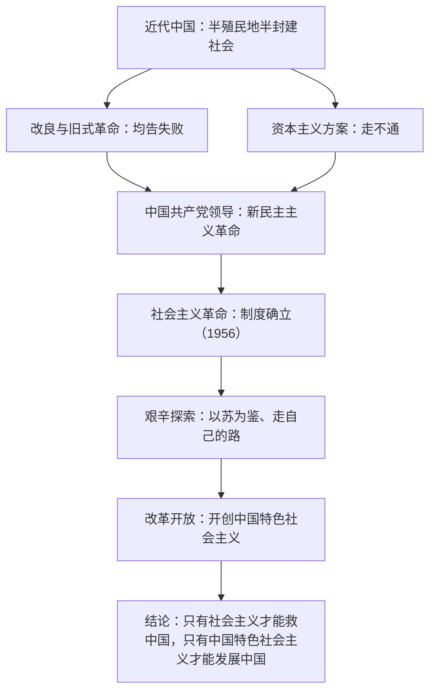

# 综合探究一 回看走过的路 比较别人的路 远眺前行的路

## 核心概念

**探究主题**：通过"回看走过的路、比较别人的路、远眺前行的路"，理解近代以来中国道路选择的历史必然性，得出"只有社会主义才能救中国"的结论。

**回看走过的路**：近代各阶级救国方案（农民起义、洋务运动、维新变法、辛亥革命）先后失败，中国共产党领导人民走出新民主主义革命—社会主义革命的正确道路。

**比较别人的路**：资本主义道路在中国走不通（帝国主义不允许、封建势力阻挠、民族资产阶级软弱）；照搬苏联模式也出现弊端，必须把马克思主义基本原理同中国具体实际相结合。

**远眺前行的路**：坚持和发展中国特色社会主义，实现中华民族伟大复兴。

## 知识梳理

## 要点表格

| 探究维度 | 关键史实 | 结论 |
| --- | --- | --- |
| 回看走过的路 | 太平天国、洋务运动、戊戌变法、辛亥革命失败；五四运动、建党、建国、三大改造 | 中国共产党的领导是历史和人民的选择 |
| 比较别人的路 | 西方资本主义道路、苏联模式 | 别国道路不能照搬，必须独立自主走自己的路 |
| 远眺前行的路 | 改革开放以来的成就与新时代蓝图 | 坚定中国特色社会主义道路自信 |

## 典型例题

**例 1（选择）**：辛亥革命推翻了清王朝统治，但没有改变旧中国半殖民地半封建的社会性质和中国人民的悲惨命运。这从根本上说明（　）
A. 革命者不够英勇　B. 资产阶级共和国方案在中国行不通　C. 中国不具备革命条件　D. 封建制度不可动摇

**解析**：选 **B**。辛亥革命的失败说明，由于民族资产阶级的软弱性和帝国主义、封建主义的强大，资产阶级共和国的方案救不了中国，中国需要新的阶级领导和新的革命道路。

**例 2（简答）**：结合史实说明"只有社会主义才能救中国"。

**解析**：①近代以来各种救国方案（改良、旧式革命、资本主义道路）都以失败告终，说明旧的道路走不通。②中国共产党把马克思列宁主义同中国实际相结合，领导新民主主义革命取得胜利，建立新中国，实现民族独立、人民解放。③通过社会主义改造确立社会主义制度，实现了中华民族有史以来最为广泛而深刻的社会变革，建立起独立的工业体系，社会面貌发生翻天覆地的变化。历史证明，只有社会主义才能救中国。

## 易错点

- "只有社会主义才能救中国"与"只有中国特色社会主义才能发展中国"针对的历史阶段不同，前者对应革命与制度确立，后者对应改革开放以来，答题勿混用。
- 借鉴别国经验不等于照搬别国模式；苏联模式的教训说明必须**独立自主、实事求是**。
- 中国走社会主义道路是历史的必然、人民的选择，不是"少数人的选择"或偶然事件。
- 综合探究题多为开放性论述，需**史论结合**：观点＋史实＋结论，不能只堆砌史实。

## 背记要点

1. 三条线索：走过的路（党史国史）、别人的路（西方与苏联）、前行的路（中国特色社会主义）。
2. 核心结论：中国共产党的领导和社会主义道路是历史的结论、人民的选择。
3. 方法论：马克思主义基本原理必须同中国具体实际相结合。
4. 情感态度：增强道路自信、理论自信、制度自信、文化自信。

## 自测题

1. 近代中国资本主义道路走不通的原因有哪些？
2. "只有社会主义才能救中国"的史实依据是什么（至少两条）？
3. 苏联模式给我们的最重要启示是____。
4. "四个自信"指____、____、____、____。

## 相关知识点

革命历程详见 [[2.1 新民主主义革命的胜利]] 与 [[2.2 社会主义制度在中国的确立]]；"发展中国"的答案见 [[3.1 伟大的改革开放]]；方向与道路的进一步论证见 [[综合探究二 方向决定道路 道路决定命运]]。
