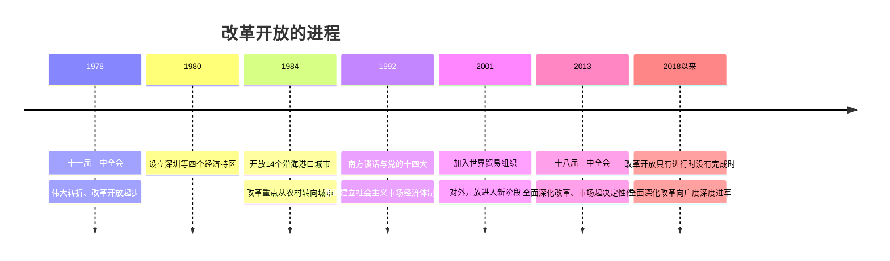

# 3.1 伟大的改革开放

## 核心概念

**十一届三中全会（1978 年 12 月）**：重新确立解放思想、实事求是的思想路线，作出把党和国家工作中心转移到经济建设上来、实行改革开放的历史性决策，实现了新中国成立以来党的历史上具有深远意义的**伟大转折**，开启了改革开放和社会主义现代化建设新时期。

**改革开放的性质**：党在新的时代条件下带领人民进行的**新的伟大革命**，是决定当代中国命运的**关键一招**，也是决定实现"两个一百年"奋斗目标、实现中华民族伟大复兴的关键一招。

**改革开放的意义（三个"伟大飞跃"）**：中华民族迎来了从站起来、富起来到强起来的伟大飞跃；中国特色社会主义迎来了从创立、发展到完善的伟大飞跃；中国人民迎来了从温饱不足到小康富裕的伟大飞跃。

## 知识梳理

## 要点表格

| 阶段 | 时间 | 标志性事件 |
| --- | --- | --- |
| 起步阶段 | 1978—1992 | 家庭联产承包责任制、乡镇企业、经济特区、沿海开放 |
| 新阶段 | 1992—2012 | 南方谈话、十四大确立社会主义市场经济体制目标、加入 WTO |
| 全面深化 | 2012 至今 | 十八届三中全会总目标：完善和发展中国特色社会主义制度、推进国家治理体系和治理能力现代化 |

## 典型例题

**例 1（选择）**：改革开放之所以被称为"决定当代中国命运的关键一招"，是因为它（　）
①极大解放和发展了社会生产力　②使中国彻底消灭了社会主要矛盾　③增强了社会发展活力，改变了中国面貌　④标志着社会主义制度在中国确立
A. ①③　B. ①②　C. ②④　D. ③④

**解析**：选 **A**。改革开放极大解放和发展了社会生产力、极大增强了社会发展活力，深刻改变了中国、影响了世界，①③正确。主要矛盾会转化但始终存在，②错误；社会主义制度确立于 1956 年，④错误。

**例 2（简答）**：为什么说改革开放只有进行时、没有完成时？

**解析**：①改革开放是党和人民大踏步赶上时代的重要法宝，是坚持和发展中国特色社会主义的必由之路。②我国社会主要矛盾发生变化，发展不平衡不充分问题仍然突出，只有全面深化改革才能破解发展难题、增强发展动力。③实践发展永无止境，解放思想永无止境，改革开放也永无止境；停顿和倒退没有出路。因此必须坚持改革开放不动摇，将改革进行到底。

## 易错点

- 改革的性质是**社会主义制度的自我完善和发展**，不是改变社会主义根本制度；"新的伟大革命"不等于推翻现有制度。
- 十一届三中全会的关键词：思想路线（解放思想、实事求是）＋工作中心转移＋改革开放决策，三者缺一不可。
- 对外开放格局：经济特区→沿海开放城市→沿海经济开放区→内地，是**全方位、多层次、宽领域**逐步形成，非一步到位。
- 社会主义市场经济体制目标由**党的十四大（1992）**明确提出，勿写成十一届三中全会。

## 背记要点

1. 1978 十一届三中全会＝伟大转折；改革开放＝关键一招＝强国之路＝活力之源。
2. 改革先从农村（家庭联产承包）突破，后转向城市（国企改革）。
3. 三个"伟大飞跃"：民族（站起来—富起来—强起来）、中国特色社会主义（创立—发展—完善）、人民（温饱不足—小康富裕）。
4. 全面深化改革总目标：完善和发展中国特色社会主义制度，推进国家治理体系和治理能力现代化。

## 自测题

1. 开启改革开放和社会主义现代化建设新时期的会议是____。
2. 我国农村改革的突破口是实行____。
3. 明确提出建立社会主义市场经济体制目标的会议是____。
4. 改革开放的三个"伟大飞跃"分别是什么？

## 相关知识点

改革开放前的探索与基础见 [[社会主义制度在中国的确立]]；改革开放中形成的理论体系见 [[中国特色社会主义的创立、发展和完善]]；改革开放在新时代的深化见 [[中国特色社会主义进入新时代]]。
