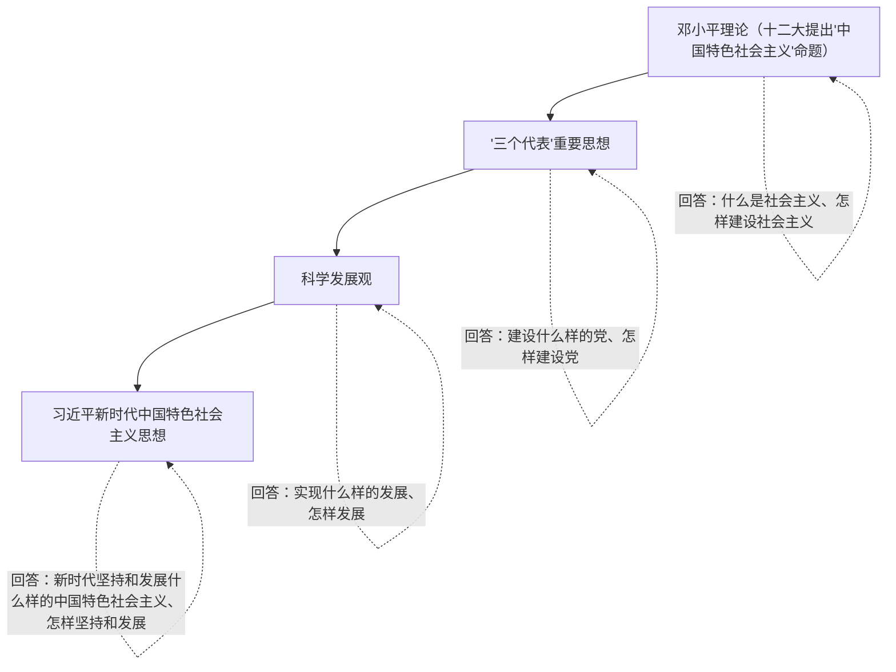

# 3.2 中国特色社会主义的创立、发展和完善

## 核心概念

**改革开放以来党的全部理论和实践的主题**：坚持和发展中国特色社会主义。

**中国特色社会主义理论体系**：包括邓小平理论、"三个代表"重要思想、科学发展观、习近平新时代中国特色社会主义思想。

**"四个自信"的对象**：中国特色社会主义**道路**（实现途径）、**理论体系**（行动指南）、**制度**（根本保障）、**文化**（精神力量）。四者统一于中国特色社会主义伟大实践。

## 知识梳理

## 要点表格

| 理论成果 | 形成时期/主要代表 | 核心主题（回答的问题） | 历史贡献 |
| --- | --- | --- | --- |
| 邓小平理论 | 十一届三中全会以后，邓小平 | 什么是社会主义、怎样建设社会主义 | 成功开创了中国特色社会主义 |
| "三个代表"重要思想 | 十三届四中全会以后，江泽民 | 建设什么样的党、怎样建设党 | 成功把中国特色社会主义推向 21 世纪 |
| 科学发展观 | 十六大以后，胡锦涛 | 新形势下实现什么样的发展、怎样发展 | 成功在新形势下坚持和发展了中国特色社会主义 |
| 习近平新时代中国特色社会主义思想 | 十八大以来，习近平 | 新时代坚持和发展什么样的中国特色社会主义、怎样坚持和发展 | 推动中国特色社会主义进入新时代 |

## 典型例题

**例 1（选择）**：中国特色社会主义道路、理论体系、制度、文化的关系是（　）
A. 相互独立、互不相关　B. 道路是根本保障，制度是实现途径　C. 统一于中国特色社会主义伟大实践　D. 文化是行动指南

**解析**：选 **C**。道路是实现途径，理论体系是行动指南，制度是根本保障，文化是精神力量（积淀着中华民族最深层的精神追求），四者统一于中国特色社会主义伟大实践。A、B、D 对应关系错乱。

**例 2（简答）**：为什么必须坚定中国特色社会主义文化自信？

**解析**：①中国特色社会主义文化源自于中华民族五千多年文明历史所孕育的中华优秀传统文化，熔铸于党领导人民在革命、建设、改革中创造的革命文化和社会主义先进文化，植根于中国特色社会主义伟大实践。②文化自信是更基础、更广泛、更深厚的自信，是一个国家、一个民族发展中更基本、更深沉、更持久的力量。③坚定文化自信，才能为道路、理论、制度提供深厚精神支撑，凝聚起实现民族复兴的磅礴力量。

## 易错点

- "中国特色社会主义"命题由邓小平在**党的十二大（1982）**提出（"把马克思主义的普遍真理同我国的具体实际结合起来，走自己的道路，建设有中国特色的社会主义"）。
- 中国特色社会主义理论体系**不包括毛泽东思想**；毛泽东思想是其重要思想渊源，但属于第一次历史性飞跃的成果。
- 四个自信的对应关系必须记准：道路—途径、理论—指南、制度—保障、文化—力量，选择题常错位设错。
- 各理论成果之间是**既一脉相承又与时俱进**的关系，不是相互替代、彼此割裂。

## 背记要点

1. 主题：坚持和发展中国特色社会主义是改革开放以来党的全部理论和实践的主题。
2. 四大理论成果及各自回答的时代课题（见表格），"开创—推向 21 世纪—新形势下坚持发展—新时代"四个动词要记牢。
3. 四个自信内涵：道路自信、理论自信、制度自信、文化自信。
4. 中国特色社会主义是改革开放以来党的全部理论和实践的主题，是当代中国发展进步的根本方向。

## 自测题

1. 改革开放以来党的全部理论和实践的主题是____。
2. 中国特色社会主义理论体系包括哪四大理论成果？
3. 邓小平理论主要回答的基本问题是____。
4. 中国特色社会主义道路、理论体系、制度、文化分别是实现社会主义现代化的____、____、____、____。

## 相关知识点

理论体系形成的实践基础见 [[伟大的改革开放]]；最新理论成果的时代背景见 [[中国特色社会主义进入新时代]]；道路问题的极端重要性见 [[综合探究二 方向决定道路 道路决定命运]]。
