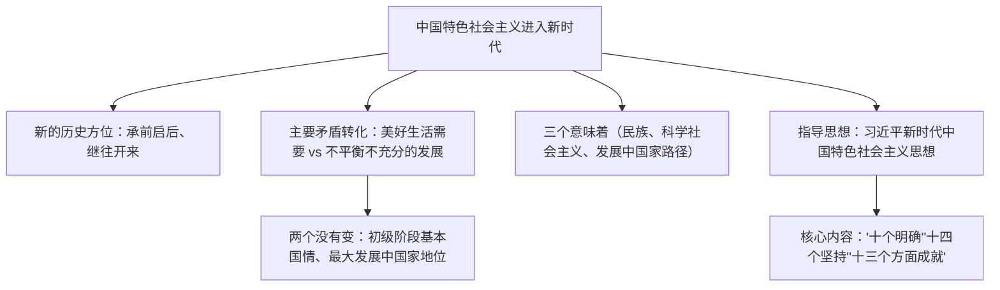

# 4.1 中国特色社会主义进入新时代

## 核心概念

**新时代的历史方位**：经过长期努力，中国特色社会主义进入了新时代，这是我国发展新的历史方位。这个新时代是承前启后、继往开来、在新的历史条件下继续夺取中国特色社会主义伟大胜利的时代。

**新时代社会主要矛盾**：人民日益增长的**美好生活需要**和**不平衡不充分的发展**之间的矛盾。主要矛盾的变化没有改变我国仍处于并将长期处于**社会主义初级阶段**的基本国情，没有改变我国是世界最大发展中国家的国际地位。

**新时代的"三个意味着"**：意味着近代以来久经磨难的中华民族迎来了从站起来、富起来到强起来的伟大飞跃；意味着科学社会主义在 21 世纪的中国焕发出强大生机活力，在世界上高高举起了中国特色社会主义伟大旗帜；意味着中国特色社会主义道路、理论、制度、文化不断发展，拓展了发展中国家走向现代化的途径。

## 知识梳理

## 要点表格

| 项目 | 内容 | 高考视角提示 |
| --- | --- | --- |
| 进入新时代的依据 | 党的十八大以来的历史性成就和历史性变革 | 常以成就材料考"说明了什么" |
| 主要矛盾 | 美好生活需要与不平衡不充分的发展 | 与八大、十一届六中全会表述对比设错 |
| 两个"没有变" | 初级阶段国情、最大发展中国家地位 | 防止"超越阶段"类错误选项 |
| 指导思想 | 习近平新时代中国特色社会主义思想 | 当代中国马克思主义、21世纪马克思主义 |

## 典型例题

**例 1（选择）**：我国社会主要矛盾已经转化为人民日益增长的美好生活需要和不平衡不充分的发展之间的矛盾。这一转化（　）
①表明我国已不再处于社会主义初级阶段　②是关系全局的历史性变化　③对党和国家工作提出了许多新要求　④意味着我国已成为发达国家
A. ①②　B. ②③　C. ①④　D. ③④

**解析**：选 **B**。主要矛盾的转化是关系全局的历史性变化，要求在继续推动发展的基础上着力解决好发展不平衡不充分问题，②③正确。"两个没有变"排除①④。

**例 2（简答）**：如何理解中国特色社会主义进入新时代的世界意义？

**解析**：①科学社会主义意义：中国特色社会主义的成功使科学社会主义在 21 世纪的中国焕发出强大生机活力，在世界上高高举起了中国特色社会主义伟大旗帜。②现代化路径意义：拓展了发展中国家走向现代化的途径，给世界上那些既希望加快发展又希望保持自身独立性的国家和民族提供了全新选择。③人类文明意义：为解决人类问题贡献了中国智慧和中国方案。

## 易错点

- 主要矛盾变了，但**社会主义初级阶段的基本国情没有变**、最大发展中国家的国际地位没有变，"变"与"不变"必须同时把握。
- 新时代主要矛盾中"需要"是**美好生活需要**（不只是物质文化需要），"制约"是**不平衡不充分的发展**（不再是"落后的社会生产"）。
- 习近平新时代中国特色社会主义思想的核心内容概括为"十个明确、十四个坚持、十三个方面成就"，勿只写"八个明确"（旧表述已发展）。
- "三个意味着"从民族、科学社会主义、发展中国家三个角度展开，答题勿遗漏角度。

## 背记要点

1. 新时代＝新的历史方位；判断依据是历史性成就与历史性变革。
2. 主要矛盾：美好生活需要 vs 不平衡不充分的发展；牢记"两个没有变"。
3. "三个意味着"：民族复兴前景、科学社会主义活力、现代化新路径。
4. 习近平新时代中国特色社会主义思想是当代中国马克思主义、21 世纪马克思主义，是中华文化和中国精神的时代精华。

## 自测题

1. 我国发展新的历史方位是____。
2. 新时代我国社会主要矛盾是____。
3. "两个没有变"指什么没有变？
4. 习近平新时代中国特色社会主义思想的核心内容可概括为"____""____""____"。

## 相关知识点

新时代的理论渊源见 [[中国特色社会主义的创立、发展和完善]]；新时代的奋斗目标见 [[实现中华民族伟大复兴的中国梦]]；道路自信的历史逻辑见 [[综合探究二 方向决定道路 道路决定命运]]。
