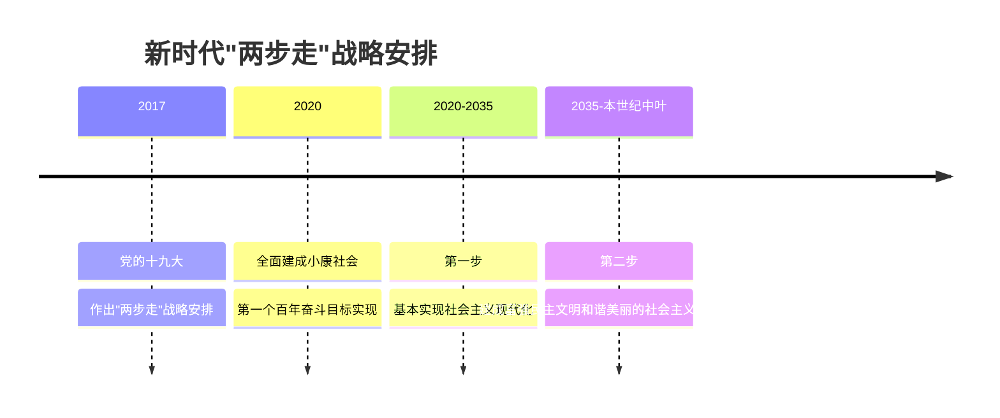

# 4.2 实现中华民族伟大复兴的中国梦

## 核心概念

**中国梦的本质**：国家富强、民族振兴、人民幸福。中国梦归根到底是**人民的梦**，必须紧紧依靠人民来实现，必须不断为人民造福。中国梦同世界人民的梦想息息相通，是和平、发展、合作、共赢的梦。

**"两个一百年"奋斗目标**：到建党一百年时全面建成小康社会（已实现）；到新中国成立一百年时全面建成社会主义现代化强国。

**新时代"两步走"战略安排**：从 2020 年到 2035 年基本实现社会主义现代化；从 2035 年到本世纪中叶，把我国建成富强民主文明和谐美丽的社会主义现代化强国。

**实现中国梦的路径**：必须进行伟大斗争、建设伟大工程、推进伟大事业、实现伟大梦想（"四个伟大"），其中起决定性作用的是**党的建设新的伟大工程**。

## 知识梳理

## 要点表格

| 项目 | 内容 | 备注（高考视角） |
| --- | --- | --- |
| 中国梦本质 | 国家富强、民族振兴、人民幸福 | 三位一体，"人民幸福"是落脚点 |
| 中国梦特征 | 人民的梦；与世界梦相通 | 排除"扩张梦、霸权梦"类干扰项 |
| 四个伟大 | 斗争、工程、事业、梦想 | 起决定性作用的是党的建设新的伟大工程 |
| 青年担当 | 做有理想、敢担当、能吃苦、肯奋斗的新时代好青年 | 常与"青春梦融入中国梦"结合考查 |

## 典型例题

**例 1（选择）**：中国梦归根到底是人民的梦。这意味着（　）
①中国梦必须紧紧依靠人民来实现　②中国梦必须不断为人民造福　③实现中国梦仅是国家和政府的事　④人民是中国梦的主体和最大受益者
A. ①②③　B. ①②④　C. ①③④　D. ②③④

**解析**：选 **B**。中国梦是人民的梦，人民是实现主体也是受益者，必须依靠人民、造福人民，①②④正确；③割裂了个人与国家的关系，每个人都是梦想的参与者、书写者。

**例 2（简答）**："四个伟大"之间是什么关系？为什么党的建设新的伟大工程起决定性作用？

**解析**：①伟大斗争、伟大工程、伟大事业、伟大梦想紧密联系、相互贯通、相互作用。②其中起决定性作用的是党的建设新的伟大工程。因为实现伟大梦想、推进伟大事业、进行伟大斗争，关键在党；办好中国的事情，关键在党。③推进伟大工程，要结合伟大斗争、伟大事业、伟大梦想的实践来进行，确保党在世界形势深刻变化的历史进程中始终走在时代前列，始终成为全国人民的主心骨，始终成为坚强领导核心。

## 易错点

- 全面建成小康社会对应**建党一百年**（2021 年宣告全面建成），现代化强国对应**新中国成立一百年**，两个时间节点勿混淆。
- 2035 年目标是"**基本实现**社会主义现代化"，本世纪中叶才是"建成现代化**强国**"，程度词是选择题高频设错点。
- 强国目标的定语是"富强民主文明和谐**美丽**"五个词，"美丽"是十九大新增，不可漏写。
- 中国梦不是"独善其身"的梦，也绝不是威胁他国的梦；它与世界各国人民的美好梦想相通。

## 背记要点

1. 中国梦本质：国家富强、民族振兴、人民幸福；归根到底是人民的梦。
2. 两步走：2035 基本实现现代化；本世纪中叶建成富强民主文明和谐美丽的社会主义现代化强国。
3. 四个伟大：斗争（手段）、工程（保证，起决定性作用）、事业（主题）、梦想（目标）。
4. 青年使命：把青春梦融入中国梦，在实现中国梦的生动实践中放飞青春梦想。

## 自测题

1. 中国梦的本质是____、____、____。
2. 新时代"两步走"战略中，2035 年的目标是____。
3. "四个伟大"中起决定性作用的是____。
4. 到本世纪中叶，我国要建成____的社会主义现代化强国（写全五个定语）。

## 相关知识点

新时代的历史方位与主要矛盾见 [[4.1 中国特色社会主义进入新时代]]；实现梦想的道路保障见 [[3.2 中国特色社会主义的创立、发展和完善]]；方向与道路的总结提升见 [[综合探究二 方向决定道路 道路决定命运]]。
