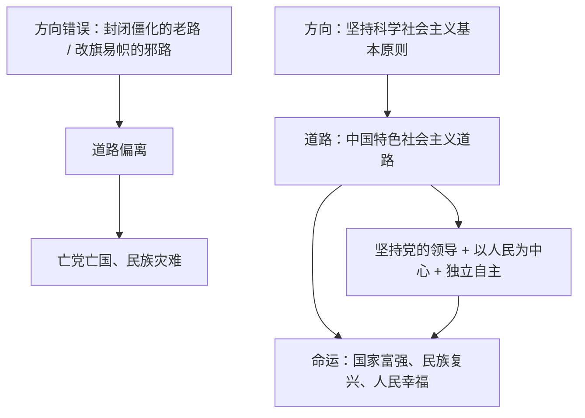

# 综合探究二 方向决定道路 道路决定命运

## 核心概念

**探究主题**：方向决定道路，道路决定命运。中国特色社会主义道路是实现社会主义现代化、创造人民美好生活的必由之路，是创造中华民族伟大复兴的康庄大道。

**方向问题**：在方向问题上，我们的头脑必须十分清醒。中国特色社会主义是社会主义而不是其他什么主义，科学社会主义基本原则不能丢，丢了就不是社会主义。

**道路自信的根据**：中国特色社会主义道路既坚持科学社会主义基本原则，又根据时代条件赋予其鲜明的中国特色；其成功来自历史和人民的选择、来自改革开放以来的伟大成就。

## 知识梳理

## 要点表格

| 探究维度 | 核心观点 | 论证材料 |
| --- | --- | --- |
| 为什么方向决定道路 | 举什么旗、走什么路决定国家前途命运 | 苏联改旗易帜导致解体的教训 |
| 为什么道路决定命运 | 道路正确与否决定事业成败 | 中国道路带来"三个伟大飞跃" |
| 怎样坚持正确方向 | 既不走封闭僵化的老路，也不走改旗易帜的邪路 | 坚持党的领导，坚持科学社会主义基本原则 |
| 落脚点 | 增强"四个自信"，走好新时代长征路 | 青年学生的使命担当 |

## 典型例题

**例 1（选择）**：习近平总书记强调，中国特色社会主义"既不走封闭僵化的老路，也不走改旗易帜的邪路"。这告诉我们（　）
①必须坚持科学社会主义基本原则　②改革开放前的历史应全盘否定　③必须立足国情走自己的路　④可以照搬西方现代化模式
A. ①③　B. ①②　C. ②④　D. ③④

**解析**：选 **A**。"不走老路"要求与时俱进、改革开放，"不走邪路"要求坚持社会主义方向、坚持科学社会主义基本原则，同时立足中国国情，①③正确。②违背对历史的辩证评价（两个历史时期不能相互否定），④即"改旗易帜的邪路"。

**例 2（简答）**：结合中外历史，说明"方向决定道路，道路决定命运"。

**解析**：①正面论证：中国共产党坚持社会主义方向，把马克思主义基本原理同中国具体实际相结合，开辟中国特色社会主义道路，使中华民族迎来从站起来、富起来到强起来的伟大飞跃，证明道路正确则命运光明。②反面论证：苏联后期背离科学社会主义基本原则，最终改旗易帜、国家解体，证明方向错误则道路必偏、命运堪忧。③结论：中国特色社会主义道路是历史的结论、人民的选择，必须坚定道路自信，毫不动摇地沿着这条道路走下去。

## 易错点

- "老路"指封闭僵化（拒绝改革开放），"邪路"指改旗易帜（放弃社会主义），两个比喻的指向不能颠倒。
- 中国特色社会主义"特"在中国特色，但其"根"是科学社会主义基本原则，不能把它说成"另一种主义"或"中国式资本主义"。
- 改革开放前后两个历史时期**相互联系又有重大区别**，本质上都是社会主义实践探索，不能相互否定。
- 开放性论述题要做到观点明确、逻辑清晰、史论结合，避免只喊口号无史实支撑。

## 背记要点

1. 核心命题：方向决定道路，道路决定命运；找到一条正确道路多么不容易。
2. 两个"不走"：不走封闭僵化的老路，不走改旗易帜的邪路。
3. 中国特色社会主义＝科学社会主义基本原则＋中国实际＋时代特征。
4. 行动要求：坚定"四个自信"，把个人理想融入国家和民族的事业中。

## 自测题

1. "老路"和"邪路"分别指什么？
2. 中国特色社会主义与科学社会主义是什么关系？
3. 苏联解体给我们的根本教训是____。
4. 作为新时代青年，应如何在坚持正确方向中担当使命（答两点）？

## 相关知识点

道路选择的历史起点见 [[综合探究一 回看走过的路 比较别人的路 远眺前行的路]]；道路的开创与理论化见 [[3.2 中国特色社会主义的创立、发展和完善]]；新时代坚持这条道路的目标指向见 [[4.2 实现中华民族伟大复兴的中国梦]]。
