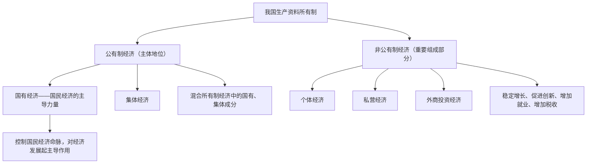

# 公有制为主体 多种所有制经济共同发展

## 核心概念

- **生产资料所有制**：生产关系的核心，是经济制度的基础，决定着社会的基本性质和发展方向。
- **公有制经济**：包括国有经济、集体经济，以及混合所有制经济中的国有成分和集体成分。
- **非公有制经济**：包括个体经济、私营经济、外商投资经济等，是社会主义市场经济的重要组成部分。
- **基本经济制度**：公有制为主体、多种所有制经济共同发展，按劳分配为主体、多种分配方式并存，社会主义市场经济体制等社会主义基本经济制度。

## 知识梳理

| 比较项 | 公有制经济 | 非公有制经济 |
| --- | --- | --- |
| 地位 | 主体，社会主义经济制度的基础 | 社会主义市场经济的重要组成部分 |
| 范围 | 国有经济、集体经济、混合所有制中的国有集体成分 | 个体、私营、外商投资经济等 |
| 作用 | 巩固社会主义制度、掌握国家经济命脉、实现共同富裕的保证 | 稳增长、促创新、增就业、增税收 |
| 市场地位 | 平等使用生产要素、公平参与市场竞争、同等受法律保护 | 同左（市场地位平等） |

## 重点精讲

1. **公有制主体地位的体现**（高频考点）：①公有资产在社会总资产中占优势；②国有经济控制国民经济命脉，对经济发展起主导作用。注意："占优势"是就全国而言，有的地方、有的产业可以有所差别。
2. **国有经济的主导作用**主要体现在**控制力**上——控制国民经济发展方向、控制经济运行的整体态势、控制重要稀缺资源，而不是数量上处处占优。
3. **发展壮大国有经济**：推进国有经济布局优化和结构调整，做强做优做大国有资本和国有企业，增强国有经济竞争力、创新力、控制力、影响力、抗风险能力。
4. **农村集体经济**：巩固和完善农村基本经营制度（以家庭承包经营为基础、统分结合的双层经营体制），发展新型农村集体经济，深化农村集体产权制度改革。
5. **为什么坚持这一所有制结构**：与我国社会主义初级阶段生产力发展不平衡、多层次的状况相适应，符合生产关系一定要适应生产力状况的规律。

## 典型例题

**例1（选择题）** 公有制的主体地位主要体现在（　）
①公有资产在社会总资产中占优势　②国有经济在各个地方、各个产业都占优势　③国有经济控制国民经济命脉，对经济发展起主导作用　④公有制经济在市场竞争中享有优先权
A. ①③　B. ①②　C. ②④　D. ③④
**解析**：主体地位的两个体现即①③；"占优势"就全国而言，②错误；各种所有制经济市场地位平等，④错误。选 **A**。

**例2（材料题）** 材料：某民营科技企业近年吸纳就业上万人，年纳税超10亿元，多项技术填补国内空白。
问：结合材料，说明非公有制经济在我国经济社会发展中的作用。
**解析**：非公有制经济是社会主义市场经济的重要组成部分，在支撑经济增长、促进创新、扩大就业、增加税收等方面具有重要作用。材料中该企业吸纳就业体现"促进就业"，纳税体现"增加税收"，技术突破体现"促进创新"。国家毫不动摇鼓励、支持、引导非公有制经济发展。

## 易错点

- 公有资产"占优势"是就**全国**而言，不是每个地方、每个产业都必须占优势。
- 国有经济的主导作用体现在**控制力**上，不等于国有企业数量最多。
- 非公有制经济是**社会主义市场经济**的重要组成部分，不能说成"社会主义经济的重要组成部分"。
- 各种所有制经济**市场地位平等**，但在国民经济中的**地位不平等**（公有制是主体）。

## 背记要点

1. 生产资料所有制是生产关系的核心，是经济制度的基础
2. 公有制主体地位两体现：公有资产占优势 + 国有经济控制命脉、起主导作用
3. 国有经济主导作用体现在控制力上
4. 非公有制经济作用：稳增长、促创新、增就业、增税收
5. **高考视角**：常以国企改革、民营经济政策为背景，考查公有制主体地位的体现、国有经济与非公有制经济的地位作用辨析，注意区分"市场地位平等"与"国民经济中地位不同"。

## 自测题

1. 公有制经济和非公有制经济各包括哪些成分？
2. 公有制主体地位主要体现在哪两个方面？
3. 国有经济的主导作用主要体现在什么上？具体指哪"三个控制"？
4. 为什么我国要坚持公有制为主体、多种所有制经济共同发展？

## 相关知识点

对两类所有制经济的方针政策见 [[坚持两个毫不动摇]]；所有制结构与市场经济的关系见 [[使市场在资源配置中起决定性作用]]。
