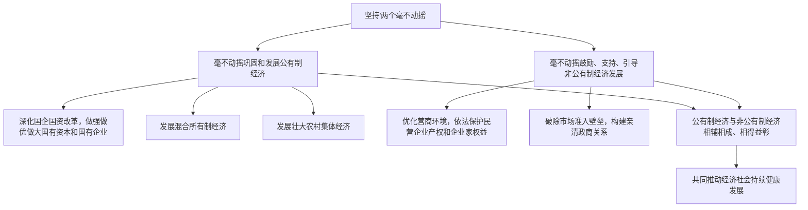

# 坚持"两个毫不动摇"

## 核心概念

- **"两个毫不动摇"**：毫不动摇巩固和发展公有制经济，毫不动摇鼓励、支持、引导非公有制经济发展。
- **国有企业**：国有经济最主要的实现形式，是中国特色社会主义的重要物质基础和政治基础。
- **混合所有制经济**：国有资本、集体资本、非公有资本等交叉持股、相互融合的经济形式，是基本经济制度的重要实现形式。
- **亲清政商关系**：构建亲清政商关系，促进非公有制经济健康发展和非公有制经济人士健康成长。

## 知识梳理

| 方面 | 巩固发展公有制经济 | 鼓励支持引导非公有制经济 |
| --- | --- | --- |
| 主要举措 | 深化国企改革、发展混合所有制、壮大集体经济 | 优化营商环境、保护产权、公平竞争 |
| 目标 | 增强竞争力、创新力、控制力、影响力、抗风险能力 | 促进民营经济发展壮大 |
| 原因 | 公有制是社会主义经济制度的基础 | 非公经济是推动发展不可或缺的力量 |

## 重点精讲

1. **为什么坚持"两个毫不动摇"**：公有制经济和非公有制经济都是社会主义市场经济的重要组成部分，都是我国经济社会发展的重要基础；二者相辅相成、相得益彰，而不是相互排斥、相互抵消。
2. **国企改革方向**：坚持和加强党对国有企业的全面领导，完善中国特色现代企业制度，推进国有经济布局优化和结构调整，国有资本向关系国家安全、国民经济命脉的重要行业和关键领域集中。
3. **支持非公有制经济的举措**（高频）：①营造市场化、法治化、国际化营商环境；②依法保护民营企业产权和企业家权益；③破除制约市场准入的壁垒；④构建亲清政商关系。
4. **辨析**："两个毫不动摇"表明国家对两类经济都高度重视，但不能理解为二者地位作用完全相同——公有制为主体这一点不动摇。

## 典型例题

**例1（选择题）** 国家出台措施破除民营企业市场准入壁垒，依法保护企业家合法权益。这表明国家（　）
A. 使非公有制经济成为国民经济的主导　B. 毫不动摇鼓励、支持、引导非公有制经济发展　C. 改变公有制的主体地位　D. 对各种所有制经济实行完全相同的政策
**解析**：主导力量是国有经济，A错；公有制主体地位不变，C错；对两类经济方针有区别，D错。选 **B**。

**例2（材料题）** 材料：某国有企业引入民营资本实施混合所有制改革后，决策效率提高，市场反应更灵敏，国有资本收益率显著提升。
问：运用"两个毫不动摇"的知识，分析发展混合所有制经济的意义。
**解析**：①混合所有制经济是基本经济制度的重要实现形式，有利于国有资本放大功能、保值增值、提高竞争力，巩固和发展公有制经济；②有利于各种所有制资本取长补短、相互促进、共同发展，体现公有制经济与非公有制经济相辅相成、相得益彰；③有利于完善公司治理，增强企业活力，做强做优做大国有资本和国有企业。

## 易错点

- 混合所有制经济**不等于**公有制经济，只有其中的国有成分和集体成分属于公有制经济。
- "两个毫不动摇"不意味着两类经济**地位相同**：公有制为主体不动摇。
- 国有资本"有进有退"是布局优化和结构调整，不是削弱公有制主体地位。
- 支持民营经济不等于对其**放任不管**，仍需依法监管、引导其健康发展。

## 背记要点

1. "两个毫不动摇"：巩固发展公有制经济 + 鼓励支持引导非公有制经济发展
2. 国企改革：完善中国特色现代企业制度，做强做优做大国有资本和国有企业
3. 混合所有制经济是基本经济制度的重要实现形式
4. 支持民营经济：优化营商环境、保护产权、公平准入、亲清政商关系
5. **高考视角**：常结合国企混改案例、民营经济促进政策命题，考查"两个毫不动摇"的原因与举措，答题时抓住"相辅相成、相得益彰"这一关键表述。

## 自测题

1. "两个毫不动摇"的具体内容是什么？
2. 为什么公有制经济与非公有制经济能够相辅相成、相得益彰？
3. 国家鼓励、支持、引导非公有制经济发展有哪些具体举措？
4. 发展混合所有制经济对巩固公有制主体地位有何意义？

## 相关知识点

所有制结构的基本内容见 [[公有制为主体 多种所有制经济共同发展]]；两类经济公平竞争的制度环境见 [[使市场在资源配置中起决定性作用]]。
