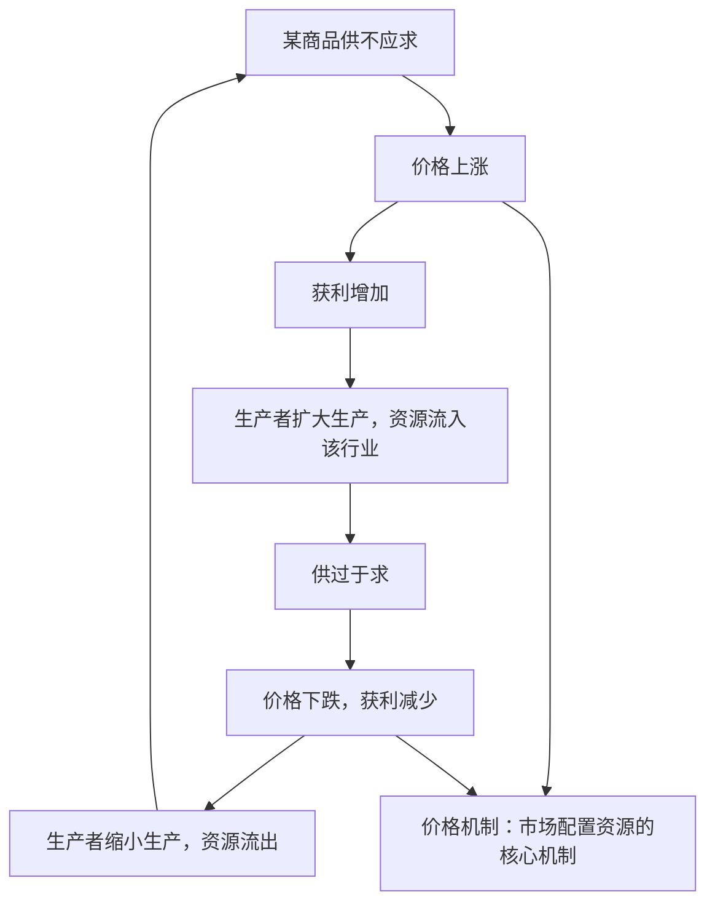

# 使市场在资源配置中起决定性作用

## 核心概念

- **资源配置**：由于资源的有限性与人类需求的无限性之间的矛盾，社会必须合理配置有限资源。计划和市场是配置资源的两种基本手段。
- **市场经济**：市场在资源配置中起决定性作用的经济。
- **市场机制**：价格、供求、竞争等市场机制相互联系、相互制约，共同实现资源配置。
- **统一开放、竞争有序的市场体系**：市场发挥决定性作用的基础，核心是公平竞争。
- **市场缺陷**：市场调节不是万能的，存在自发性、盲目性、滞后性等固有弊端。

## 知识梳理

| 市场调节的弊端 | 含义 | 典型表现 |
| --- | --- | --- |
| 自发性 | 为追逐利益不择手段 | 制假售假、污染环境、垄断欺诈 |
| 盲目性 | 信息不全导致一哄而上、一哄而散 | 盲目跟风种植致产品滞销 |
| 滞后性 | 事后调节，有时间差 | 价格信号传导慢，调整落后于市场变化 |

## 重点精讲

1. **市场配置资源的优点**：市场能够通过价格涨落及时、准确、灵敏地反映供求变化，传递供求信息，实现资源合理配置；市场竞争引导资源流向效率高的环节，推动科技和管理进步。
2. **市场体系建设**（高频）：①完善市场准入和退出制度（负面清单制度）；②健全公平开放透明的市场规则；③完善主要由市场决定价格的机制；④建设全国统一大市场。
3. **规范市场秩序的关键**：良好的市场秩序依赖市场规则（市场准入规则、市场竞争规则、市场交易规则）来维护；诚信是市场经济正常运行必不可少的条件，要建立健全社会征信体系，形成守信激励、失信惩戒机制。
4. **市场调节的局限**：市场调节不能配置的领域——国防、治安、消防等公共物品；不能让市场调节的领域——枪支弹药、危险品、麻醉品等。市场解决不了国民经济总量平衡、社会公平等问题，需要国家宏观调控。

## 典型例题

**例1（选择题）** 某地农民看到去年大蒜价格高涨，今年纷纷扩种大蒜，结果蒜价暴跌、蒜贱伤农。这主要反映了市场调节的（　）
A. 自发性　B. 盲目性　C. 滞后性　D. 竞争性
**解析**：农民缺乏全局信息、一哄而上盲目扩种，属于盲目性；若强调"事后才发现供过于求"则兼有滞后性，但材料主旨是跟风决策。选 **B**。

**例2（材料题）** 材料：国家推行市场准入负面清单制度，"非禁即入"；同时建设全国统一大市场，清理妨碍公平竞争的政策规定。
问：结合材料，说明上述举措对发挥市场决定性作用的意义。
**解析**：①市场在资源配置中起决定性作用，要求建设统一开放、竞争有序的市场体系；②负面清单制度放宽准入、保障各类市场主体平等进入，激发市场活力；③清理妨碍公平竞争的规定，健全公平开放透明的市场规则，促进商品和要素自由流动、平等交换；④有利于提高资源配置效率，建设高标准市场体系。

## 易错点

- 市场起"**决定性**作用"，不是"全部作用"，也不能说"基础性作用"（旧表述）。
- 市场决定性作用**不等于**市场可以配置一切资源：公共物品、违禁品领域不适用。
- 自发性（**利益驱动**、损人利己）与盲目性（**信息不足**、跟风决策）要区分：前者是"不想"守规则，后者是"不知"市场全貌。
- 诚信缺失、假冒伪劣属于**自发性**的表现，不是盲目性。

## 背记要点

1. 计划和市场是配置资源的两种基本手段；市场经济是市场起决定性作用的经济
2. 价格、供求、竞争机制共同实现资源配置，价格机制是核心
3. 市场体系：统一开放、竞争有序；负面清单、公平规则、市场定价
4. 市场缺陷：自发性、盲目性、滞后性
5. **高考视角**：常以价格波动、行业跟风、假冒伪劣等案例考查市场机制的传导过程和三大弊端的区分，材料题注意"市场决定性作用 + 弊端 + 需要政府作用"的完整逻辑链。

## 自测题

1. 为什么市场能够有效配置资源？其核心机制是什么？
2. 建设统一开放、竞争有序市场体系有哪些主要举措？
3. 举例区分市场调节的自发性、盲目性、滞后性。
4. 哪些领域不能由市场调节？为什么？

## 相关知识点

市场失灵需要 [[更好发挥政府作用]] 来弥补；二者的有机结合见 [[综合探究一 加快完善社会主义市场经济体制]]。
