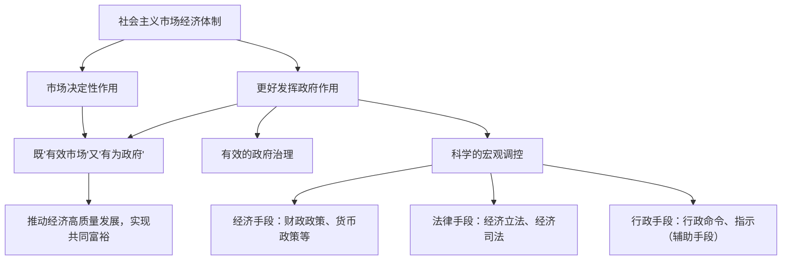

# 更好发挥政府作用

## 核心概念

- **社会主义市场经济体制**：把社会主义制度和市场经济有机结合起来，使市场在资源配置中起决定性作用，更好发挥政府作用。
- **基本特征**：坚持党的领导是根本特征（最重要）；促进全体人民实现共同富裕是根本目标；促进市场经济更好发挥科学的宏观调控、有效的政府治理的显著优势。
- **宏观调控**：政府综合运用经济、法律和行政手段，对经济总量进行调节和控制。
- **主要目标**：促进经济增长、增加就业、稳定物价、保持国际收支平衡。

## 知识梳理

| 调控手段 | 内容 | 特点 |
| --- | --- | --- |
| 经济手段 | 财政政策（税收、国债、支出）、货币政策（利率、存款准备金率）、规划计划 | 间接、常用、主要手段 |
| 法律手段 | 经济立法、经济司法 | 具有强制性、规范性 |
| 行政手段 | 行政命令、指示、规定 | 直接迅速，但须在法定范围内辅助使用 |

## 重点精讲

1. **为什么要发挥政府作用**：市场调节存在自发性、盲目性、滞后性等固有弊端，单纯市场调节会导致资源浪费、经济波动、收入分配不公；社会主义市场经济的正常运行既需要"有效市场"，也需要"有为政府"。
2. **社会主义市场经济体制的基本特征**（高频）：①坚持党的领导（根本特征）；②促进全体人民实现共同富裕（根本目标）；③科学的宏观调控、有效的政府治理是社会主义市场经济体制的内在要求。
3. **财政政策与货币政策的区分**：财政政策的主体是**政府（财政部门）**，工具是税收、国债、财政支出；货币政策的主体是**中国人民银行**，工具是利率、存款准备金率、公开市场操作。经济过热用紧缩性政策，经济下行用积极（扩张性）政策。
4. **政府与市场的边界**："更好发挥政府作用"不是更多干预，而是弥补市场失灵、维护公平竞争、加强和优化公共服务——既不能缺位，也不能越位、错位。

## 典型例题

**例1（选择题）** 为应对经济下行压力，国家实施减税降费、扩大专项债券发行规模。这属于（　）
A. 紧缩性财政政策　B. 积极的财政政策　C. 稳健的货币政策　D. 行政手段
**解析**：减税、增发国债/债券、扩大支出属于财政政策工具；刺激经济为扩张性（积极的）取向。选 **B**。

**例2（材料题）** 材料：针对部分平台企业"二选一"、大数据杀熟等行为，市场监管部门依法查处并开出罚单，同时完善反垄断法规。
问：运用社会主义市场经济体制的知识，说明政府上述做法的依据。
**解析**：①市场调节具有自发性，平台企业为逐利实施垄断行为，损害公平竞争和消费者权益；②社会主义市场经济体制要求更好发挥政府作用，实施科学的宏观调控和有效的政府治理；③政府综合运用法律手段（完善反垄断法规、依法查处）规范市场秩序，维护公平竞争的市场环境；④有利于市场更好发挥资源配置的决定性作用，促进经济健康发展。

## 易错点

- 更好发挥政府作用≠政府作用**越大越好**，政府要弥补市场失灵而非取代市场。
- 财政政策主体是**政府**，货币政策主体是**中央银行**，二者不能混淆。
- 行政手段不是主要手段，宏观调控应**以经济手段和法律手段为主**。
- 坚持党的领导是社会主义市场经济体制的**根本特征**，不能漏答或答成"根本目标"。

## 背记要点

1. 社会主义市场经济体制 = 社会主义制度 + 市场经济的有机结合
2. 基本特征：党的领导（根本特征）、共同富裕（根本目标）、科学宏观调控与有效政府治理
3. 宏观调控目标：促增长、稳就业、稳物价、保持国际收支平衡
4. 三大手段：经济手段（财政政策+货币政策）为主，法律手段规范，行政手段辅助
5. **高考视角**：常以宏观经济政策（减税降费、降准降息）或市场监管案例命题，考查政策手段的判断与"有效市场+有为政府"关系，注意先答"为什么管"（市场失灵）再答"怎么管"（手段）。

## 自测题

1. 社会主义市场经济体制的基本特征有哪些？
2. 宏观调控的主要目标和主要手段分别是什么？
3. 如何区分财政政策与货币政策？各举两个工具。
4. 为什么说社会主义市场经济既需要"有效市场"又需要"有为政府"？

## 相关知识点

市场机制及其局限见 [[使市场在资源配置中起决定性作用]]；政府与市场关系的综合运用见 [[综合探究一 加快完善社会主义市场经济体制]]。
