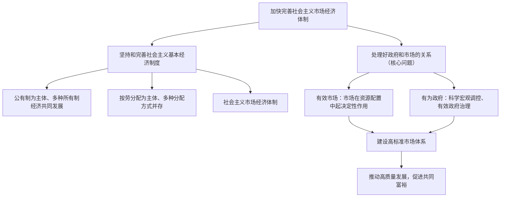

# 综合探究一 加快完善社会主义市场经济体制

## 探究主题

围绕"处理好政府和市场的关系"这一经济体制改革的核心问题，综合运用第一、二课知识，探究如何坚持和完善社会主义基本经济制度，加快完善社会主义市场经济体制，实现"有效市场"和"有为政府"的更好结合。

## 知识梳理

| 完善方向 | 主要内容 |
| --- | --- |
| 产权制度 | 健全归属清晰、权责明确、保护严格、流转顺畅的现代产权制度 |
| 要素市场化配置 | 促进土地、劳动力、资本、技术、数据等要素自主有序流动 |
| 公平竞争 | 强化竞争政策基础地位，落实公平竞争审查制度 |
| 市场监管 | 创新监管方式，维护市场秩序，建设社会信用体系 |

## 探究活动

**活动一：为什么经济体制改革的核心是政府和市场的关系？**
市场决定资源配置是市场经济的一般规律，但市场有自发性、盲目性、滞后性等失灵之处；政府能弥补市场失灵，但过度干预会抑制活力。只有让"看不见的手"和"看得见的手"各就其位、协同发力，才能既充满活力又规范有序。

**活动二：搜集本地"放管服"改革案例**
如"最多跑一次""一网通办"、市场准入负面清单等，分析其如何减少政府对资源的直接配置、激发市场主体活力，体现"放（简政放权）—管（公正监管）—服（优化服务）"的统一。

## 典型例题

**例1（选择题）** 完善社会主义市场经济体制必须坚持的改革核心问题是（　）
A. 所有制结构调整　B. 收入分配制度改革　C. 处理好政府和市场的关系　D. 对外开放水平提升
**解析**：经济体制改革的核心问题是处理好政府和市场的关系，使市场在资源配置中起决定性作用，更好发挥政府作用。选 **C**。

**例2（材料题）** 材料：某省深化要素市场化配置改革，建立城乡统一的建设用地市场，推进数据要素交易平台建设；同时全面落实公平竞争审查制度，清理废除妨碍统一市场的规定。
问：结合材料，说明该省举措对完善社会主义市场经济体制的意义。
**解析**：①要素市场化配置改革使市场在资源配置中起决定性作用，促进土地、数据等要素自主有序流动、高效配置；②落实公平竞争审查、清理妨碍统一市场的规定，体现更好发挥政府作用，建设统一开放、竞争有序的高标准市场体系；③二者结合有利于处理好政府和市场的关系，激发各类市场主体活力，推动经济高质量发展。

## 易错点

- 完善市场经济体制不是"政府退出"，而是政府**职能转变**——从直接配置资源转向弥补市场失灵、提供公共服务。
- "使市场在资源配置中起决定性作用"与"更好发挥政府作用"是**有机统一**的整体，不能割裂或对立。
- 要素市场包括土地、劳动力、资本、技术、**数据**等，数据是新增的重要生产要素。

## 总结提升（含高考视角）

1. 一条主线：坚持和完善社会主义基本经济制度，处理好政府和市场的关系
2. 两只手：有效市场（决定性作用）+ 有为政府（科学调控、有效治理）
3. 重点任务：现代产权制度、要素市场化配置、公平竞争、高标准市场体系
4. 根本目标：解放和发展社会生产力，促进全体人民共同富裕
5. **高考视角**：综合探究常作为大题背景材料出现，如"全国统一大市场""营商环境改革"等时政，答题需整合第一、二课知识，按"制度基础—市场作用—政府作用—意义目标"的逻辑组织答案。

## 自测题

1. 为什么说处理好政府和市场的关系是经济体制改革的核心问题？
2. 建设高标准市场体系包括哪些重点任务？
3. 结合"放管服"改革实例，说明政府职能如何转变。
4. 如何理解"有效市场"和"有为政府"的有机统一？

## 相关知识点

市场作用的原理见 [[使市场在资源配置中起决定性作用]]；政府作用的原理见 [[更好发挥政府作用]]；制度基础见 [[公有制为主体 多种所有制经济共同发展]]。
