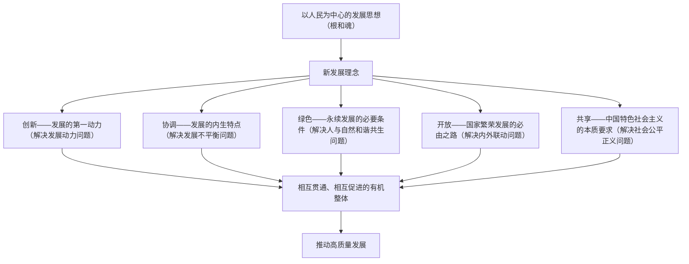

# 坚持新发展理念

## 核心概念

- **以人民为中心的发展思想**：发展为了人民、发展依靠人民、发展成果由人民共享。这是新发展理念的"根"和"魂"。
- **新发展理念**：创新、协调、绿色、开放、共享的发展理念，回答了关于发展的目的、动力、方式、路径等一系列理论和实践问题。
- **主要矛盾**：我国社会主要矛盾已经转化为人民日益增长的美好生活需要和不平衡不充分的发展之间的矛盾。

## 知识梳理

| 理念 | 地位 | 解决的问题 | 关键举措 |
| --- | --- | --- | --- |
| 创新 | 第一动力，摆在国家发展全局核心位置 | 发展动力 | 科技自立自强、创新驱动 |
| 协调 | 持续健康发展的内在要求 | 发展不平衡 | 城乡、区域协调发展 |
| 绿色 | 永续发展的必要条件 | 人与自然和谐共生 | 绿水青山就是金山银山 |
| 开放 | 国家繁荣发展的必由之路 | 发展内外联动 | 更高水平开放型经济 |
| 共享 | 中国特色社会主义的本质要求 | 社会公平正义 | 全民共享、全面共享、共建共享、渐进共享 |

## 重点精讲

1. **为什么坚持以人民为中心**：人民是历史的创造者，是决定党和国家前途命运的根本力量；把人民对美好生活的向往作为奋斗目标，依靠人民创造历史伟业，发展成果由人民共享，朝着共同富裕方向稳步前进。
2. **五大理念各自定位**（高频背记）：创新是**第一动力**、协调是**内生特点/内在要求**、绿色是**普遍形态/必要条件**、开放是**必由之路**、共享是**本质要求**。
3. **共享的四个内涵**：全民共享（人人享有）、全面共享（共享各方面成果）、共建共享（人人参与、人人尽力）、渐进共享（由低到高、逐步实现）。
4. **整体性**：新发展理念是一个相互贯通、相互促进的有机整体，要**统一贯彻**，不能顾此失彼，也不能相互替代；哪一个理念贯彻不到位，发展进程都会受影响。

## 典型例题

**例1（选择题）** "绿水青山就是金山银山""像保护眼睛一样保护生态环境"体现的新发展理念是（　）
A. 创新　B. 协调　C. 绿色　D. 共享
**解析**：材料强调生态环境保护、人与自然和谐共生，对应绿色发展理念。选 **C**。

**例2（材料题）** 材料：某市一手抓高新技术产业培育，建设创新孵化基地；一手推进老旧小区改造、扩大普惠性养老托育服务，让市民共享城市发展红利。
问：结合材料，说明该市是如何贯彻新发展理念的。
**解析**：①坚持创新发展，培育高新技术产业、建设孵化基地，把创新作为引领发展的第一动力；②坚持共享发展，改造老旧小区、发展普惠养老托育，使发展成果更多更公平惠及全体人民，体现以人民为中心的发展思想；③统一贯彻新发展理念，注重发展的整体性协同性，推动经济发展与民生改善相互促进。

## 易错点

- 新发展理念的"根"和"魂"是**以人民为中心的发展思想**，不是某一个理念。
- 创新是"第一动力"，不能与"第一生产力（科学技术）""第一资源（人才）"混淆表述对象。
- 五大理念是**有机整体**，要统一贯彻，不存在"最重要可以只抓一个"的说法。
- 共享≠平均主义、同步富裕；共享是**渐进**的过程。

## 背记要点

1. 以人民为中心：发展为了人民、依靠人民、成果由人民共享
2. 创新（第一动力）、协调（内生特点）、绿色（必要条件）、开放（必由之路）、共享（本质要求）
3. 共享四内涵：全民、全面、共建、渐进
4. 五大理念相互贯通、相互促进，是有机整体
5. **高考视角**：高频考点，常给出地方发展实践材料要求"指出体现了哪些理念并分析"，答题模式为"理念名称 + 地位表述 + 材料对应"，务必逐条对应材料信息。

## 自测题

1. 以人民为中心的发展思想包括哪三个方面？
2. 默写五大发展理念各自的地位表述和解决的问题。
3. 共享发展的四个内涵是什么？
4. 为什么必须统一贯彻新发展理念、不能顾此失彼？

## 相关知识点

新发展理念引领 [[建设现代化经济体系]]；发展成果的公平分配见 [[我国的个人收入分配]]。
