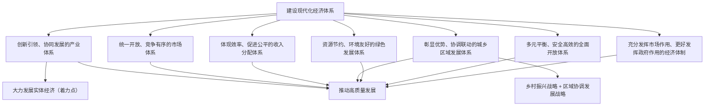

# 建设现代化经济体系

## 核心概念

- **现代化经济体系**：由社会经济活动各个环节、各个层面、各个领域的相互关系和内在联系构成的一个有机整体，是一个统一体。
- **高质量发展**：能够很好满足人民日益增长的美好生活需要的发展，是体现新发展理念的发展。
- **实体经济**：一国经济的立身之本，财富创造的根本源泉，国家强盛的重要支柱。
- **乡村振兴战略**：坚持农业农村优先发展，实现产业兴旺、生态宜居、乡风文明、治理有效、生活富裕。
- **区域协调发展战略**：促进区域间要素合理流动和资源优化配置，如京津冀协同发展、长江经济带、粤港澳大湾区等。

## 知识梳理

| 重点任务 | 主要内容 |
| --- | --- |
| 大力发展实体经济 | 筑牢现代化经济体系的坚实基础，深化供给侧结构性改革，把发展经济的着力点放在实体经济上 |
| 实施乡村振兴战略 | 农业农村优先发展，"二十字"总要求，巩固拓展脱贫攻坚成果 |
| 实施区域协调发展战略 | 西部大开发、东北振兴、中部崛起、东部率先，京津冀、长三角、粤港澳等重大战略 |

## 重点精讲

1. **为什么建设现代化经济体系**：我国经济已由高速增长阶段转向**高质量发展阶段**；建设现代化经济体系是跨越关口的迫切要求和我国发展的战略目标，是转变发展方式、优化经济结构、转换增长动力的迫切要求。
2. **高质量发展的内涵**（高频）：不是单纯以GDP论英雄，而是创新成为第一动力、协调成为内生特点、绿色成为普遍形态、开放成为必由之路、共享成为根本目的的发展。
3. **实体经济的地位**：一国经济的立身之本、财富创造的根本源泉、国家强盛的重要支柱。要虚实结合，防止经济"脱实向虚"，推动互联网、大数据、人工智能同实体经济深度融合。
4. **乡村振兴总要求**：产业兴旺、生态宜居、乡风文明、治理有效、生活富裕——二十字方针要准确背记，不可与旧的新农村建设"生产发展、生活宽裕……"混淆。

## 典型例题

**例1（选择题）** 国家强调"把发展经济的着力点放在实体经济上"，是因为实体经济是（　）
①一国经济的立身之本　②财富创造的根本源泉　③资源配置的决定力量　④国家强盛的重要支柱
A. ①②③　B. ①②④　C. ①③④　D. ②③④
**解析**：资源配置起决定性作用的是市场，③错误；①②④为教材对实体经济地位的规范表述。选 **B**。

**例2（材料题）** 材料：某县立足特色农产品资源，建设农产品深加工产业园，发展乡村旅游和农村电商，村集体收入和农民收入连年增长，村容村貌明显改善。
问：结合材料，说明该县做法对实施乡村振兴战略的意义。
**解析**：①发展深加工、乡村旅游、电商，推动农村一二三产业融合发展，实现产业兴旺；②增加集体和农民收入，促进生活富裕，让农民共享发展成果；③改善村容村貌，助力生态宜居；④坚持农业农村优先发展，为建设现代化经济体系、彰显城乡协调联动提供支撑。

## 易错点

- 高质量发展≠高速度增长，我国经济已**由高速增长阶段转向高质量发展阶段**。
- 现代化经济体系是"**一体建设**"的有机整体（七大体系），不能只抓产业体系。
- 实体经济与虚拟经济：要**虚实结合、以实为本**，不是排斥金融等虚拟经济。
- 乡村振兴二十字总要求与"社会主义新农村建设"表述不同，默写勿混。

## 背记要点

1. 转向高质量发展阶段——建设现代化经济体系的时代背景
2. 现代化经济体系"7个体系"：产业、市场、分配、城乡区域、绿色、开放 + 经济体制
3. 着力点：实体经济（立身之本、根本源泉、重要支柱）
4. 乡村振兴：产业兴旺、生态宜居、乡风文明、治理有效、生活富裕
5. **高考视角**：常结合制造强国、乡村振兴、区域重大战略等时政命题，考查"为什么发展实体经济""如何推进乡村振兴"，答题结合新发展理念形成完整逻辑。

## 自测题

1. 现代化经济体系包括哪几个体系？
2. 为什么要大力发展实体经济？
3. 乡村振兴战略的总要求是什么？
4. 我国区域协调发展战略包括哪些重大举措？

## 相关知识点

引领现代化经济体系建设的理念见 [[坚持新发展理念]]；分配体系的具体内容见 [[我国的个人收入分配]]；市场体系建设见 [[使市场在资源配置中起决定性作用]]。
