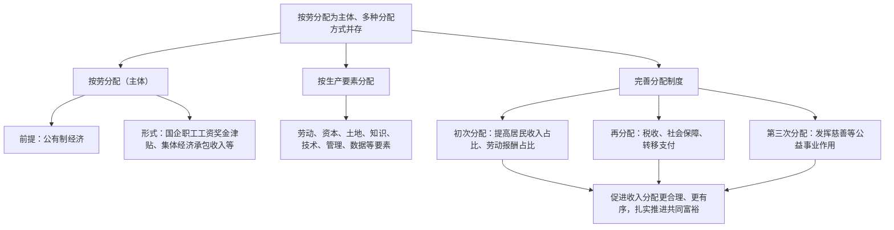

# 我国的个人收入分配

## 核心概念

- **分配制度**：按劳分配为主体、多种分配方式并存，是社会主义基本经济制度的重要内容，由生产资料所有制决定。
- **按劳分配**：社会主义的分配原则，在公有制经济中以劳动为尺度分配个人消费品，多劳多得、少劳少得。
- **按要素分配**：让劳动、资本、土地、知识、技术、管理、数据等生产要素由市场评价贡献、按贡献决定报酬。
- **居民收入来源**：劳动性收入、财产性收入、经营性收入、转移性收入。
- **共同富裕**：在高质量发展中促进共同富裕，正确处理效率和公平的关系。

## 知识梳理

| 收入类型 | 含义 | 举例 |
| --- | --- | --- |
| 劳动性收入 | 通过劳动获得 | 工资、奖金、津贴 |
| 财产性收入 | 通过自有财产获得 | 利息、股息、房租 |
| 经营性收入 | 通过生产经营活动获得 | 个体户经营利润 |
| 转移性收入 | 国家、单位、社会团体的转移支付 | 养老金、社会救济、补贴 |

## 重点精讲

1. **为什么实行这一分配制度**：生产资料所有制决定分配方式——公有制为主体决定了按劳分配为主体；多种所有制共同发展、社会主义市场经济体制决定了多种分配方式并存。
2. **按劳分配的意义**：有利于充分调动劳动者的积极性和创造性，激励劳动者努力学习科学技术、提高劳动技能；体现了劳动者共同劳动、平等分配的社会地位。
3. **按要素分配的意义**：有利于让一切要素的活力竞相迸发，让一切创造社会财富的源泉充分涌流，推动资源优化配置，促进经济发展。
4. **完善收入分配的举措**（高频大题）：①坚持居民收入增长和经济增长基本同步、劳动报酬提高和劳动生产率提高基本同步；②初次分配提高劳动报酬比重，坚持多劳多得；③再分配健全以税收、社会保障、转移支付为主要手段的调节机制；④重视第三次分配，发展慈善等社会公益事业；⑤规范收入分配秩序，扩大中等收入群体，取缔非法收入。
5. **树立正确劳动观**：劳动是财富的源泉，要弘扬劳动最光荣、劳动最崇高、劳动最伟大、劳动最美丽的社会风尚。

## 典型例题

**例1（选择题）** 某国有企业工程师小王每月获得工资1.2万元，其持有的公司股票年终分红3万元，出租住房年租金收入4万元。小王的收入分配方式依次是（　）
A. 按劳分配、按资本要素分配、按土地要素分配　B. 按劳分配、按资本要素分配、按资本要素分配　C. 按要素分配、按劳分配、按资本要素分配　D. 按劳分配、按技术要素分配、按资本要素分配
**解析**：国企工资属于公有制中的按劳分配；股票分红属于按资本要素分配；房租属于财产性收入，按资本（财产）要素分配。选 **B**。

**例2（材料题）** 材料：国家提高个税专项附加扣除标准，扩大中等收入群体；同时鼓励企业家积极参与慈善捐赠和公益事业。
问：结合材料，说明上述举措如何促进收入分配公平。
**解析**：①提高个税专项附加扣除，运用税收手段完善再分配调节机制，减轻中低收入者负担，缩小收入差距；②扩大中等收入群体，形成橄榄型分配格局，促进社会公平；③鼓励慈善捐赠，发挥第三次分配作用，引导社会力量参与财富合理分配；④初次分配、再分配、第三次分配协调配套，扎实推进共同富裕。

## 易错点

- 按劳分配的前提是**公有制经济**：私营、外资企业中的工资是按**劳动要素**分配，不是按劳分配。
- 劳动性收入≠按劳分配收入：二者划分标准不同（收入来源 vs 分配方式）。
- 转移性收入包括养老金、救济金等，**不属于**按劳分配。
- 共同富裕不是同时富裕、同等富裕，允许一部分人先富起来，先富带后富。

## 背记要点

1. 分配制度：按劳分配为主体、多种分配方式并存（由所有制决定）
2. 按劳分配：公有制前提、劳动尺度、多劳多得
3. 要素分配：劳动、资本、土地、知识、技术、管理、数据
4. 三次分配：初次分配（效率与报酬）、再分配（税收社保转移支付）、第三次分配（慈善公益）
5. **高考视角**：判断分配方式类选择题和"如何促进分配公平"类大题是高频题型，答题按"两个同步—初次分配—再分配—第三次分配—规范秩序"的框架展开。

## 自测题

1. 我国分配制度的内容是什么？由什么决定？
2. 按劳分配的前提、尺度和结果分别是什么？
3. 居民收入按来源分为哪四类？各举一例。
4. 完善个人收入分配、促进社会公平有哪些主要举措？

## 相关知识点

再分配的重要手段见 [[我国的社会保障]]；分配制度所属的基本经济制度见 [[公有制为主体 多种所有制经济共同发展]]；共享发展理念见 [[坚持新发展理念]]。
