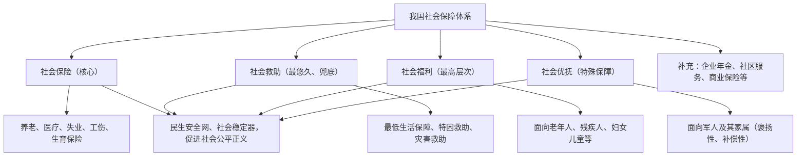

# 我国的社会保障

## 核心概念

- **社会保障**：由国家依法建立、政府主导的保障社会成员基本生存与生活安全的各种制度和措施的总称，是民生安全网、社会稳定器。
- **社会保险**：我国社会保障体系的**核心**，包括基本养老保险、基本医疗保险、失业保险、工伤保险、生育保险等。
- **社会救助**：政府对生活困难者给予物质帮助和服务，是最先形成、历史最悠久的社会保障形式，发挥"兜底"作用。
- **社会福利**：政府和社会向老年人、残疾人、妇女儿童等提供的福利性物质帮助和服务，是最高层次的社会保障。
- **社会优抚**：对现役军人、退役军人及军烈属等的褒扬和优待，是特殊的社会保障。

## 知识梳理

| 形式 | 地位 | 资金来源特点 | 举例 |
| --- | --- | --- | --- |
| 社会保险 | 核心 | 个人、单位、政府共同分担 | 职工养老保险 |
| 社会救助 | 兜底、最悠久 | 政府无偿提供 | 低保、特困供养 |
| 社会福利 | 最高层次 | 政府和社会提供 | 高龄津贴、公共福利设施 |
| 社会优抚 | 特殊保障 | 国家和社会提供 | 抚恤金、优待军烈属 |

## 重点精讲

1. **社会保障的功能**（高频）：①通过防范和化解社会成员的生存危机，保障基本生活权利，维护社会稳定（"稳定器"）；②通过国民收入再分配，缩小收入差距，促进社会公平正义（"调节器"）；③通过风险分摊与责任共担，助人自助，化解社会风险。
2. **完善社会保障体系的要求**：①公平对待每个公民，保证人人享有（应保尽保、公平性）；②既要尽力而为，又要量力而行——保障水平要与经济发展水平相适应，不能超越发展阶段搞过高承诺；③严格依法监管，做到保证方案实施、责任落实、资金监管有法可依。
4. **区分四种形式**：看对象和性质——缴费型对应保险，困难兜底对应救助，普惠提升对应福利，军人对象对应优抚。

## 典型例题

**例1（选择题）** 张大爷家因病致贫，民政部门为其办理了最低生活保障；李叔叔是退役军人，每年收到政府优待金。二人享受的社会保障形式分别是（　）
A. 社会保险、社会福利　B. 社会救助、社会优抚　C. 社会福利、社会救助　D. 社会救助、社会保险
**解析**：低保属于对困难群众的兜底性社会救助；退役军人优待金属于社会优抚。选 **B**。

**例2（材料题）** 材料：某地在提高城乡居民基础养老金标准时，坚持"小步慢提"，同时严查骗保冒领行为，确保基金安全可持续。
问：结合材料，说明完善社会保障体系应坚持的原则。
**解析**：①既要尽力而为，又要量力而行——"小步慢提"使保障水平与经济发展水平相适应，增进民生福祉又不超越发展阶段；②坚持公平性，提高城乡居民养老金，让发展成果更多更公平惠及全体人民；③严格依法监管，严查骗保确保资金安全，保证社会保障基金可持续运行。

## 易错点

- 社会保障体系的核心是**社会保险**，不是社会救助或社会福利。
- 社会救助是**最先形成、历史最悠久**的保障形式；社会福利是**最高层次**——两个"最"勿混。
- 商业保险不属于国家社会保障的基本形式，是**补充**形式，遵循自愿原则。
- "尽力而为"与"量力而行"缺一不可：保障水平**不是越高越好**。

## 背记要点

1. 社会保障功能：稳定器（保基本生活）、调节器（再分配促公平）、化解风险（助人自助）
2. 四种主要形式：社会保险（核心）、社会救助（兜底）、社会福利（最高层次）、社会优抚（特殊）
3. 完善要求：公平对待人人享有、尽力而为量力而行、依法监管
4. 目标：建成覆盖全民、统筹城乡、公平统一、安全规范、可持续的多层次社会保障体系
5. **高考视角**：选择题常考四种形式的判断（给情境认类型），大题常考"社会保障的作用"与"如何完善"，注意结合再分配、共同富裕的知识作答。

## 自测题

1. 我国社会保障体系包括哪四种主要形式？各自地位如何？
2. 社会保障有哪些主要功能？
3. 社会保险与商业保险有什么区别？
4. 为什么完善社会保障既要"尽力而为"又要"量力而行"？

## 相关知识点

社会保障是再分配的重要手段，见 [[我国的个人收入分配]]；共享发展理念见 [[坚持新发展理念]]；相关社会责任见 [[综合探究二 践行社会责任 促进社会进步]]。
