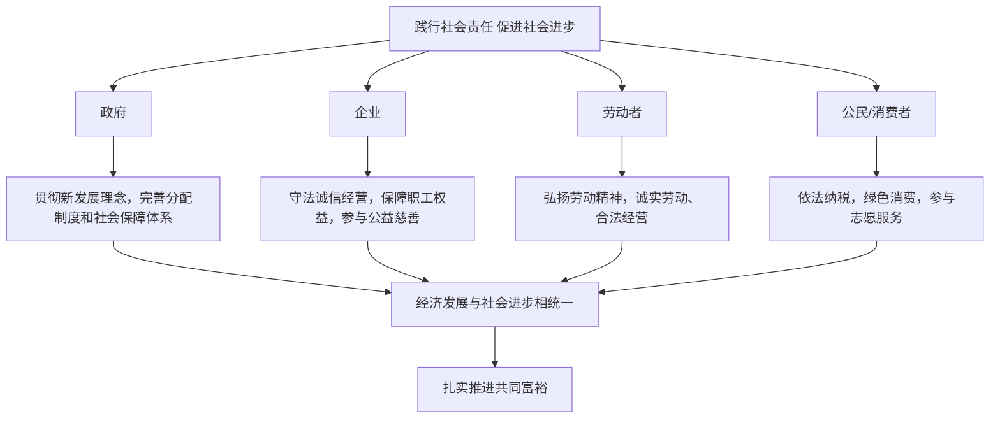

# 综合探究二 践行社会责任 促进社会进步

## 探究主题

围绕"经济活动参与者如何承担社会责任"，综合运用第三、四课知识，探究政府、企业、劳动者、消费者等主体在贯彻新发展理念、完善收入分配和社会保障中的责任担当，理解经济发展与社会进步的统一。

## 知识梳理

| 主体 | 主要社会责任 |
| --- | --- |
| 政府 | 坚持以人民为中心，做好再分配调节，健全社会保障，规范市场秩序 |
| 企业 | 依法经营、诚信纳税，节能环保，善待员工，积极参与第三次分配 |
| 劳动者 | 提高素质技能，爱岗敬业，通过诚实劳动创造财富 |
| 公民 | 树立正确金钱观劳动观，量入为出理性消费，热心公益 |

## 探究活动

**活动一：企业为什么要承担社会责任？**
企业是市场经济的主要参与者。市场调节的自发性表明，仅靠逐利动机可能损害社会利益；企业承担社会责任既是法律和道德的要求，也有利于树立良好信誉和形象，实现经济效益与社会效益的统一。践行共享理念、参与慈善事业，也是第三次分配的重要力量。

**活动二：调研身边的公益实践**
收集本地企业捐资助学、社区志愿服务、"慈善一日捐"等案例，分析不同主体如何通过第三次分配和志愿行动促进社会公平，思考中学生力所能及的参与方式（志愿服务、公益宣传、理性消费等）。

## 典型例题

**例1（选择题）** 某企业在实现利润增长的同时，坚持为员工足额缴纳社会保险，并连续多年捐资建设乡村小学。该企业的做法（　）
①体现了践行社会责任　②参与了第三次分配　③履行了政府再分配职能　④有利于促进社会公平
A. ①②③　B. ①②④　C. ①③④　D. ②③④
**解析**：再分配的主体是国家（政府），企业捐赠属于第三次分配，③错误；缴纳社保、捐资助学体现社会责任并促进公平。选 **B**。

**例2（材料题）** 材料：某民营企业积极研发环保新技术，降低单位产品能耗；设立员工技能提升基金；疫情期间向社会捐赠物资数千万元。
问：结合材料，说明企业应如何践行社会责任、促进社会进步。
**解析**：①贯彻绿色发展理念，研发环保技术、降低能耗，实现经济效益与生态效益统一；②尊重劳动者，设立技能提升基金，保障和发展员工权益，体现共享发展；③积极参与公益慈善捐赠，发挥第三次分配作用，促进社会公平；④企业将自身发展与社会责任相结合，有利于树立良好形象，实现经济发展与社会进步的统一。

## 易错点

- 第三次分配的主体是**社会力量**（企业、个人自愿捐赠），不能与政府主导的**再分配**（税收、社保、转移支付）混淆。
- 企业承担社会责任与追求利润**不矛盾**：良好信誉与形象本身是无形资产。
- 践行社会责任是**所有经济活动参与者**的事，不只是政府和企业，劳动者、消费者同样有责。

## 总结提升（含高考视角）

1. 一个主题：经济活动参与者共同承担社会责任，促进经济发展与社会进步统一
2. 四类主体：政府（调节保障）、企业（诚信公益）、劳动者（诚实劳动）、公民（理性消费、热心公益）
3. 两个抓手：新发展理念（尤其共享）+ 三次分配协调配套
4. 落脚点：扎实推进共同富裕
5. **高考视角**：探究题常给企业公益、志愿服务等情境，要求多主体分析"责任与担当"，答题按主体分层，并链接共享理念、第三次分配、社会保障等原理，避免只谈道德口号。

## 自测题

1. 企业承担社会责任的原因和主要表现有哪些？
2. 第三次分配与再分配有何区别？各自主体是谁？
3. 政府、劳动者、消费者各自应如何践行社会责任？
4. 结合实例说明"经济效益与社会效益可以统一"。

## 相关知识点

共享理念的内涵见 [[坚持新发展理念]]；三次分配框架见 [[我国的个人收入分配]]；保障民生的制度安排见 [[我国的社会保障]]。
