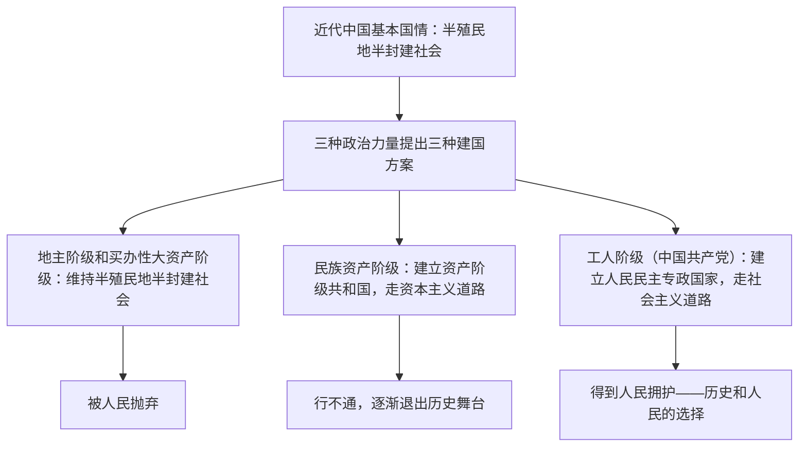

# 中华人民共和国成立前各种政治力量

## 核心要义

- **近代中国的基本国情**：半殖民地半封建社会，这是认识和解决近代中国一切社会问题的基本依据。
- **两大主要矛盾**：帝国主义和中华民族的矛盾、封建主义和人民大众的矛盾。
- **两大历史任务**：争取民族独立、人民解放；实现国家富强、人民幸福。
- **中国共产党的性质**：中国工人阶级的先锋队，同时是中国人民和中华民族的先锋队（"两个先锋队"）。

## 知识梳理

| 项目 | 内容 |
| --- | --- |
| 基本国情 | 半殖民地半封建社会 |
| 主要矛盾 | 帝国主义与中华民族的矛盾（最主要）、封建主义与人民大众的矛盾 |
| 历史任务 | 民族独立、人民解放；国家富强、人民幸福 |
| 党的诞生条件 | 马克思列宁主义传入并同中国工人运动相结合 |
| 党的初心使命 | 为中国人民谋幸福，为中华民族谋复兴 |

## 重点精讲

1. **各种尝试为何失败**：太平天国运动、洋务运动、戊戌变法、辛亥革命等都未能改变半殖民地半封建的社会性质，根本原因在于没有先进阶级的科学理论指导，没有找到解决中国问题的正确道路。
2. **三种建国方案的比较**是等级考高频设问，注意从"代表阶级—方案内容—历史结局"三个维度作答；只有中国共产党的方案最终赢得人民拥护。
3. **1921年建党的意义**：中国人民谋求民族独立、人民解放和国家富强、人民幸福的斗争从此有了主心骨，中国人民从精神上由被动转为主动，这是开天辟地的大事变。
4. **党的领导地位的形成**：不是自封的，是在长期革命斗争中形成的，是历史的必然、人民的选择。

## 典型例题

**例1（选择题）** 近代中国民族资产阶级建立资产阶级共和国的方案行不通，其根本原因是（　）
A. 民族资产阶级人数太少　B. 帝国主义不允许中国走资本主义道路　C. 半殖民地半封建的社会性质决定了资本主义道路在中国走不通　D. 无产阶级力量过于强大
**解析**：帝国主义不容许、封建势力阻挠、民族资产阶级自身的软弱性，归根到底由半殖民地半封建的基本国情决定。选 **C**。

**例2（材料题）** 材料：从1840年到1921年，各阶级轮番登上历史舞台，各种救国方案相继破产；中国共产党成立后，中国革命面貌焕然一新。
问：结合材料，说明"中国共产党执政是历史的必然、人民的选择"。
**解析**：①半殖民地半封建的基本国情决定了其他政治力量的方案都行不通；②中国共产党以马克思主义为指导，代表中国最广大人民的根本利益，找到了新民主主义革命的正确道路；③党团结带领人民建立新中国，实现民族独立、人民解放。因此党的领导和执政地位是历史和人民的选择。

## 易错点

- 近代中国社会性质是**半殖民地半封建社会**，不能表述为"先半殖民地、后半封建两个阶段"。
- "两个先锋队"缺一不可：工人阶级先锋队 + 中国人民和中华民族的先锋队。
- 党的领导地位是**历史和人民的选择**，不是自封的。
- 新民主主义革命的领导阶级是**工人阶级（通过中国共产党）**，不是农民阶级。

## 背记要点

1. 基本国情：半殖民地半封建社会；两大矛盾、两大历史任务
2. 三种政治力量、三种建国方案，只有共产党的方案得到人民拥护
3. 1921年建党：开天辟地的大事变，中国人民有了主心骨
4. 党的性质：两个先锋队；初心使命：为中国人民谋幸福、为中华民族谋复兴

## 自测题

1. 近代中国的基本国情、主要矛盾和两大历史任务分别是什么？
2. 简述近代中国三种政治力量提出的三种建国方案及其结局。
3. 中国共产党诞生的条件和意义是什么？
4. 为什么说中国共产党的领导地位不是自封的？

## 相关知识点

党领导人民实现三次伟大飞跃见 [[中国共产党领导人民站起来、富起来、强起来]]；党的性质宗旨的深入阐释见 [[始终坚持以人民为中心]]。
